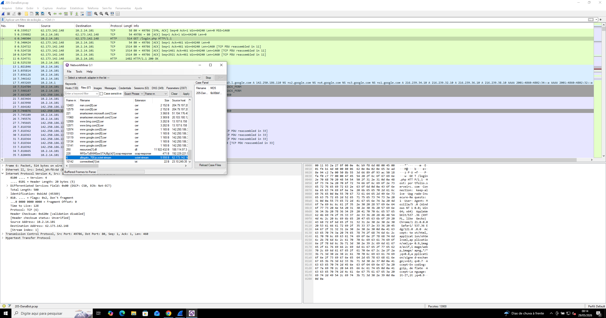
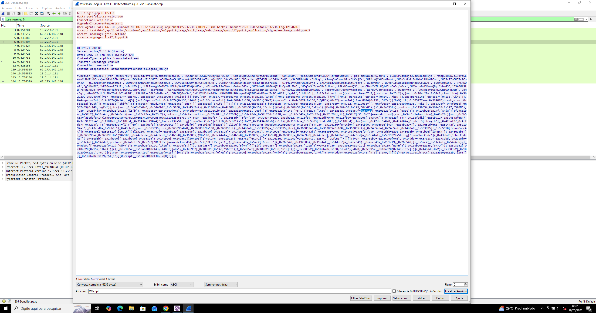
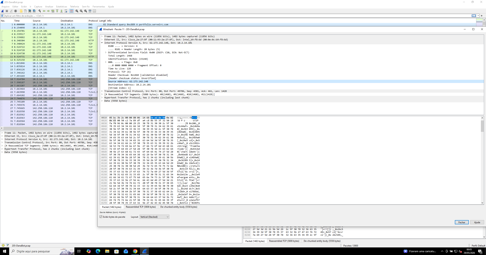
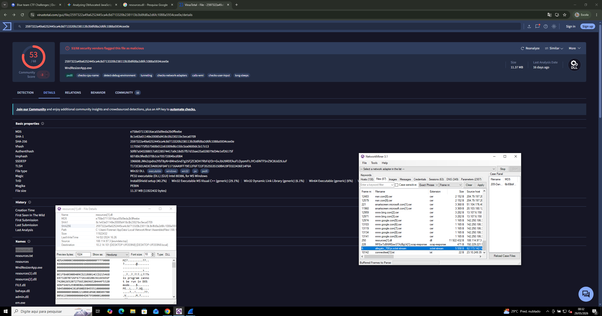

# 🦠 DanaBot Malware — Network Forensic Analysis

## 📌 Overview

Este writeup apresenta a análise forense de um incidente envolvendo o malware **DanaBot**, identificado através de tráfego de rede e execução de scripts maliciosos.

---

## 🎯 Objetivo

* Identificar vetor inicial
* Analisar execução do malware
* Correlacionar tráfego de rede
* Identificar payload
* Extrair IOCs

---

## 🧠 Resumo do Ataque

1. 📥 Download de script `.js`
2. ⚙️ Execução via `wscript.exe`
3. 🌐 Comunicação com C2
4. 📦 Download de DLL
5. 🦠 Execução do malware

---

## ⏱️ Timeline do Ataque

| Fase     | Evento                 |
| -------- | ---------------------- |
| Inicial  | Download de arquivo JS |
| Execução | Script executado       |
| Rede     | Conexão com IP externo |
| Payload  | Download de DLL        |
| Infecção | Execução final         |

---

## 🔍 Análise Técnica

---

### 🎯 Vetor Inicial

Arquivo identificado:

```bash id="6gnyrc"
allegato_708.js
```



💡 Indica:

* engenharia social
* arquivo anexado (phishing)

---

### ⚙️ Execução

Processo responsável:

```bash id="x0i2p4"
wscript.exe
```



📌 Execução via Windows Script Host.

---

### 🌐 Comunicação com C2

IP identificado:

```bash id="qq3n5q"
62.173.142.148
```



🔴 Indica comunicação com servidor externo (C2).

---

### 📦 Payload Secundário

Arquivo:

* DLL maliciosa

```bash id="pj6hlm"
MD5: e75e07113016aca55d9edab20ffeebee
```



---

## 🧠 Comportamento do Malware

Padrão típico do **DanaBot**:

* Loader em JS
* Download de payload
* Execução modular
* Comunicação com C2

---

## 📡 Evidências

* Script `.js`
* Processo `wscript.exe`
* IP externo
* DLL maliciosa

---

## 🚨 IOCs

* `allegato_708.js`
* `wscript.exe`
* `62.173.142.148`
* DLL maliciosa