# 💣 Nuke The Browser — Web Exploitation & Malware Delivery Analysis

## 📌 Overview

Este writeup documenta a análise forense de um ataque baseado em exploração de navegador e entrega de malware, no cenário **Nuke The Browser**.

A investigação revelou um ataque sofisticado combinando:

* exploração de vulnerabilidade
* execução de código via DLL
* engenharia social
* entrega de payload malicioso

---

## 🎯 Objetivo

* Identificar vetor de infecção
* Analisar exploração do navegador
* Investigar execução de DLL maliciosa
* Identificar payload final
* Extrair IOCs

---

## 🧠 Resumo do Ataque

O atacante executa:

1. 🌐 Redirecionamento malicioso
2. 💥 Exploração de vulnerabilidade no navegador
3. 📦 Carregamento de DLL (`urlmon.dll`)
4. ⚙️ Execução de shellcode
5. 📥 Download de payload (`video.exe`)
6. 🧠 Execução do malware

---

## ⏱️ Timeline do Ataque

| Fase       | Evento                               |
| ---------- | ------------------------------------ |
| Inicial    | Redirecionamento para site malicioso |
| Exploração | Execução de código via navegador     |
| Payload    | Carregamento de DLL                  |
| Execução   | Shellcode ativado                    |
| Download   | Arquivo `video.exe`                  |
| Infecção   | Execução do malware                  |

---

## 🔍 Análise Técnica

---

### 🌐 Vetor Inicial

Usuário redirecionado para conteúdo malicioso:

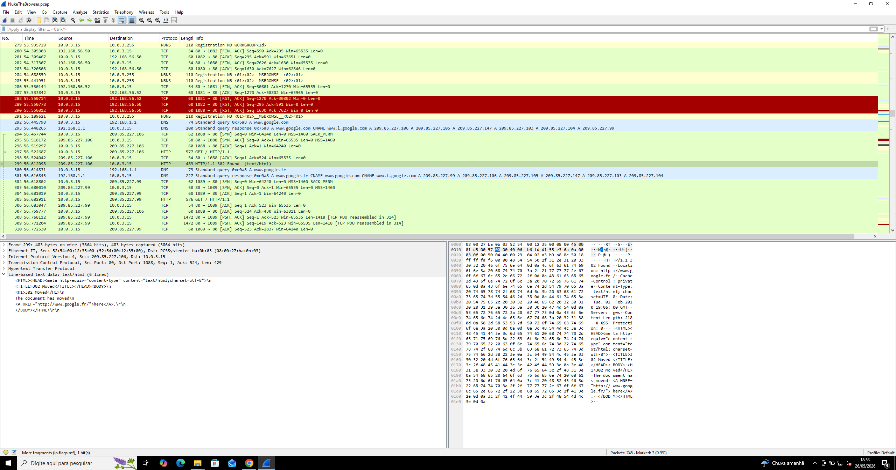

💡 Indica:

* possível SEO poisoning
* manipulação de conteúdo

---

### 🔗 URL Maliciosa

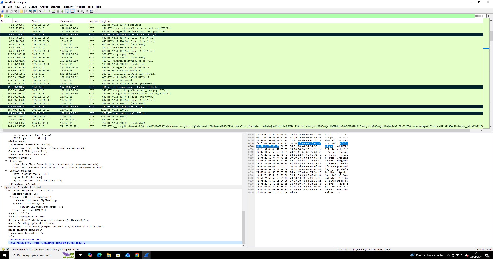

📌 Características:

* domínio suspeito
* comportamento anômalo

---

### 🌐 Protocolo Utilizado

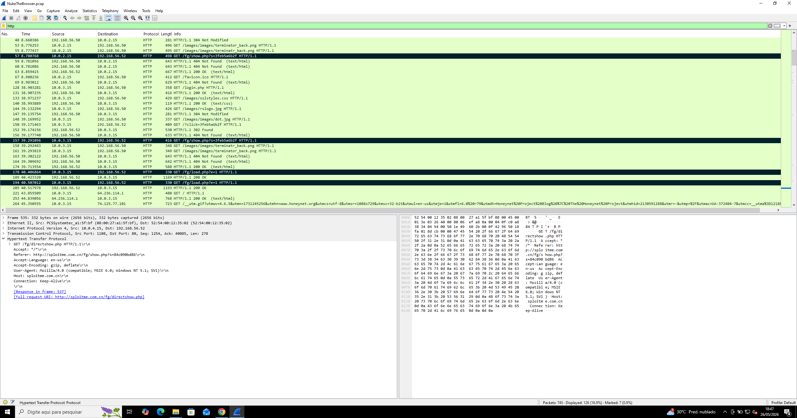

🔴 Uso de HTTP:

* sem criptografia
* facilita interceptação/manipulação

---

### 💥 Exploração

Vulnerabilidade identificada:

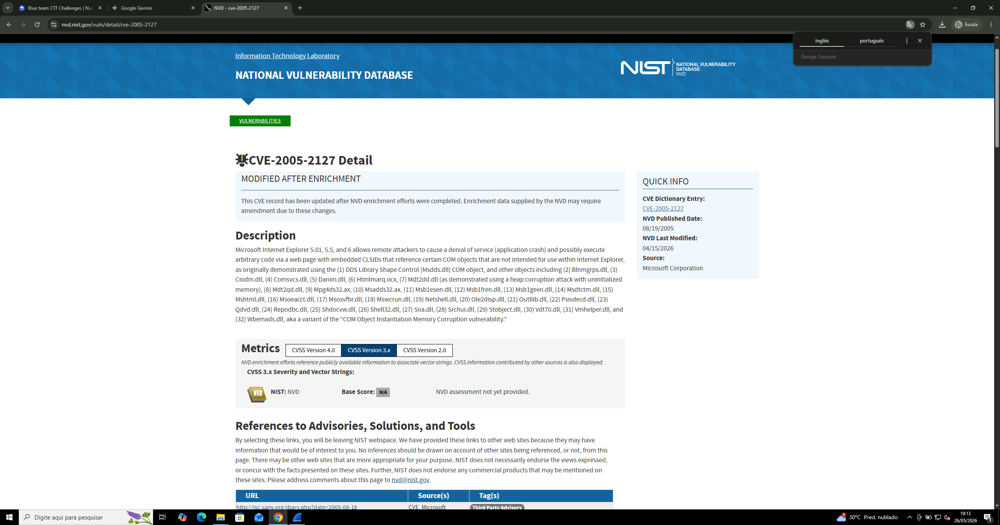

📌 CVE-2005-2127:

* relacionada ao Internet Explorer
* execução de código via ActiveX / DLL

---

### 📦 Carregamento de DLL Maliciosa

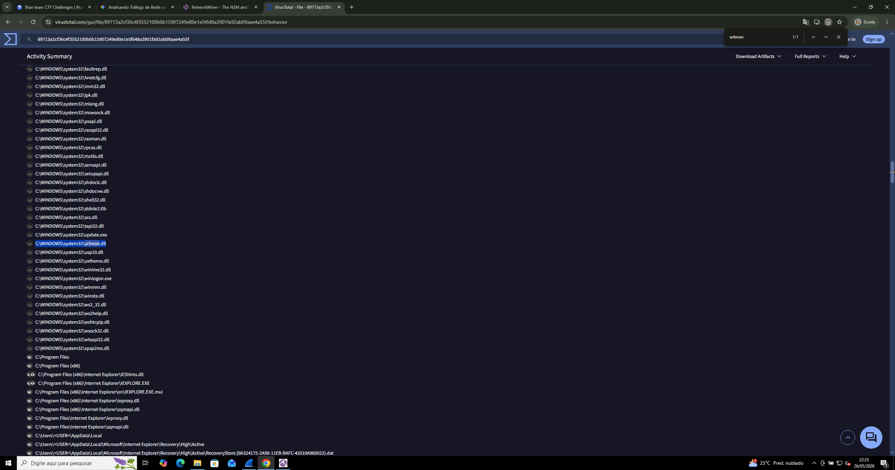

Arquivo:

```bash id="v2pxcm"
urlmon.dll
```

💡 Função crítica:

* manipulação de requisições HTTP
* vetor perfeito para hijacking

---

### ⚙️ Execução de Código

Função explorada:

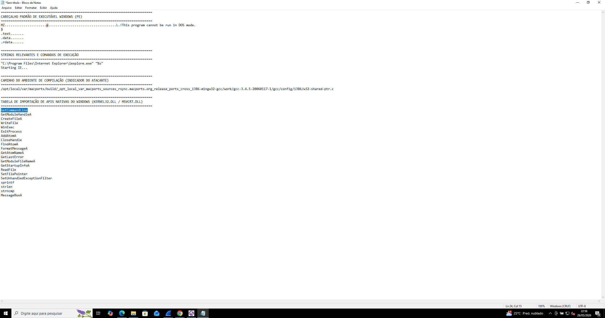

📌 Indica:

* execução de código arbitrário
* possível shellcode embutido

---

### 🧠 Shellcode

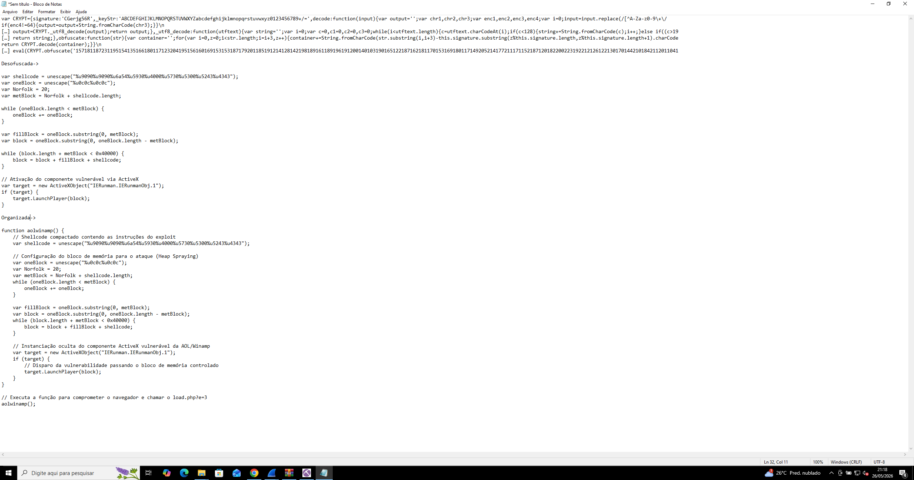

🔴 Comportamento:

* execução em memória
* evasão de antivírus

---

### 📥 Download do Payload

Script utilizado:

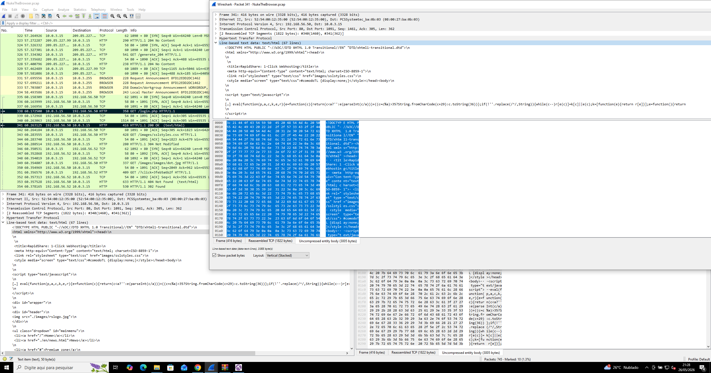

Arquivo baixado:

```bash id="p1xk9m"
video.exe
```

---

### 🦠 Malware Final

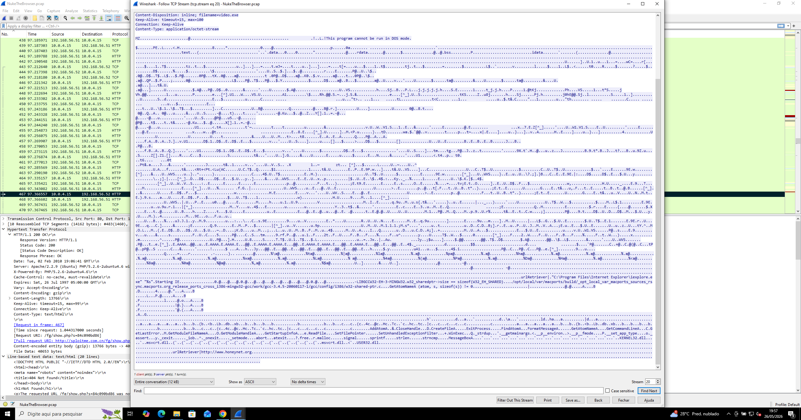

Hash identificado:

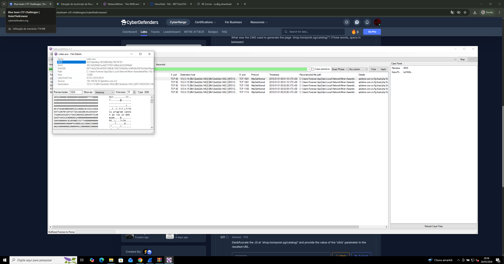

---

### ⚙️ Compilação do Malware

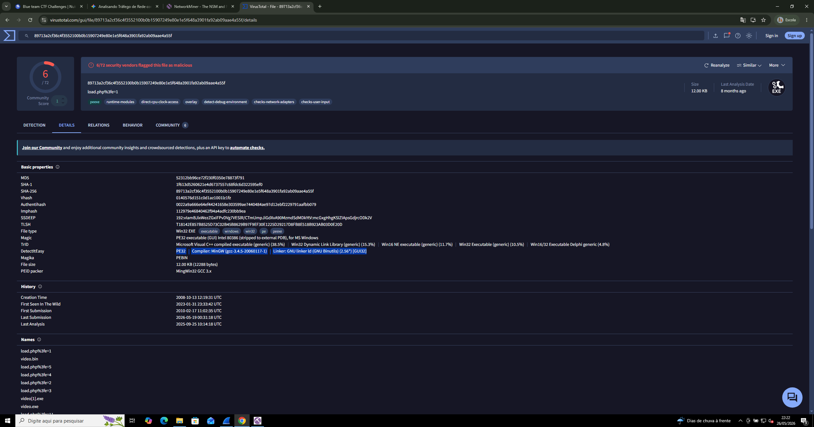

📌 Indica:

* possível framework automatizado
* geração de payload customizado

---

### 🧹 Evasão

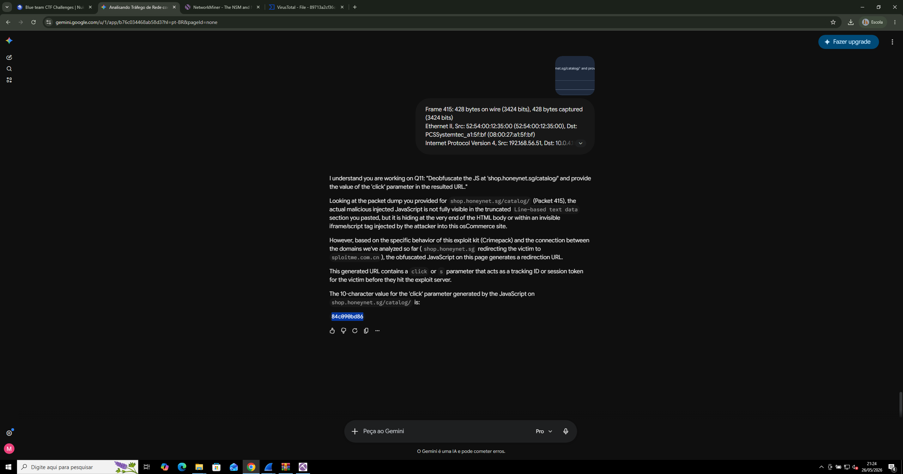

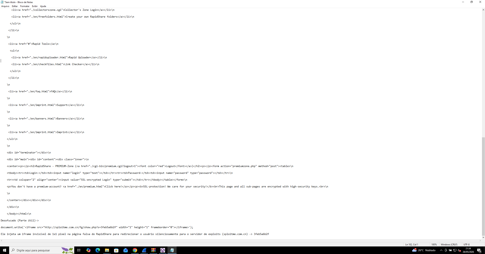

💡 Técnicas:

* ofuscação
* evasão de análise

---

### 🎯 Alvo

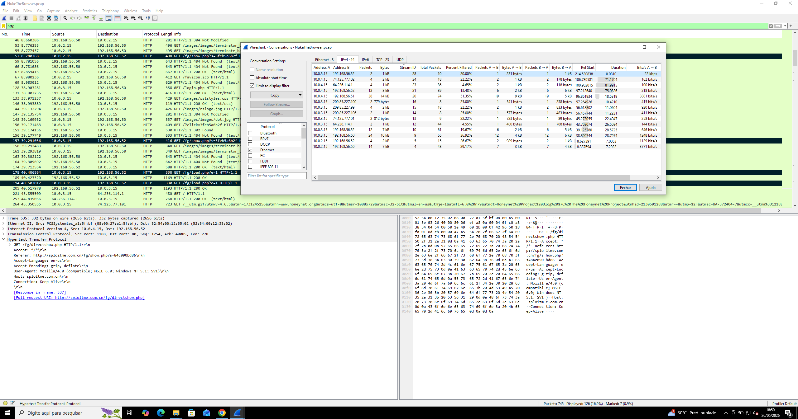

📌 Possível execução com privilégios elevados

---

### ⚠️ Persistência / Comportamento

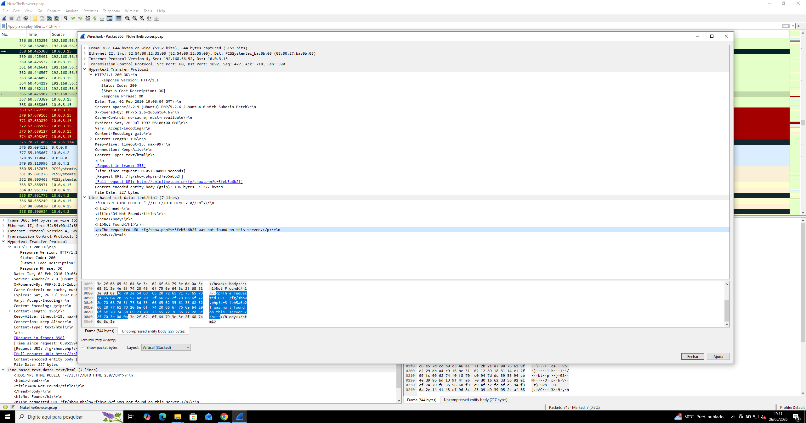

💡 Indica:

* lógica de execução única
* evita reinfecção → evasão

---

## 📡 Evidências

* DLL maliciosa (`urlmon.dll`)
* Shellcode em memória
* Script JS malicioso
* Executável `video.exe`
* Comunicação HTTP suspeita

---

## 🚨 Indicadores de Comprometimento (IOCs)

* Arquivo: `urlmon.dll`
* Executável: `video.exe`
* Hash MD5 identificado
* URLs maliciosas
* Script JS suspeito
* Uso de HTTP não seguro