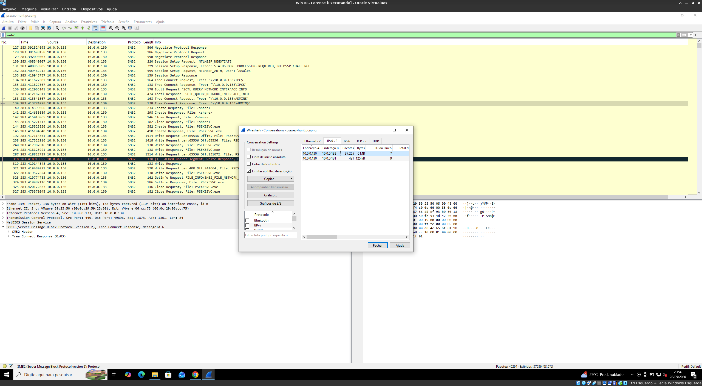
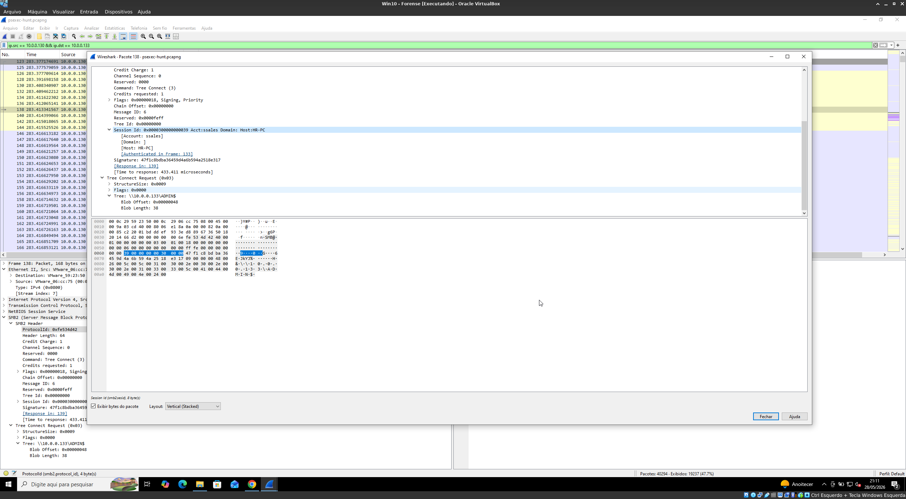
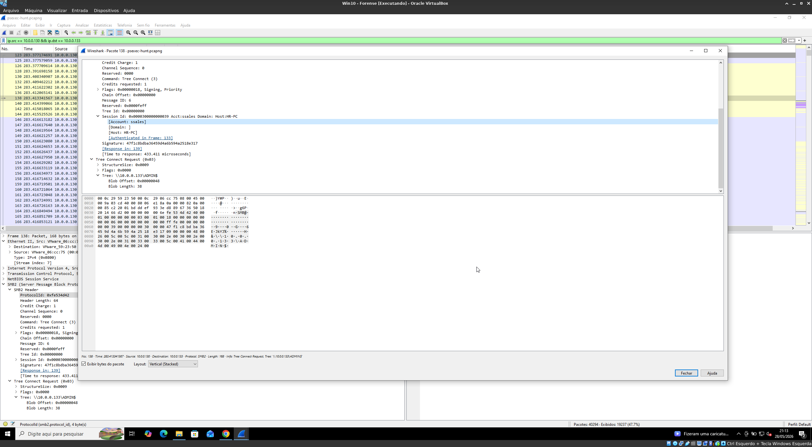
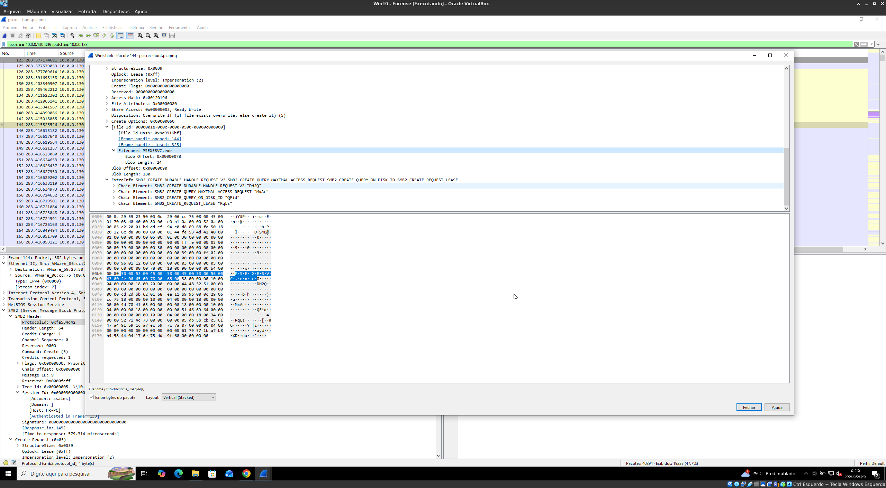
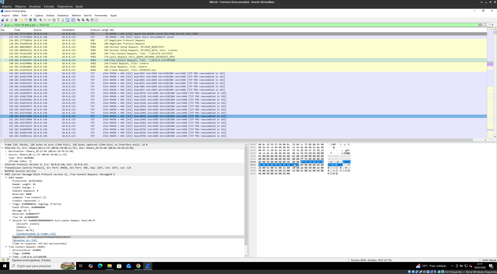
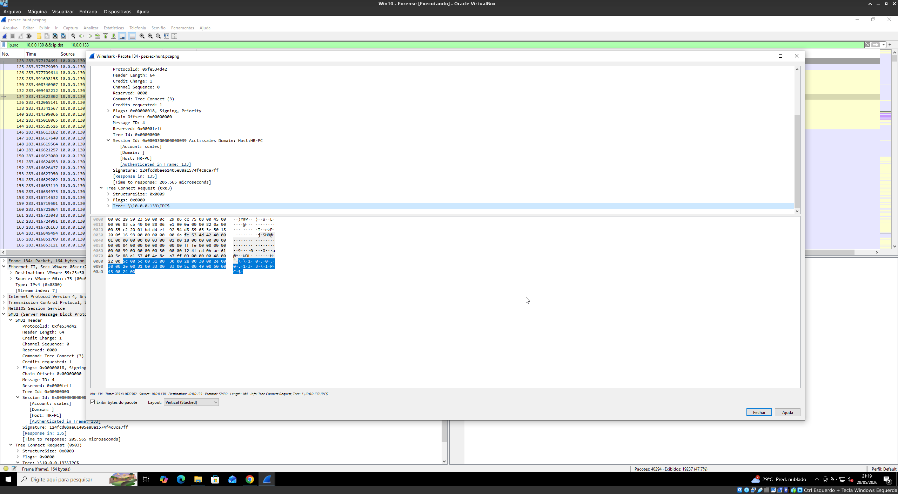
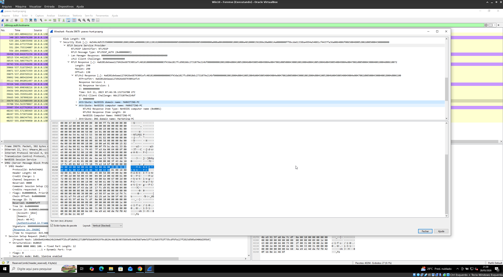

# 🛡️ PsExec Hunt — Lateral Movement Forensic Analysis

## 📌 Overview

Este writeup apresenta a análise forense de um ataque de **movimento lateral** utilizando a ferramenta legítima **PsExec**, baseado no desafio *PsExec Hunt*.

A investigação foi conduzida a partir de tráfego de rede (PCAP), permitindo identificar autenticação NTLM, transferência de arquivos via SMB e pivoting entre máquinas da rede interna.

---

## 🎯 Objetivo

* Identificar origem do ataque
* Detectar uso de credenciais comprometidas
* Analisar movimento lateral via SMB
* Mapear pivoting entre hosts
* Extrair IOCs

---

## 🧠 Resumo do Ataque

O atacante (**10.0.0.130**) realizou:

1. 🔐 Autenticação NTLM com credenciais válidas
2. 🔗 Conexão SMB com host interno
3. 📤 Upload do serviço `PSEXESVC.exe`
4. ⚙️ Execução remota via PsExec
5. 🔁 Pivoting para múltiplos hosts

---

## ⏱️ Timeline do Ataque (Detalhada)

| Fase         | Evento                    | Análise                            |
| ------------ | ------------------------- | ---------------------------------- |
| Inicial      | Conexão SMB2 iniciada     | Host 10.0.0.130 inicia comunicação |
| Autenticação | NTLM com usuário `ssales` | Uso de credencial legítima         |
| Acesso       | Conexão ao host HR-PC     | Primeiro alvo comprometido         |
| Execução     | Upload do `PSEXESVC.exe`  | Serviço remoto criado              |
| Comunicação  | Uso do IPC$               | Canal de controle                  |
| Pivoting     | Acesso ao MARKETING-PC    | Expansão lateral                   |

---

## 🔍 Análise Técnica

---

### 🌐 Origem do Ataque

* IP: **10.0.0.130**



📌 Este host inicia todas as conexões SMB → comportamento típico de atacante interno ou máquina comprometida.

---

### 🖥️ Primeiro Alvo (Pivot Inicial)

* Host: **HR-PC**
* IP: **10.0.0.133**



💡 Identificado via autenticação NTLM → campo `Session Id`.

---

### 👤 Credencial Comprometida

* Usuário: **ssales**



📌 Uso de credencial legítima:

* evita detecção imediata
* comum em ataques internos

---

### ⚙️ Execução Remota (PsExec)

Arquivo implantado:

```bash
PSEXESVC.exe
```



🔴 Indica:

* criação de serviço remoto
* execução de comandos no host alvo

---

### 📂 Compartilhamentos Utilizados

#### 📤 Upload do serviço

* Compartilhamento: `ADMIN$`



#### 🔗 Comunicação

* Compartilhamento: `IPC$`



💡 Padrão clássico do PsExec:

* ADMIN$ → deploy
* IPC$ → controle

---

### 🔁 Segundo Pivoting

* Host: **MARKETING-PC**



📌 Evidência de expansão lateral → comprometimento em cadeia.

---

## 📡 Evidências Forenses

* Tráfego SMB2 (Wireshark)
* Autenticação NTLM
* Transferência de executável
* Criação de serviço remoto
* Conexões entre múltiplos hosts

---

## 🧬 MITRE ATT&CK

| Técnica                  | ID        | Descrição                    |
| ------------------------ | --------- | ---------------------------- |
| SMB/Windows Admin Shares | T1021.002 | Movimento lateral            |
| Service Execution        | T1569.002 | Execução via serviço         |
| Valid Accounts           | T1078     | Uso de credenciais legítimas |

---

## 🚨 Indicadores de Comprometimento (IOCs)

* IP atacante: `10.0.0.130`
* Host comprometido: `HR-PC`, `MARKETING-PC`
* Usuário: `ssales`
* Arquivo: `PSEXESVC.exe`
* Compartilhamentos:

  * `ADMIN$`
  * `IPC$`