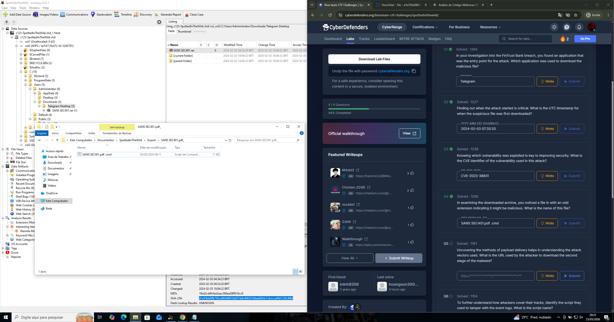
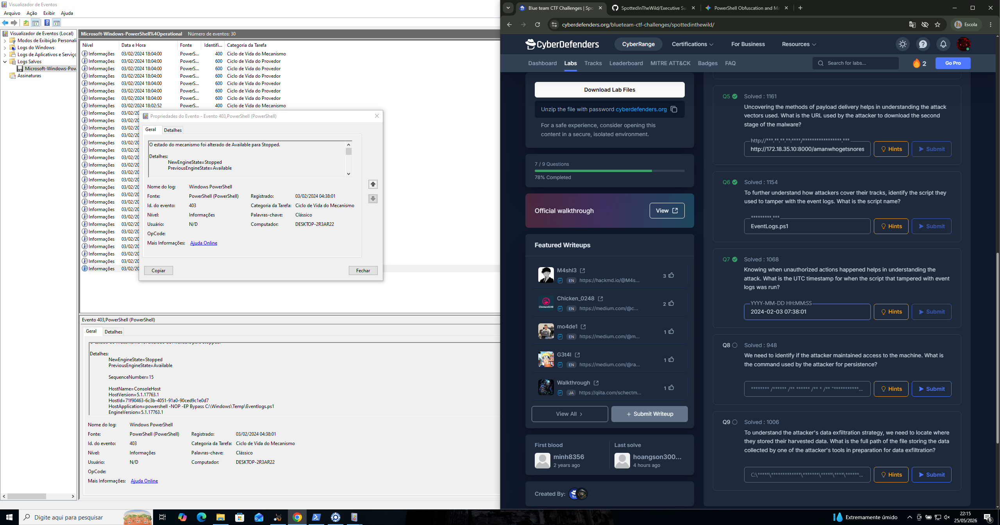
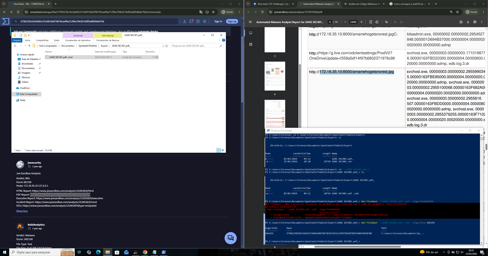
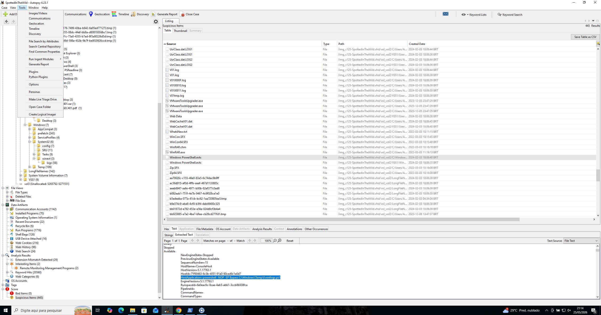
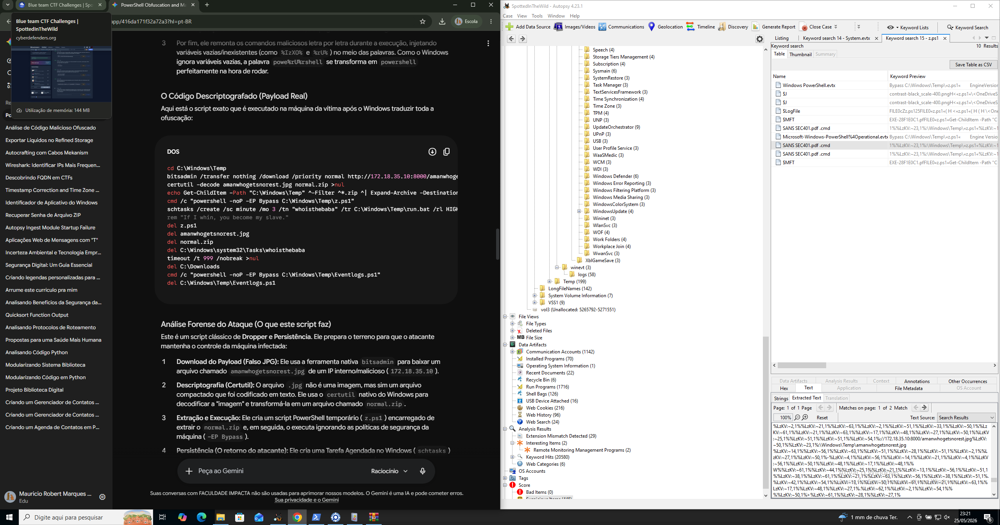
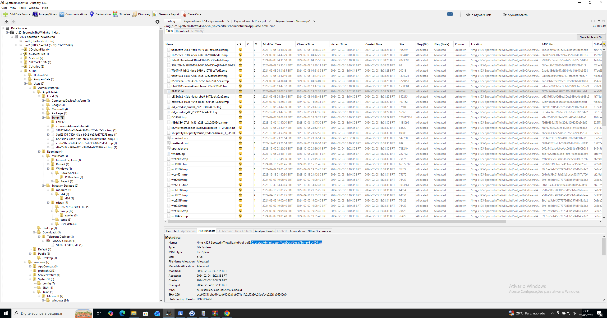
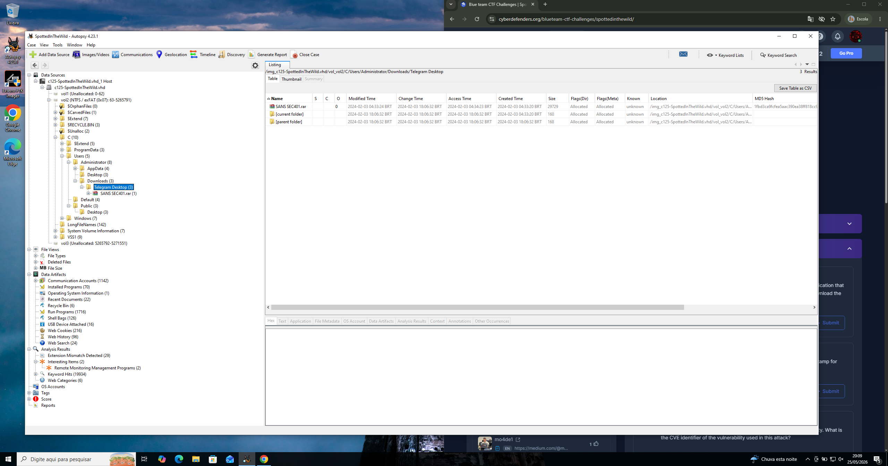
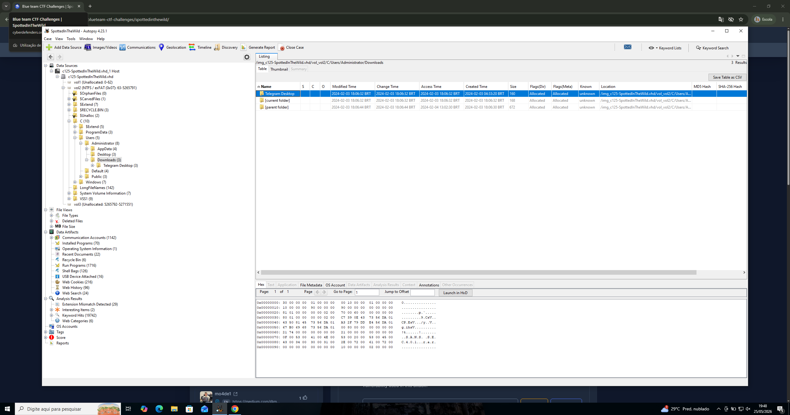

# 🛡️ Spotted In The Wild — Forensic Analysis (Multi-Stage Malware Attack)

## 📌 Overview

Este writeup documenta a análise forense de um incidente realista envolvendo execução de malware, persistência e tentativa de evasão, baseado no cenário **Spotted In The Wild**.

A investigação revelou um ataque multiestágio com execução de scripts maliciosos, limpeza de logs e possível exfiltração de dados.

---

## 🎯 Objetivo

* Identificar cadeia de ataque
* Analisar comportamento do malware
* Detectar persistência
* Correlacionar evidências visuais
* Extrair IOCs

---

## 🧠 Resumo do Ataque

O ataque segue um padrão clássico:

1. 🎯 Vetor inicial (arquivo malicioso)
2. 📥 Execução de payload
3. 🔗 Download de segundo estágio
4. 🧠 Execução de script PowerShell
5. 🧹 Limpeza de logs (anti-forense)
6. 📦 Possível exfiltração
7. ♻️ Persistência

---

## ⏱️ Timeline do Ataque

| Fase         | Evento                        |
| ------------ | ----------------------------- |
| Inicial      | Execução de arquivo malicioso |
| Execução     | Script PowerShell ativado     |
| Download     | Segunda fase via URL          |
| Ação         | Coleta / manipulação de dados |
| Anti-Forense | Exclusão de logs              |
| Persistência | Manutenção do acesso          |
| Exfiltração  | Arquivos compactados          |

---

## 🔍 Análise Técnica

---

### 🎯 Vetor Inicial

Arquivo suspeito identificado:

💡 Indício claro de **mascaramento de extensão** (.pdf + .cmd), técnica comum para enganar usuários.

---

### 🧠 Execução do Malware

Momento da execução identificado:

Script PowerShell ativado:

* Indica execução automatizada
* Provável loader inicial

---

### 🔗 Segunda Fase do Ataque

Download de payload adicional:

📌 Características:

* Comunicação externa
* Indica arquitetura multi-stage

---

### 🧹 Anti-Forense (Limpeza de Logs)

Script utilizado:

⚠️ Impacto:

* Remove rastros da atividade
* Dificulta investigação
* Técnica comum pós-execução

---

### ♻️ Persistência

Evidência de persistência:

Possíveis técnicas:

* Execução recorrente via script
* Registro ou tarefa agendada

---

### 📦 Exfiltração de Dados

Arquivo identificado:

📌 Indica:

* Coleta de dados
* Preparação para envio externo

---

### 🕒 Correlação Temporal

Horário do ataque:

💡 Importante para:

* correlação de eventos
* reconstrução da timeline

---

### 💬 Vetor Social / Distribuição

Possível origem:

📌 Indica:

* Engenharia social
* Distribuição via plataformas populares

---

### 🚨 Vulnerabilidade Relacionada

Possível associação com:

* exploração de software vulnerável
* execução indireta de código

---

## 📡 Evidências Principais

* Script: `Eventlogs.ps1`
* Arquivo: `.cmd` disfarçado
* Comunicação externa (URL)
* Exclusão de logs
* Arquivo de exfiltração

---

## 🚨 Indicadores de Comprometimento (IOCs)

* Arquivos `.cmd` disfarçados
* Scripts PowerShell maliciosos
* Execução de `Eventlogs.ps1`
* URLs externas suspeitas
* Arquivos compactados de dados
* Atividade de limpeza de logs