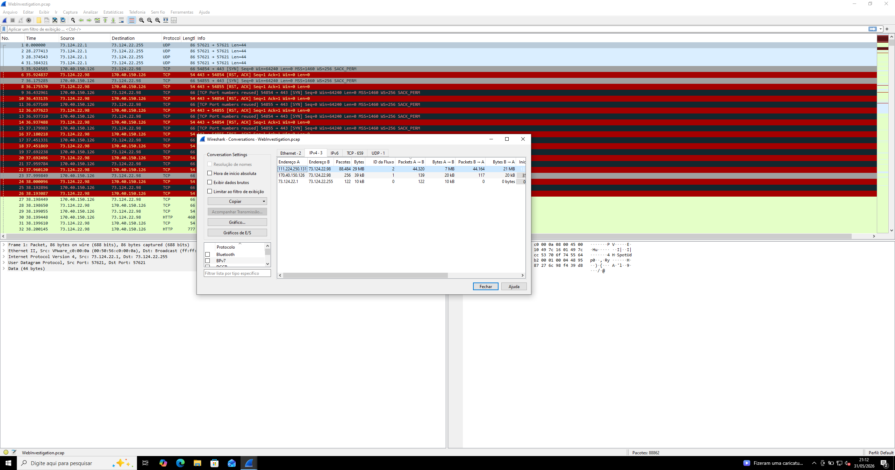
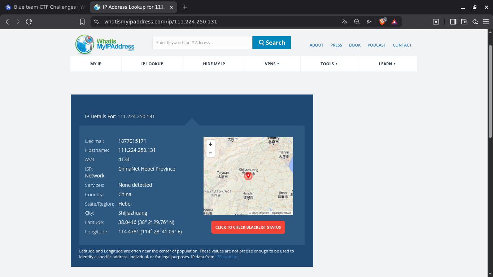
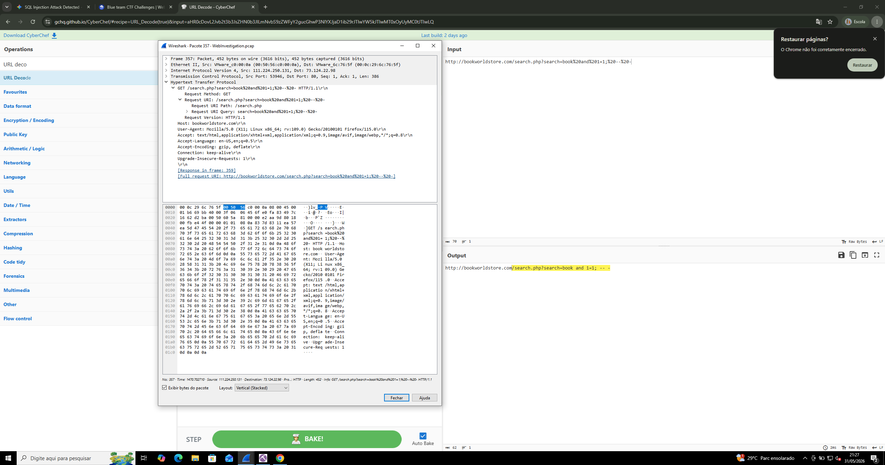
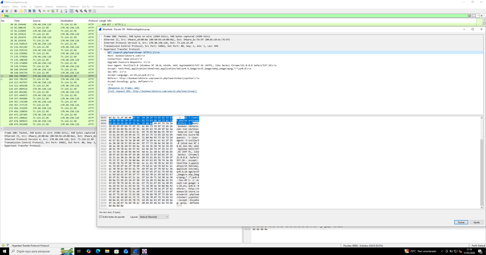
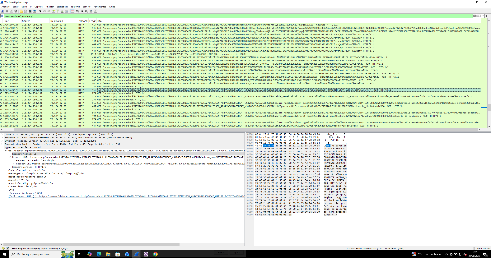
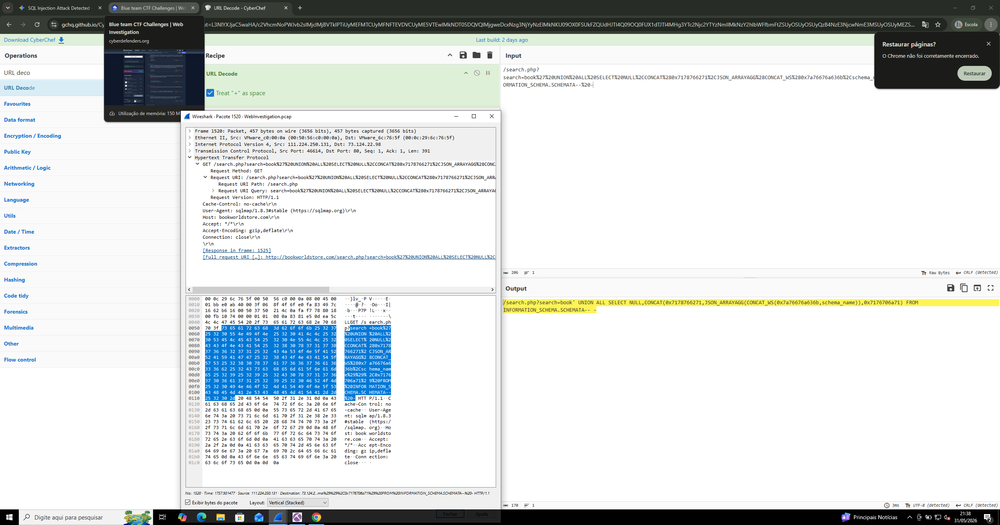
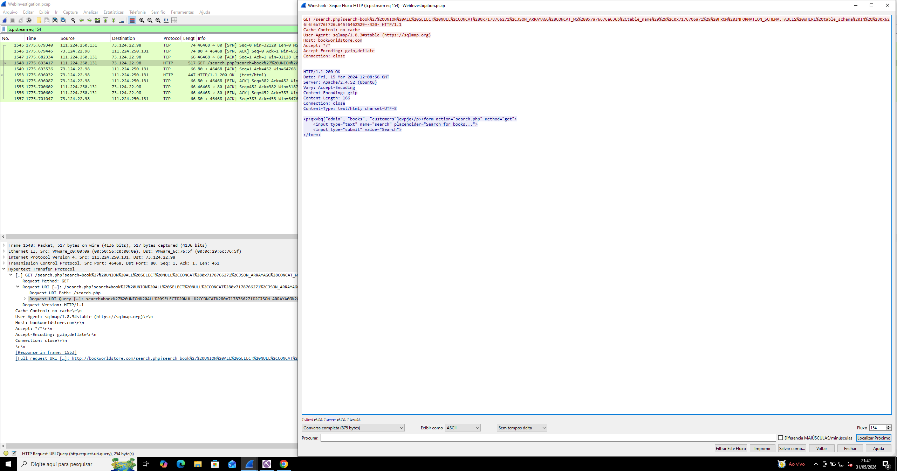
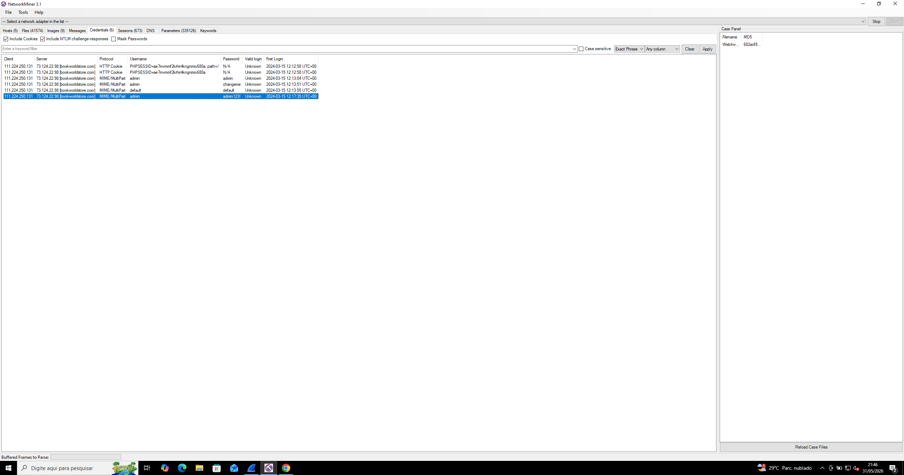
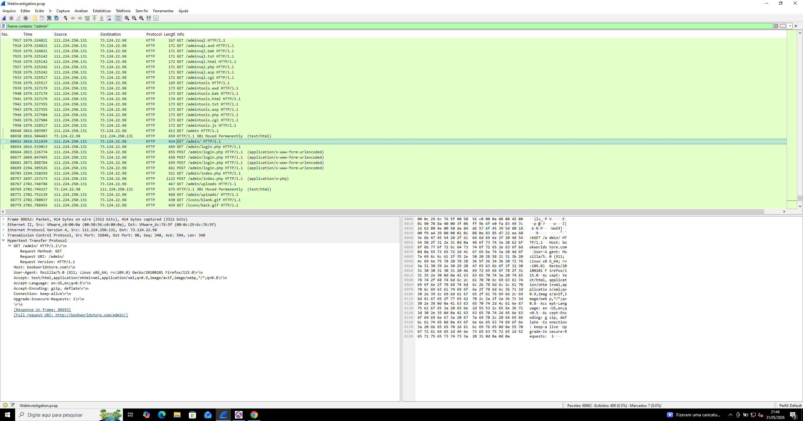
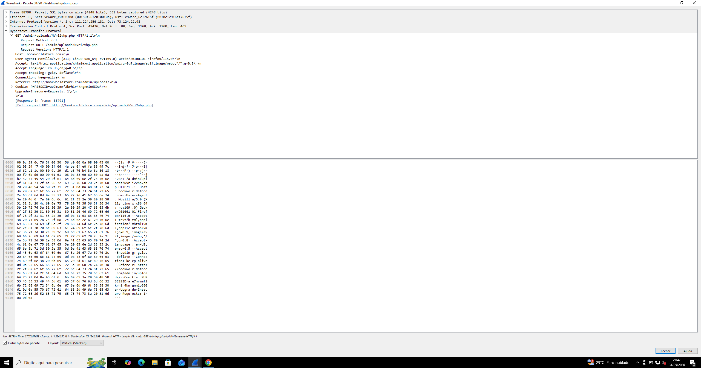

# 🕸️ Web Investigation — SQL Injection to Full Server Compromise

## 📌 Overview

Este writeup apresenta a análise forense de um ataque web baseado em **SQL Injection (SQLi)**, no cenário *Web Investigation*.

A investigação revelou um comprometimento completo do servidor, desde enumeração do banco de dados até upload de web shell.

---

## 🎯 Objetivo

* Identificar vetor de ataque
* Analisar exploração SQL Injection
* Identificar acesso administrativo
* Detectar web shell
* Extrair IOCs

---

## 🧠 Resumo do Ataque

O atacante (**111.224.250.131**) executou:

1. 🔍 Identificação de vulnerabilidade SQLi
2. 🧠 Exploração com `sqlmap`
3. 📂 Enumeração de banco de dados
4. 🔐 Extração de credenciais
5. 🚪 Acesso ao painel `/admin`
6. 📤 Upload de web shell (`NVri2vhp.php`)

---

## ⏱️ Timeline do Ataque

| Fase            | Evento                        |
| --------------- | ----------------------------- |
| Inicial         | Reconhecimento do site        |
| Exploração      | SQL Injection em `search.php` |
| Enumeração      | Leitura de banco de dados     |
| Credenciais     | Extração de usuários          |
| Acesso          | Login no `/admin`             |
| Comprometimento | Upload de web shell           |

---

## 🔍 Análise Técnica

---

### 🌐 Origem do Ataque

* IP: **111.224.250.131**
* Localização: Shijiazhuang, China



---

### 📍 Geolocalização



---

### 💥 Exploração SQL Injection

Primeira evidência:



📌 Vulnerabilidade:

* Parâmetro vulnerável no `search.php`
* Permite execução de queries arbitrárias

---

### 🧠 Ferramenta Utilizada

Evidência de automação:

```bash
sqlmap/1.8.3#stable
```



---

### 📂 Enumeração do Banco de Dados

Leitura via URL:



Versão decodificada:



📌 Indica:

* extração direta de dados
* exploração avançada (não manual)

---

### 👤 Dados Comprometidos

Tabela de usuários:



---

### 🔐 Credenciais Obtidas



📌 Credencial crítica:

```bash
admin:admin1234
```

---

### 🚪 Acesso ao Painel Administrativo



---

### ⚙️ Execução de Código (Web Shell)

Script utilizado pelo atacante:



Arquivo malicioso:

```bash
NVri2vhp.php
```

🔴 Impacto:

* execução remota de comandos
* controle total do servidor

---

## 📡 Evidências Forenses

* Tráfego HTTP com SQLi
* User-Agent `sqlmap`
* Queries maliciosas
* Extração de dados
* Acesso ao admin
* Upload de web shell

---

## 🧬 MITRE ATT&CK

| Técnica            | ID        | Descrição          |
| ------------------ | --------- | ------------------ |
| SQL Injection      | T1190     | Exploração web     |
| Credential Dumping | T1003     | Extração de dados  |
| Valid Accounts     | T1078     | Uso de credenciais |
| Web Shell          | T1505.003 | Persistência       |

---

## 🚨 Indicadores de Comprometimento (IOCs)

* IP atacante: `111.224.250.131`
* Domínio: `bookworldstore.com`
* Script vulnerável: `search.php`
* Ferramenta: `sqlmap`
* Credencial: `admin:admin1234`
* Web shell: `NVri2vhp.php`
* Endpoint: `/admin`